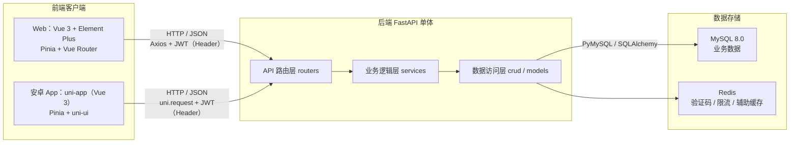

# 01 · 技术栈分析与选型

> 报告日期：2026年9月21日
> 撰写人：王晨宇
> 修订日期：2026年9月22日 · 版本：v1.1（选型基线，实际依赖版本待 M1 验证）
> 工具使用：DeepSeek Harness、Codex

本文说明设计选择，不表示框架已安装或系统已实现。业务范围以 [02](02-功能需求分析.md) 为准，技术验证责任见 [04](04-团队分工与开发规范.md)。

## 1. 选型原则

本课程设计项目的选型遵循以下原则：

1. **主流成熟**：优先选择工业界广泛使用、资料丰富、团队上手成本低的技术栈。
2. **学习价值**：能体现前后端分离、分层架构、RESTful 设计、数据校验、鉴权等知识点。
3. **够用不复杂**：避免引入微服务、消息队列、分布式事务等超出课程范围的重型组件；采用单体架构 + 清晰分层即可。
4. **可演示**：界面友好、联调方便、能快速产出演示材料。

## 2. 总体架构：前后端分离 + 单体后端



- **Web 前端**：单页应用（SPA），通过 Axios 调用后端 RESTful API，令牌放在 `Authorization` 请求头。
- **安卓端**：本学期使用 uni-app（Vue 3）实现借款人侧 App，复用同一套 RESTful API；管理端继续使用 Web。
- **后端**：FastAPI 单体应用，分层为「API 路由层（routers）→ 业务逻辑层（services）→ 数据访问层（crud/models）」。
- **数据库**：MySQL 持久化业务、会话、附件元数据与幂等结果；Redis 用于验证码、限流和辅助缓存。

## 3. 后端技术栈对比与推荐

| 维度       | FastAPI                     | Django + DRF             | Flask      |
| ---------- | --------------------------- | ------------------------ | ---------- |
| API 开发特点 | 类型声明生成 OpenAPI | 内置 ORM/Admin，DRF 提供 API | 核心轻量，校验/ORM 等需自行组合 |
| 数据校验   | Pydantic v2（强、类型驱动） | DRF Serializer           | 弱         |
| ORM        | SQLAlchemy 2.x（灵活）      | Django ORM（强、约定多） | 需自选     |
| 管理后台   | 需自建                      | 内置 Admin（省力）       | 需自建     |
| 上手难度   | 低～中                      | 中                       | 低         |
| 适合场景   | 前后端分离 RESTful API      | 快速全栈 / 想复用 Admin  | 极简小项目 |

**结论**：采用 **FastAPI**。

**理由**：

1. 与「前后端分离 + RESTful」架构天然契合，接口设计干净。
2. 自带交互式接口文档，便于双端协作；实际契约仍需提供权限、错误和幂等语义。
3. Pydantic 做请求/响应校验，类型清晰，代码量少，适合课程项目周期。
4. 技术栈现代、社区活跃，学习价值与就业相关度都高。

### 3.1 后端核心依赖清单

| 依赖                | 用途                                |
| ------------------- | ----------------------------------- |
| Python 3.11+        | 运行时                              |
| FastAPI             | Web 框架                            |
| Uvicorn             | ASGI 服务器（启动服务）             |
| SQLAlchemy 2.x      | ORM，模型与查询                     |
| Pydantic v2         | 数据校验 / 序列化（请求、响应模型） |
| PyMySQL             | MySQL 驱动                          |
| PyJWT               | 登录鉴权（签发/校验 JWT）           |
| passlib[bcrypt]     | 密码加密（BCrypt）                  |
| redis               | Redis 客户端（验证码、限流、辅助缓存） |
| python-multipart    | 表单解析                            |
| APScheduler | 单实例运行签约超时、逾期补算和还款提醒 |
| Alembic | 版本化数据库迁移 |
| pytest | 计算与数据库集成验证 |

### 3.2 后端分层结构

```
app/
├── main.py            # FastAPI 入口：创建应用、注册路由、CORS、异常处理
├── core/              # 配置、安全、JWT 依赖、统一异常/返回
├── api/               # 路由层（只做参数接收与响应，不写业务）
│   └── v1/
│       ├── auth.py        # 注册 / 登录 / 续期 / 退出
│       ├── user.py        # 实名认证 / 个人信息 / 银行卡
│       ├── product.py     # 贷款产品
│       ├── application.py # 借款申请 / 审批
│       ├── repayment.py   # 还款 / 还款计划
│       ├── file.py        # 测试附件上传/鉴权读取
│       ├── message.py     # 消息与已读状态
│       └── admin.py       # 后台管理（用户/产品/统计）
├── models/            # SQLAlchemy 模型（映射数据库表）
├── schemas/           # Pydantic 模型（请求体/响应体）
├── services/          # 业务逻辑层（利息计算、审批、放款、逾期）
├── crud/              # 数据访问层（增删改查）
├── db/                # 数据库连接、Session 依赖
└── utils/             # 工具函数（金额 Decimal、分页、脱敏）
```

### 3.3 实现约束

采用 SQLAlchemy 同步 Session + PyMySQL；数据库路由使用同步 def，或显式将阻塞调用放入线程池。不得在 async def 中直接执行同步数据库操作而宣称获得异步吞吐收益。每请求一个 Session，事务边界由服务层管理，禁止跨线程共享 Session。

APScheduler 在独立单实例进程运行，不能在每个 Uvicorn worker 内启动一份。签约每分钟扫描、逾期每日零点后补算、提醒每日生成；任务正确性依赖数据库状态/计费日期/事件键，即使误重跑也不能重复计费。

会话与刷新令牌摘要、附件元数据、幂等结果持久化到 MySQL，见 [03](03-数据库设计.md)。Redis 用于演示验证码、限流及必要的吊销缓存；缓存不是账务事实来源。冻结/退出必须更新会话状态，不能仅删客户端 token。

## 4. 前端技术栈对比与推荐

| 维度                | Vue 3 + Element Plus       | React + Ant Design  |
| ------------------- | -------------------------- | ------------------- |
| 上手难度            | 低                         | 中                  |
| 组件库（后台/表单） | Element Plus 表格/表单极强 | Ant Design 同样强大 |
| 生态                | 完善                       | 完善                |
| 与课程常见教学      | 国内高校前端课程多用 Vue   | 次之                |

**结论**：Web 端采用 **Vue 3 + Vite + Element Plus + Pinia + Vue Router + Axios**；安卓端采用 **uni-app（Vue 3）+ Pinia + uni-ui（uView Plus 作为备选，不同时引入）**。

### 4.1 前端核心依赖清单

| 依赖         | 用途                                            |
| ------------ | ----------------------------------------------- |
| Vue 3        | 框架                                            |
| uni-app      | 安卓端跨平台框架（复用 Vue 3 语法）             |
| Vite         | 构建工具                                        |
| Element Plus | UI 组件库（表格/表单/弹窗）                     |
| Pinia        | 状态管理（用户信息、权限）                      |
| Vue Router   | 路由与权限守卫                                  |
| Axios        | HTTP 请求与拦截器（统一携带 JWT、统一错误处理） |
| uni-ui（uView Plus 作为备选，不同时引入） | 安卓端移动 UI 组件                         |

### 4.2 前端目录结构

```
src
├── api            # 后端接口封装
├── assets         # 静态资源
├── components     # 通用组件
├── router         # 路由配置 + 权限守卫
├── stores         # Pinia 状态
├── utils          # axios 封装、工具函数
├── views          # 页面（用户端 / 管理端）
└── App.vue / main.js
```

### 4.3 安卓端目录与构建

安卓端单独放在 mobile/，使用 uni-app Vue 3 模板、uni-ui、Pinia、uni.request 和 pages.json。Element Plus、Vue Router、Axios 的 Web 实现不能不经适配直接复制；可共享数据结构、状态枚举和校验规则，UI 分别维护。

CLI 可完成前端资源构建，但 APK 还需要 HBuilderX 配套打包流程或已配置的 Android 原生构建环境及签名。本期优先 HBuilderX 流程：M1 产出最小真机测试包，M4 交付签名 APK 与构建说明。云打包的网络、账号、额度条件在 M1 记录；离线构建仅在已有 SDK/JDK 环境时作为备选。详细边界见 [06](06-扩展与演进规划.md)。

## 5. 数据库与存储选型

| 存储         | 选型      | 用途                                           |
| ------------ | --------- | ---------------------------------------------- |
| 关系型数据库 | MySQL 8.0 | 业务、会话、附件元数据和幂等结果 |
| 缓存/临时状态 | Redis | 验证码（带过期）、限流和辅助缓存 |

## 6. 工具链与环境

| 类别       | 选型                                                   |
| ---------- | ------------------------------------------------------ |
| 运行时     | Python 3.11+；Node.js 22 LTS 为候选，M1 核对 Vite/uni-app 模板兼容范围 |
| 依赖管理   | Python 锁定经过验证的版本；JS 提交 package-lock.json/pnpm-lock.yaml（每工程选一种） |
| 前端包管理 | npm / pnpm                                             |
| 版本控制   | GitHub 仓库                                            |
| 接口调试   | FastAPI 内置 Swagger UI（`/docs`）/ Apifox / Postman |
| IDE        | PyCharm/VS Code；安卓构建使用 HBuilderX，记录版本和签名方式 |
| Agent      | DSH 、 Codex                                           |

Windows 开发机的 Redis 可通过 WSL2 或容器运行。正式构建前记录实测版本，不将 Python/Node 的最低版本声明当作所有依赖组合均兼容的保证。BCrypt 方案需锁定 passlib/bcrypt 兼容组合并验证注册、登录及中文密码的 UTF-8 字节长度；超过 BCrypt 72 字节上限的密码必须明确拒绝，不能静默截断。

## 7. 金额精度与安全要点（技术层面）

1. **金额精度**：所有金额字段使用 `DECIMAL(18,2)`（数据库）与 Python `decimal.Decimal`（代码），**严禁**使用 `float` 做金额运算。
2. **敏感信息**：密码使用 BCrypt（passlib）加密存储；身份证号、手机号在日志中脱敏。
3. **接口安全**：JWT 鉴权（FastAPI 依赖注入）；管理端接口额外校验角色；关键操作（放款、审批）二次校验。
4. **并发控制**：按用户 → 申请 → 账户 → 计划的统一顺序加锁，配合状态条件及幂等唯一键；放款增加余额、还款扣减余额，额度单独检查。
5. **参数校验**：后端用 Pydantic 对所有入参校验，不信任前端。API 金额/利率/大整数 ID 使用字符串，费率计算先除以 100。
6. **会话安全**：access token 默认 2 小时，会话固定 7 天；服务端只存刷新令牌摘要，轮换与吊销规则见《04》§6.2。App 刷新令牌存安全存储，普通 uni storage 不等同于加密存储。
7. **传输与上传**：部署使用 HTTPS；局域网明文例外只用于隔离演示配置。上传 JPEG/PNG 测试图片（≤5 MiB），检查真实格式和归属，鉴权读取而非公开路径。
8. **配置**：密钥、数据库密码和 APK 签名文件不入库；CORS 只开放已配置的 Web 源，原生 App 可调用 API 不等于获得授权。

## 8. 不引入的技术

| 技术                       | 不引入理由                                                                                             |
| -------------------------- | ------------------------------------------------------------------------------------------------------ |
| 微服务架构                 | 课程项目业务规模小，单体架构足够，避免复杂度失控                                                       |
| 消息队列（RabbitMQ/Kafka） | 无高并发削峰需求；异步通知可用 APScheduler 定时任务替代                                                |
| 分布式事务                 | 业务以单库事务为主，无需分布式事务                                                                     |
| 规则引擎 | 本期只有固定黑名单与校验规则；无需独立规则配置表或模型平台，后续按验证结果选择 |
| 原生安卓 App（Kotlin）     | 需要维护另一套技术栈；本学期采用 uni-app 交付安卓端，减少学习和维护成本                           |

## 9. 参考资料与版本记录

下列为技术依据入口，实际实现需按选定版本核对，本文未进行最新价格或版本可用性在线核验。

| 资料 | 用途 |
| --- | --- |
| [FastAPI 文档](https://fastapi.tiangolo.com/) | 同步/异步路由、依赖注入、OpenAPI |
| [SQLAlchemy 2.0 文档](https://docs.sqlalchemy.org/en/20/) | Session 生命周期与事务 |
| [Python Decimal](https://docs.python.org/3/library/decimal.html) | 金额精度、舍入 |
| [MySQL 8.0 文档](https://dev.mysql.com/doc/refman/8.0/en/) | InnoDB 锁、外键、CHECK 和索引 |
| [Vue 文档](https://vuejs.org/guide/introduction.html) / [Vite 指南](https://vite.dev/guide/) | Web 框架与构建依赖 |
| [uni-app 文档](https://uniapp.dcloud.net.cn/) | Vue 3 模板、平台差异与 App 打包 |

M1 产出依赖锁文件和环境清单，记录 OS、Python/Node、MySQL/Redis、HBuilderX、Android 机型/版本、构建日期。没有实测证据前，不能把“方案选定”写成“兼容性已通过”。
