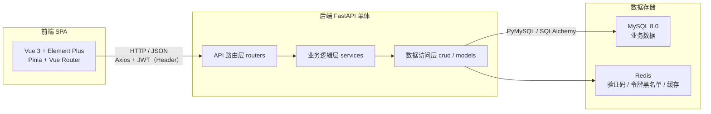

# 01 · 技术栈分析与选型

> 报告日期：2026年9月21日
> 撰写人：王晨宇
> 版本：v1.0
> 工具使用：DeepSeek Harness、Codex

## 1. 选型原则

本课程设计项目的选型遵循以下原则：

1. **主流成熟**：优先选择工业界广泛使用、资料丰富、团队上手成本低的技术栈。
2. **学习价值**：能体现前后端分离、分层架构、RESTful 设计、数据校验、鉴权等知识点。 <!-- RESTful 设计是一种设计 Web API 的风格，核心是：把系统中的数据或业务对象抽象为资源，并通过标准 HTTP 方法对资源进行操作。-->
3. **够用不复杂**：避免引入微服务、消息队列、分布式事务等超出课程范围的重型组件；采用单体架构 + 清晰分层即可。
4. **可演示**：界面友好、联调方便、能快速产出演示材料。

## 2. 总体架构：前后端分离 + 单体后端



- **前端**：单页应用（SPA），通过 Axios 调用后端 RESTful API，令牌放在 `Authorization` 请求头。
- **后端**：FastAPI 单体应用，分层为「API 路由层（routers）→ 业务逻辑层（services）→ 数据访问层（crud/models）」。
- **数据库**：MySQL 持久化业务数据；Redis 用于验证码、登录令牌黑名单、热点数据缓存等。

## 3. 后端技术栈对比与推荐

| 维度       | FastAPI                     | Django + DRF             | Flask      |
| ---------- | --------------------------- | ------------------------ | ---------- |
| 现代化程度 | 5★( 原生异步)               | 4★                       | 3★         |
| 数据校验   | Pydantic v2（强、类型驱动） | DRF Serializer           | 弱         |
| ORM        | SQLAlchemy 2.x（灵活）      | Django ORM（强、约定多） | 需自选     |
| 管理后台   | 需自建                      | 内置 Admin（省力）       | 需自建     |
| 上手难度   | 低～中                      | 中                       | 低         |
| 适合场景   | 前后端分离 RESTful API      | 快速全栈 / 想复用 Admin  | 极简小项目 |

**结论**：采用 **FastAPI**。

**理由**：

1. 与「前后端分离 + RESTful」架构天然契合，接口设计干净。
2. 自带交互式接口文档，演示与联调非常方便。
3. Pydantic 做请求/响应校验，类型清晰，代码量少，适合课程项目周期。
4. 技术栈现代、社区活跃，学习价值与就业相关度都高。

### 3.1 后端核心依赖清单

| 依赖                | 用途                                |
| ------------------- | ----------------------------------- |
| Python 3.11+        | 运行时                              |
| FastAPI             | Web 框架                            |
| Uvicorn             | ASGI 服务器（启动服务）             |
| SQLAlchemy 2.x      | ORM，模型与查询                     |
| Pydantic v2         | 数据校验 / 序列化（请求、响应模型） |
| PyMySQL             | MySQL 驱动                          |
| PyJWT               | 登录鉴权（签发/校验 JWT）           |
| passlib[bcrypt]     | 密码加密（BCrypt）                  |
| redis               | Redis 客户端（验证码、令牌黑名单）  |
| python-multipart    | 表单解析                            |
| APScheduler（可选） | 定时任务：逾期检测、还款提醒        |

### 3.2 后端分层结构

```
app/
├── main.py            # FastAPI 入口：创建应用、注册路由、CORS、异常处理
├── core/              # 配置、安全、JWT 依赖、统一异常/返回
├── api/               # 路由层（只做参数接收与响应，不写业务）
│   └── v1/
│       ├── auth.py        # 注册 / 登录 / 退出
│       ├── user.py        # 实名认证 / 个人信息 / 银行卡
│       ├── product.py     # 贷款产品
│       ├── application.py # 借款申请 / 审批
│       ├── repayment.py   # 还款 / 还款计划
│       └── admin.py       # 后台管理（用户/产品/统计）
├── models/            # SQLAlchemy 模型（映射数据库表）
├── schemas/           # Pydantic 模型（请求体/响应体）
├── services/          # 业务逻辑层（利息计算、审批、放款、逾期）
├── crud/              # 数据访问层（增删改查）
├── db/                # 数据库连接、Session 依赖
└── utils/             # 工具函数（金额 Decimal、分页、脱敏）
```

## 4. 前端技术栈对比与推荐

| 维度                | Vue 3 + Element Plus       | React + Ant Design  |
| ------------------- | -------------------------- | ------------------- |
| 上手难度            | 低                         | 中                  |
| 组件库（后台/表单） | Element Plus 表格/表单极强 | Ant Design 同样强大 |
| 生态                | 完善                       | 完善                |
| 与课程常见教学      | 国内高校前端课程多用 Vue   | 次之                |

**结论**：采用 **Vue 3 + Vite + Element Plus + Pinia + Vue Router + Axios**。

### 4.1 前端核心依赖清单

| 依赖         | 用途                                            |
| ------------ | ----------------------------------------------- |
| Vue 3        | 框架                                            |
| Vite         | 构建工具                                        |
| Element Plus | UI 组件库（表格/表单/弹窗）                     |
| Pinia        | 状态管理（用户信息、权限）                      |
| Vue Router   | 路由与权限守卫                                  |
| Axios        | HTTP 请求与拦截器（统一携带 JWT、统一错误处理） |

### 4.2 前端目录结构

```
src
├── api            # 后端接口封装
├── assets         # 静态资源
├── components     # 通用组件
├── router         # 路由配置 + 权限守卫
├── stores         # Pinia 状态
├── utils          # axios 封装、工具函数
├── views          # 页面（用户端 / 管理端）
└── App.vue / main.js
```

## 5. 数据库与存储选型

| 存储         | 选型      | 用途                                           |
| ------------ | --------- | ---------------------------------------------- |
| 关系型数据库 | MySQL 8.0 | 用户、产品、申请、还款、账户等核心业务数据     |
| 缓存/会话    | Redis     | 验证码（带过期）、登录令牌黑名单、热点数据缓存 |

## 6. 工具链与环境

| 类别       | 选型                                                 |
| ---------- | ---------------------------------------------------- |
| 运行时     | Python 3.11+                                         |
| 依赖管理   | pip + requirements.txt                               |
| 前端包管理 | npm / pnpm                                           |
| 版本控制   | GitHub 仓库                                          |
| 接口调试   | FastAPI 内置 Swagger UI（`/docs`）/ Apifox / Postman |
| IDE        | PyCharm（后端）、VS Code（前端）                     |
| Agent      | DSH 、 Codex                                         |

## 7. 金额精度与安全要点（技术层面）

1. **金额精度**：所有金额字段使用 `DECIMAL(18,2)`（数据库）与 Python `decimal.Decimal`（代码），**严禁**使用 `float` 做金额运算。
2. **敏感信息**：密码使用 BCrypt（passlib）加密存储；身份证号、手机号在日志中脱敏。
3. **接口安全**：JWT 鉴权（FastAPI 依赖注入）；管理端接口额外校验角色；关键操作（放款、审批）二次校验。
4. **并发控制**：账户扣款/放款使用数据库行级锁（`SELECT ... FOR UPDATE`）或乐观锁（版本号），防止并发超扣。
5. **参数校验**：后端用 Pydantic 对所有入参校验，不信任前端。

## 8. 不引入的技术

| 技术                       | 不引入理由                                                                                                     |
| -------------------------- | -------------------------------------------------------------------------------------------------------------- |
| 微服务架构                 | 课程项目业务规模小，单体架构足够，避免复杂度失控                                                               |
| 消息队列（RabbitMQ/Kafka） | 无高并发削峰需求；异步通知可用 APScheduler 定时任务替代                                                        |
| 分布式事务                 | 业务以单库事务为主，无需分布式事务                                                                             |
| 规则引擎                   | 本期风控规则简单，用代码 + 配置表即可表达；多数据融合风控（最终项目）按需引入，见《08-多数据融合风控预留设计》 |
| 原生安卓 App（本期）       | 等于多维护一套客户端，会挤压答辩重点；安卓端已在《07-多端适配与安卓端规划》中规划为综设2 用 uni-app 实现       |
