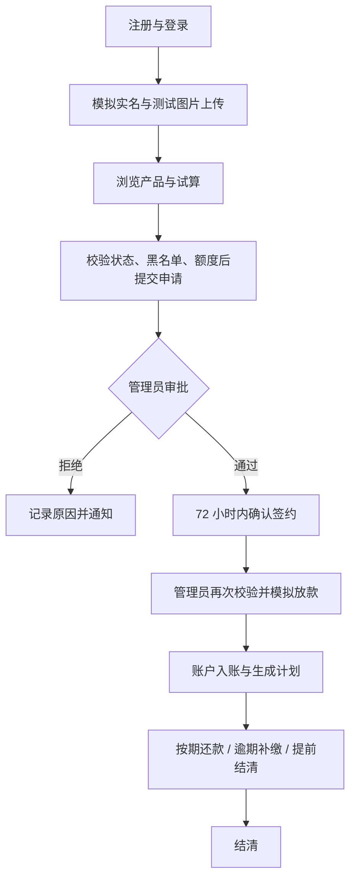
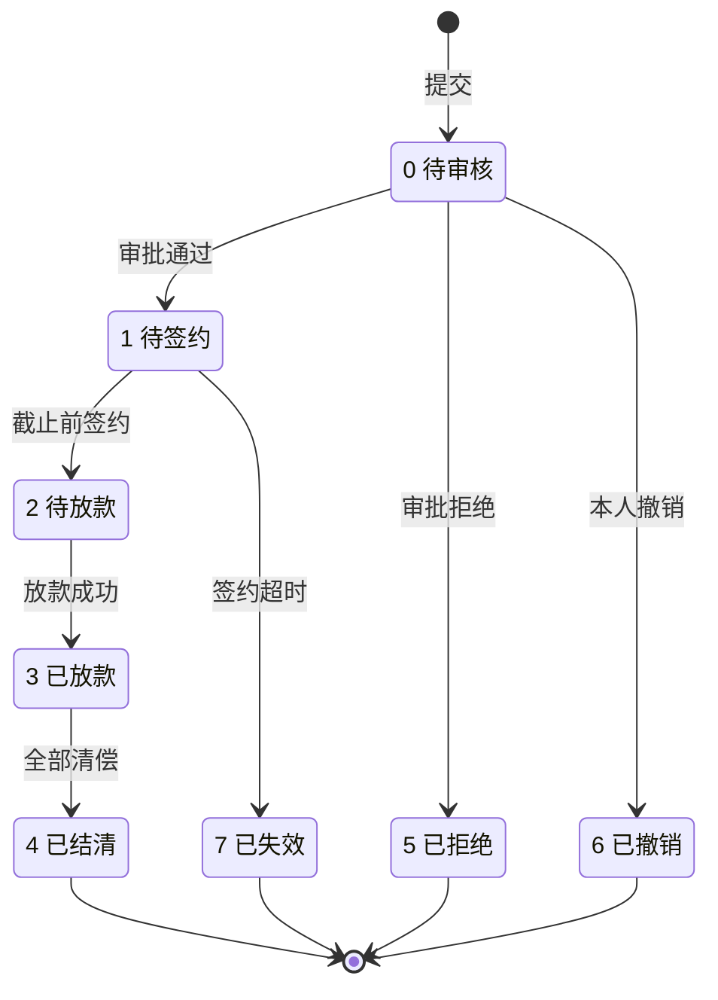

# 02 · 功能需求分析

> 项目类型：「综合设计 1」课程设计项目
> 初稿日期：2026年9月21日
> 撰写人：王晨宇
> 修订日期：2026年9月22日 · 版本：v1.1（文档设计基线，尚未实现）
> 工具使用：DeepSeek Harness、Codex

## 1. 系统概述与范围

FinLend 是使用虚构身份、模拟资金的课程借贷平台。本学期交付 **Web 用户端、Web 管理端及 uni-app 安卓借款人 App（APK）**，共用后端与业务数据。管理员操作仅在 Web 提供。

本文是业务规则与功能范围的依据；数据结构见 [03-数据库设计](03-数据库设计.md)，接口规范及验收流程见 [04-团队分工与开发规范](04-团队分工与开发规范.md)，安卓实施计划及风控预留见 [06-扩展与演进规划](06-扩展与演进规划.md)。文中的默认值是本次修订采用的课程演示基线；实现前如需调整，应同步计算示例、数据设计和验收用例。

| 范围     | 本学期约定                                                                                                             |
| -------- | ---------------------------------------------------------------------------------------------------------------------- |
| 必须交付 | 注册登录、会话续期、模拟实名与基础图片上传、产品、申请、签约、审批放款、还款与提前结清、逾期、站内消息、基础后台及 APK |
| 可选增强 | 统计图表、导出、催收备注、模拟充值页面（基础演示资金由 seed 提供）                                                     |
| 后续实现 | 动态信用评分、多源风控、小程序、厂商推送、真实身份核验及资金通道                                                       |
| 排除项   | 真实放贷、真实扣银行卡、任意部分还款、自动银行卡扣款、真实个人信息采集                                                 |

## 2. 用户角色与权限

| 角色   | 可执行操作                                                 | 限制                                                               |
| ------ | ---------------------------------------------------------- | ------------------------------------------------------------------ |
| 访客   | 注册、登录                                                 | 不能读取借款、账户或消息                                           |
| 借款人 | 浏览产品、试算、认证、申请/撤销/签约、还款、查看账户与消息 | 仅能访问本人资源；未实名不能申请；冻结后不能登录、续期、申请或放款 |
| 管理员 | 用户/产品/黑名单管理、审批、放款、逾期查询                 | 每次调用校验管理员身份；不能以客户端传入角色获得权限               |

本学期管理员只设 ADMIN 一种角色。冻结是账号停用，已签发会话也失效；不会清除欠款或停止罚息，需管理员解冻后才能继续用户还款。黑名单只阻断新申请与放款，允许用户查询并偿还既有债务。

## 3. 功能模块划分

| 模块       | 主要能力                                                       |
| ---------- | -------------------------------------------------------------- |
| 用户与认证 | 注册、登录/续期/退出、模拟实名、图片上传、个人资料与模拟银行卡 |
| 产品       | 产品浏览、试算参数、上下架管理                                 |
| 申请与审批 | 提交、撤销、审批、签约、签约超时                               |
| 风控接口   | 黑名单检查；评分/自动决策仅返回明确标注的模拟值                |
| 放款与账户 | 模拟放款、额度检查、账户余额与流水                             |
| 还款       | 计划、按期/逾期还款、提前结清、罚息                            |
| 后台管理   | 用户、产品、审批放款与逾期列表                                 |
| 消息       | 审批/放款/还款提醒、消息列表与已读状态                         |

## 4. 功能需求与可验证结果

### 4.1 用户模块

| 编号    | 功能             | 可验证结果                                                                                                 |
| ------- | ---------------- | ---------------------------------------------------------------------------------------------------------- |
| AUTH-01 | 注册             | 账号、手机号唯一；创建用户与唯一账户；默认授信 50000.00 元；验证码仅通过演示通道提供，5 分钟过期且单次有效 |
| AUTH-02 | 登录与续期       | 密码校验成功后返回 access/refresh token；错误密码、冻结账号、过期或吊销的刷新令牌被拒绝                    |
| AUTH-03 | 退出与多端       | Web 与 App 会话独立；退出吊销当前会话的两种令牌，其他正常设备会话不受影响                                  |
| AUTH-04 | 模拟实名         | 姓名、18 位虚构证件号、本人上传的测试证件图片通过格式检查后标记模拟认证；界面标明不是真实身份核验          |
| AUTH-05 | 资料与模拟银行卡 | 修改本人资料、绑定/删除模拟卡、设置最多一张默认卡；银行卡不参与资金划转                                    |
| AUTH-06 | 账户查询         | 返回本人余额、授信和可用额度；默认分数不是实际信用评估结果                                                 |

### 4.2 贷款产品模块

| 编号    | 功能       | 可验证结果                                                                                             |
| ------- | ---------- | ------------------------------------------------------------------------------------------------------ |
| PROD-01 | 列表与详情 | 显示金额/期限范围、年利率、还款方式、罚息和提前结清费用                                                |
| PROD-02 | 产品管理   | 管理员创建/修改/上下架；金额和期限上下限有效；下架后不能新增申请                                       |
| PROD-03 | 规则快照   | 每产品指定一种还款方式；本期年利率上下限相等；申请时复制利率、费用等规则，产品后续修改不改变已提交申请 |

### 4.3 申请与审批模块

| 编号    | 功能      | 可验证结果                                                                       |
| ------- | --------- | -------------------------------------------------------------------------------- |
| LOAN-01 | 试算      | 使用后端返回的计划和总额展示；客户端不能自行决定成交利率或应还金额               |
| LOAN-02 | 提交      | 校验实名、冻结/黑名单、上架状态、金额/期限与可用额度；同一用户最多一笔待审核申请 |
| LOAN-03 | 查询/撤销 | 仅本人可查；只有待审核状态可撤销                                                 |
| LOAN-04 | 审批      | 管理员通过/拒绝，拒绝原因必填；并发审批只有一次状态转换成功                      |
| LOAN-05 | 签约      | 本人确认规则快照；审批后 72 小时内可签约，达到截止时刻后记为已失效，不得放款     |

待签约、待放款申请可以并存，本期不预占授信；**提交校验不承诺放款成功**，放款时再次锁定用户并检查可用额度。

### 4.4 风控与信用评估模块

黑名单是本期真实执行的业务规则；DefaultRiskEngine 的模拟 PASS 不能覆盖实名、冻结、黑名单或额度检查，也不等于管理员审批通过。

| 路径（前缀 /api/v1）               | 本期行为                                                       | 权限                         |
| ---------------------------------- | -------------------------------------------------------------- | ---------------------------- |
| POST /risk/evaluate                | 返回模拟 PASS、默认分 60、等级 C 与用户授信，标注 is_mock=true | 管理员；申请服务也可内部调用 |
| GET /risk/decision/{applicationId} | 校验申请存在后返回模拟决策，不冒充历史真实评分                 | 本人/管理员                  |
| GET /risk/datasources              | 返回内置 internal 数据源元信息                                 | 管理员                       |
| GET /credit/score                  | 固定 60/C，is_mock=true                                        | 本人                         |
| GET /credit/line                   | 返回本人实际配置的授信额度，不进行动态计算                     | 本人                         |

### 4.5 放款与账户模块

| 编号    | 功能       | 可验证结果                                                                                               |
| ------- | ---------- | -------------------------------------------------------------------------------------------------------- |
| LEND-01 | 模拟放款   | 仅待放款申请可操作；同一事务中再次检查额度、**增加借款人余额**、生成放款流水和完整还款计划、改变申请状态 |
| LEND-02 | 余额与流水 | 余额为借款人模拟现金，不是授信额度；流水正数入账、负数出账；每笔业务有可追踪编号                         |
| LEND-03 | 演示资金   | seed 初始化模拟余额并记录初始化流水，足够支付演示利息；无真实充值或银行卡扣款                            |

### 4.6 还款模块

| 编号     | 功能          | 可验证结果                                                                                       |
| -------- | ------------- | ------------------------------------------------------------------------------------------------ |
| REPAY-01 | 生成计划      | 放款时生成 n 期，期数不重复；各期本金之和精确等于借款额                                          |
| REPAY-02 | 按期/逾期还款 | 结清最早一笔未还计划的全部到期应还额；若尚未到期，使用提前结清功能；不接受任意部分还款或超额扣款 |
| REPAY-03 | 提前结清      | 服务端试算全部未还本金、到期未还利息/罚息、当期日息和违约金；确认时重算，金额变化则要求重新确认  |
| REPAY-04 | 逾期计费      | 按 §6.2 补计未处理日期；重跑任务不多计；扣款前补算当日罚息                                       |
| REPAY-05 | 记录与结清    | 一次还款可分摊到多期，保留分项金额；余额、计划、流水、还款记录与申请状态原子更新                 |

### 4.7 后台管理模块

用户与产品管理、审批、放款、黑名单及逾期列表为必须项；催收备注、图表和导出为可选项。统计口径：

- 放款总额：状态为已放款或已结清的申请金额合计。
- 待还总额：所有计划未付本金、未付且未减免利息、未付罚息合计；不包含尚未触发的提前还款费。
- 逾期率：当前存在逾期计划的未结清借款数 ÷ 当前未结清已放款借款数；分母为零时显示 0%，同时显示计数和统计时间。
- 用户数：已注册借款人数，不包含管理员。

### 4.8 消息通知模块

审批结果、放款成功及到期前 3 天/逾期提醒写入站内消息，同一事件只生成一次。App 在前台每 30 秒查询未读数，进入消息页刷新列表，退到后台停止轮询；恢复前台立即刷新。不要求后台实时推送。

### 4.9 安卓端交付

复用上述全部借款人必需功能，包含签约和撤销入口。断网保留非敏感表单内容；请求结果未知时先查业务结果或以相同幂等键重试，不自动重新创建扣款。APK 必须在指定真机完成一次安装与完整借还流程；管理操作在 Web 配合演示。

## 5. 核心业务流程

### 5.1 借款主流程

### 5.2 申请状态机

逾期是**还款计划状态及其聚合标志**，不增加申请状态枚举。已放款申请可同时有已还、未还及逾期计划。签约接口和超时任务都检查同一 sign_deadline，更新必须带原状态条件，避免竞争。

## 6. 关键业务规则

### 6.1 利息计算与金额精度

本金 P > 0，期数 n 为正整数。数据库与接口的年利率以百分数表示，例如 7.2000 表示 7.2%；**月利率 r = annual_rate / 100 / 12**。金额和利率通过 JSON 字符串传输，后端用 Decimal 计算，ROUND_HALF_UP 保留两位；不得由二进制浮点数构造 Decimal。

| 方式     | 公式                                                                      |
| -------- | ------------------------------------------------------------------------- |
| 等额本息 | A = P × r × (1+r)^n / ((1+r)^n − 1)；每期利息=期初剩余本金×r，本金=A−利息 |
| 等额本金 | 每期本金=P/n；每期利息=期初剩余本金×r                                     |
| 先息后本 | 每期利息=P×r；前 n−1 期本金为 0，最后一期本金=P                           |
| 零利率   | 等额本息单独取 A=P/n，避免除零；所有方式利息为 0                          |

最后一期本金用原本金减去前期已分配本金计算，等额本息最后一期月供可因舍入略有差异。若极小本金/过长期数组合造成负本金或提前分完本金，试算与提交均拒绝该参数组合。零利率先息后本的前期零金额计划生成时直接标记已还，不创建零金额扣款，也不产生逾期。

业务时区统一 Asia/Shanghai；首期到期日为放款日期加 1 个自然月。每期从原放款日推算，目标月不存在该日时取月末，例如 1 月 31 日放款，2 月月末及 3 月 31 日到期。到期日当天可还，次日开始逾期。

验算基准：P=12000.00、annual_rate=12.0000、n=12。

| 方式     | 预期结果（逐期按上述规则舍入）                               |
| -------- | ------------------------------------------------------------ |
| 等额本息 | 前 11 期月供 1066.19，末期平账为 1066.14，总利息 794.23      |
| 等额本金 | 每期本金 1000.00，首期利息 120.00、末期 10.00、总利息 780.00 |
| 先息后本 | 每期利息 120.00，总利息 1440.00，末期同时归还本金            |

### 6.2 逾期罚息与补算

日罚息 = 当日计费前的逾期未还本金 × penalty_daily_rate / 100，再舍入到分。例：未还本金 1000.00、日利率 0.0500%，一天罚息 0.50，连续 3 天未还罚息合计 1.50。

仅对逾期未还本金计费，不对利息或罚息复利；先息后本的前期纯利息逾期仍显示逾期，但该期本金为零，罚息为零。本期不允许部分还款，因此单期未结清期间计费本金固定。

last_penalty_date 初值为 due_date。业务日 D 处理 (last_penalty_date, D]，成功后更新到 D；同一日重跑增量为零。还款前在同一锁定流程中补算到当天，随后扣款并结束该期计费；按本课程约定，还款当天若已逾期也计一天。漏跑可按未处理天数补算，不得每天将“累计逾期天数罚息”再次累加。

### 6.3 提前结清

本期仅支持整笔借款提前结清，三种方式都适用。结清金额为：

1. 全部未还本金；
2. 到期（含当日）计划的未还利息与罚息；
3. 下一笔未到期计划的当期日息：以该期起息日的剩余本金 × 年利率 / 100 / 365 × 已经过的自然日计算，且不超过该期未付计划利息；
4. 未还本金 × prepay_fee_rate / 100 的违约金，默认费率 0。

起息日为上期到期日，首期为放款日；当天放款当天结清的日息为零。未来期利息及当期未计收部分记为 waived_interest，保留原计划，不覆盖原始利息。费用独立记入还款订单，不能伪装成本金或罚息。若已到最后到期日，按全额到期结清处理，不收提前结清费。

先返回报价，再提交用户确认金额和幂等键；确认时后端锁定并重算，金额不一致返回 409，不能按过期报价扣款。例：12000.00 元、年利率 12.0000%、月供周期、2026-01-01 放款，2026-01-11 全额提前结清且费率为零；未进入首期到期日，日息为 12000 × 0.12 / 365 × 10 = 39.45 元，总计 12039.45 元。

### 6.4 授信额度与余额

可用额度 = max(0, 授信额度 − 已放款未结清计划的未还本金合计)。只按**未还本金**占用额度，归还本金后立即释放；利息、罚息不占授信。

新注册默认授信 50000.00 元，管理员可调整但不得低于现有占用额。授信不等于账户余额；放款增加模拟余额，还款从余额扣减。申请/审批/签约不扣现金、不预占额度；放款持有用户锁并重新计算额度，因此多笔待放款申请不会合计超额。

### 6.5 信用评分规则（后续阶段预留）

本期只返回默认 60/C 并标记模拟。后续可研究收入、历史还款、逾期次数和资料完整度等单源特征，但权重、分数阈值和动态额度公式须经验证再确定；不把未经验证的示例当作本期审批规则。

## 7. 非功能需求

以下为计划验收指标，不能视为已测结果。

| 编号            | 指标                                                                                             | 验证方式                                                       |
| --------------- | ------------------------------------------------------------------------------------------------ | -------------------------------------------------------------- |
| NFR-01 性能     | 在记录配置的本地服务端、50 个演示用户/20 并发下，常规查询 P95 ≤ 500ms、报表 ≤ 2s（图片传输除外） | 预热后连续测试 5 分钟，记录数据量、错误率及环境                |
| NFR-02 权限     | 访问他人借款/附件、借款人调用管理 API 均被拒绝                                                   | 至少两个用户和一个管理员交叉验证                               |
| NFR-03 一致性   | 重复请求、并发放款/还款、任务重跑不导致重复入账或计费                                            | 记录同一幂等键的响应、订单数、余额差与流水                     |
| NFR-04 易用性   | 必填项、加载/断网/过期提示明确；写操作不因多次点击创建多笔业务                                   | Web 与 APK 各执行成功和失败路径                                |
| NFR-05 兼容性   | Chrome/Edge 及至少一台 Android 真机完成核心流程                                                  | M1 冻结实际 OS、浏览器、HBuilderX、机型和最低支持版本；M4 留档 |
| NFR-06 可恢复性 | 空库可通过迁移和 seed 初始化，备份可还原出同一业务余额                                           | M4 在独立测试库恢复验证                                        |
| NFR-07 可维护性 | 同一业务规则在服务层实现，接口带 OpenAPI 示例，错误与请求可追踪                                  | 代码评审与接口契约检查                                         |

## 8. 数据边界与异常处理

| 场景                      | 行为                                                               |
| ------------------------- | ------------------------------------------------------------------ |
| 重复提交/网络超时         | 相同幂等键和请求返回同一结果；同键不同内容返回 409                 |
| 余额不足/额度不足         | 拒绝操作，无部分记账；返回可理解的原因                             |
| 金额超出应还额/报价已变化 | 返回 409 并要求刷新报价，不自动多扣或退款                          |
| 无效状态操作              | 返回 409；审批、放款、签约不能跳过前置状态                         |
| 黑名单或冻结后放款        | 再次检查并拒绝，不以过去审批结果绕过                               |
| 任务漏跑/重启             | 从 last_penalty_date 补算；消息按事件键去重                        |
| Redis/数据库不可用        | 鉴权或交易安全依赖不可用时返回 503，不降级为放行；交易失败整体回滚 |

## 9. 优先级与验收追踪

| 优先级   | 范围                                                                          | 验收阶段                                         |
| -------- | ----------------------------------------------------------------------------- | ------------------------------------------------ |
| P0 必须  | AUTH、PROD、LOAN、LEND、REPAY 各必需项，Web 基础后台、安卓 APK、站内消息/轮询 | M1 认证；M2 申请；M3 资金与消息；M4 完整双端演示 |
| P1 增强  | 统计图表、导出、催收备注、模拟充值页面                                        | P0 通过后安排                                    |
| 后续预留 | 真实信用计算、多数据融合、厂商推送、小程序                                    | 本期只验收模拟接口不会改变业务校验               |

需求编号用于 docs 内追踪；既有《需求分析报告》的 FR-* 编号不因此自动替换，正式报告合稿时按业务含义映射。详细退出条件见 [04 §8](04-团队分工与开发规范.md#8-里程碑检查点)。
