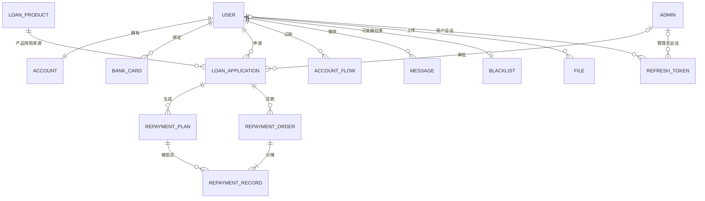

# 03 · 数据库设计（需求分析配套）

> 修订日期：2026年9月22日 · 版本：v1.1（逻辑设计基线，尚未建库）
> Web 用户端、Web 管理端及安卓 App 共用业务表。业务规则以 [02-功能需求分析](02-功能需求分析.md) 为准。
> 本文提供字段、约束与事务设计；§6 只有 DDL 片段，**不是完整初始化脚本**。实现时须编写并验收全部迁移和 seed。

## 1. 设计约定

- MySQL 8.0/InnoDB，字符集 utf8mb4、排序规则 utf8mb4_general_ci。
- 每表包含 id BIGINT 自增主键、create_time、update_time；所有业务表明确非空、外键、唯一键和检查约束。下文省略重复公共字段。
- 金额 DECIMAL(18,2)，费率 DECIMAL(8,4)，费率存百分数：7.2000 表示 7.2%。API 金额、利率和 BIGINT 标识均使用字符串，避免 JavaScript 精度丢失。
- DATETIME 按 Asia/Shanghai 业务时区写入，客户端不得用本地时区改变计息日；审计时间精确到秒。数据库连接时区与应用配置一致。
- 账务记录不物理删除；产品下架、账号冻结使用状态字段。不为金融历史表启用通用逻辑删除。
- 外键不级联删除账务历史。金额非负、已付金额不超应付由 CHECK 与服务层共同检查；跨行合计、权限和状态转换在事务中校验。
- 业务写事务显式使用 READ COMMITTED，并遵循统一用户锁约定；授信汇总在取得用户锁后查询最新已提交数据，不能使用事务早期的旧快照。所有同用户资金/授信变更都必须遵循此约定。

## 2. ER 关系概览



图中实体对应 t_ 小写表名，例如 REPAYMENT_ORDER → t_repayment_order。REFRESH_TOKEN 每行只能属于用户或管理员之一。APPROVAL 使用申请表中的 auditor_id/audit_time/audit_opinion，不引入多对多审批关系；本期单次审批，不支持反复审核。

## 3. 表结构

### 3.1 用户表 t_user

| 字段 | 类型/约束 | 含义 |
| --- | --- | --- |
| username / phone | VARCHAR(50) / VARCHAR(20)，各自 NOT NULL UNIQUE | 登录账号、模拟手机号 |
| password | VARCHAR(255) NOT NULL | 密码哈希，不返回客户端 |
| real_name / id_card | VARCHAR(50) / VARCHAR(18)，可空 | 虚构实名资料 |
| cert_file_id | BIGINT，可空，FK t_file | 模拟认证的证件图片；服务层检查 owner 与 user_id 一致 |
| nickname / email | VARCHAR(50) / VARCHAR(100)，可空 | 个人资料 |
| occupation / address | VARCHAR(50) / VARCHAR(200)，可空 | 职业、地址 |
| monthly_income | DECIMAL(12,2) NOT NULL DEFAULT 0 | 非负收入，后续评分预留 |
| credit_score / credit_level | INT DEFAULT 60 / CHAR(1) DEFAULT 'C'，NOT NULL | 模拟分数/等级 |
| credit_line | DECIMAL(18,2) NOT NULL DEFAULT 50000.00 | 授信总额，非现金 |
| is_real_name / status | TINYINT NOT NULL DEFAULT 0 | 模拟实名 0/1；状态 0 正常、1 冻结 |
| last_login_time | DATETIME，可空 | 最近登录时间 |

注册事务同时创建唯一账户。seed 的演示余额由显式初始化流水记录，不通过修改 balance 绕过账务。t_file 引用用户，用户的可空附件外键可在两表创建后通过迁移添加。

### 3.2 模拟银行卡表 t_bank_card

| 字段 | 类型/约束 | 含义 |
| --- | --- | --- |
| user_id | BIGINT NOT NULL，FK t_user | 所属用户 |
| bank_name / holder_name | VARCHAR(50) NOT NULL | 模拟开户行/持卡人 |
| card_no | VARCHAR(30) NOT NULL | 仅保存虚构测试卡号，展示仅后四位 |
| is_default | TINYINT NOT NULL DEFAULT 0 | 默认卡 0/1 |

唯一(user_id, card_no)。设置默认卡时先锁用户行、清除原默认再设置新默认；不得出现同一用户多张默认卡。真实银行卡接入及加密存储方案不属于本期，不能将“脱敏后的卡号”用于真实扣款。

### 3.3 贷款产品表 t_loan_product

| 字段 | 类型/约束 | 含义 |
| --- | --- | --- |
| name | VARCHAR(100) NOT NULL | 名称 |
| min_amount / max_amount | DECIMAL(18,2) NOT NULL | 0 < min ≤ max |
| annual_rate_min / annual_rate_max | DECIMAL(8,4) NOT NULL | 本期两者相等且 ≥ 0，使用固定成交利率 |
| min_term / max_term | INT NOT NULL | 1 ≤ min ≤ max，单位月 |
| repay_type | TINYINT NOT NULL | 1 等额本息、2 等额本金、3 先息后本；每产品一种 |
| penalty_daily_rate / prepay_fee_rate | DECIMAL(8,4) NOT NULL DEFAULT 0 | 百分数，均非负 |
| status | TINYINT NOT NULL DEFAULT 0 | 0 下架、1 上架 |
| description | TEXT，可空 | 产品说明 |

### 3.4 借款申请表 t_loan_application

| 字段 | 类型/约束 | 含义 |
| --- | --- | --- |
| apply_no | VARCHAR(32) NOT NULL UNIQUE | 业务编号 |
| user_id / product_id | BIGINT NOT NULL，FK 对应表 | 用户、产品 |
| amount / term | DECIMAL(18,2) / INT，NOT NULL | 正金额、正期数 |
| annual_rate / penalty_daily_rate / prepay_fee_rate | DECIMAL(8,4) NOT NULL | 提交时的合同费率快照，后续不随产品改变 |
| repay_type | TINYINT NOT NULL | 提交时还款方式快照 |
| purpose | VARCHAR(200)，可空 | 用途 |
| status | TINYINT NOT NULL DEFAULT 0 | 0 待审核、1 待签约、2 待放款、3 已放款、4 已结清、5 已拒绝、6 已撤销、7 已失效 |
| auditor_id | BIGINT，可空，FK t_admin | 审批人 |
| audit_opinion / audit_time | VARCHAR(200) / DATETIME，可空 | 意见、时间 |
| sign_deadline / signed_at | DATETIME，可空 | 审批通过后 72 小时截止时间、实际签约时间 |
| lend_time / finish_time | DATETIME，可空 | 放款、结清时间 |
| version | INT NOT NULL DEFAULT 0 | 状态更新版本 |

申请的逾期标志由计划聚合，不占用新的 status 值。放款前允许多笔待签约/待放款申请并存，但只允许一笔待审核申请；所有申请创建都先锁用户行检查，也可使用“status=0 时取 user_id，否则 NULL”的生成列唯一索引辅助约束。

### 3.5 还款计划表 t_repayment_plan

| 字段 | 类型/约束 | 含义 |
| --- | --- | --- |
| application_id | BIGINT NOT NULL，FK t_loan_application | 借款 |
| user_id | BIGINT NOT NULL，FK t_user | 冗余归属，创建时与借款一致 |
| period_no / due_date | INT / DATE，NOT NULL | 期数 1..n、到期日期 |
| principal / interest | DECIMAL(18,2) NOT NULL | 原始计划金额，不覆盖 |
| paid_principal / paid_interest / paid_penalty | DECIMAL(18,2) NOT NULL DEFAULT 0 | 累计已付分项 |
| penalty | DECIMAL(18,2) NOT NULL DEFAULT 0 | 累计应计罚息 |
| waived_interest | DECIMAL(18,2) NOT NULL DEFAULT 0 | 提前结清减免的计划利息 |
| last_penalty_date | DATE NOT NULL | 初始为 due_date，计费处理进度 |
| status | TINYINT NOT NULL DEFAULT 0 | 0 未还、1 部分还（保留但本期不产生）、2 已还、3 逾期 |

唯一(application_id, period_no)。CHECK：0 ≤ paid_principal ≤ principal；0 ≤ paid_interest + waived_interest ≤ interest；0 ≤ paid_penalty ≤ penalty。应还余额 = principal − paid_principal + interest − paid_interest − waived_interest + penalty − paid_penalty。

### 3.6 还款订单与分摊记录

**t_repayment_order** 表示一次完整扣款，**t_repayment_record** 表示对计划的分摊。按期还款通常一条分摊，提前结清可包含多条，不能将一笔提前结清强行关联到单个 plan_id。

| 表 | 字段 | 类型/约束 |
| --- | --- | --- |
| t_repayment_order | repay_no | VARCHAR(32) NOT NULL UNIQUE |
| t_repayment_order | application_id / user_id | BIGINT NOT NULL，FK 对应表 |
| t_repayment_order | amount / prepay_fee | DECIMAL(18,2) NOT NULL；fee 默认 0 |
| t_repayment_order | repay_type / repay_time | TINYINT（1 按期、2 提前结清、3 逾期补缴）/ DATETIME，NOT NULL |
| t_repayment_record | order_id / plan_id / user_id | BIGINT NOT NULL，FK 对应表 |
| t_repayment_record | principal / interest / penalty | DECIMAL(18,2) NOT NULL DEFAULT 0 |
| t_repayment_record | waived_interest | DECIMAL(18,2) NOT NULL DEFAULT 0 |

唯一(order_id, plan_id)。订单金额 = 全部分摊本金/利息/罚息之和 + prepay_fee；减免不参与现金扣款。本期订单表只存成功交易，失败整个事务回滚，不产生“失败但余额已扣”的订单。

### 3.7 账户表 t_account

| 字段 | 类型/约束 | 含义 |
| --- | --- | --- |
| user_id | BIGINT NOT NULL UNIQUE，FK t_user | 唯一用户账户 |
| balance | DECIMAL(18,2) NOT NULL DEFAULT 0 | 非负模拟现金余额 |
| version | INT NOT NULL DEFAULT 0 | 更新版本 |

不再用 frozen_amount 表示“冻结授信”；授信占用从未还本金计算。本期没有余额冻结业务，不保留含义模糊的冻结金额字段。

### 3.8 账户流水表 t_account_flow

| 字段 | 类型/约束 | 含义 |
| --- | --- | --- |
| user_id | BIGINT NOT NULL，FK t_user | 账户归属 |
| amount | DECIMAL(18,2) NOT NULL | 正数入账、负数出账 |
| balance_after | DECIMAL(18,2) NOT NULL | 记账后的余额 |
| type | TINYINT NOT NULL | 1 演示初始化/充值、2 放款、3 还款（包含利息/罚息/费用） |
| business_no | VARCHAR(64) NOT NULL UNIQUE | 如 LEND:申请编号、REPAY:还款编号 |
| remark | VARCHAR(200)，可空 | 备注 |

计提罚息只增加应收，不扣账户现金；罚息随还款订单统一扣除，避免再生成一次“罚息扣款”。

### 3.9 消息表 t_message

user_id BIGINT NOT NULL（FK t_user）、title VARCHAR(200) NOT NULL、content TEXT NOT NULL、type TINYINT NOT NULL（1 业务结果、2 还款提醒、3 逾期提醒）、is_read TINYINT NOT NULL DEFAULT 0、event_key VARCHAR(100) NOT NULL。

唯一(user_id, event_key)。例如 REMIND:plan_id:due_date 与 OVERDUE:plan_id:业务日期；审批/放款通知与业务事务一起写入，提醒任务可按事件键重跑。

### 3.10 管理员表 t_admin

username VARCHAR(50) NOT NULL UNIQUE、password VARCHAR(255) NOT NULL、role VARCHAR(20) NOT NULL DEFAULT 'ADMIN'、status TINYINT NOT NULL DEFAULT 0（0 启用、1 禁用）。管理员由 seed 创建，不开放公开注册；不与 t_user 共享 ID 命名空间。

### 3.11 黑名单表 t_blacklist

user_id BIGINT NOT NULL UNIQUE（FK t_user）、reason VARCHAR(200) NOT NULL、operator_id BIGINT NOT NULL（FK t_admin）、active TINYINT NOT NULL DEFAULT 1。移出时设置 active=0，保存操作人及更新时间；本期不要求完整历史轨迹。

### 3.12 风控预留表（本期不建）

t_risk_datasource、t_risk_data_record、t_risk_feature、t_risk_decision、t_risk_rule 仅作后续设计参考，字段见 [06 §3.6](06-扩展与演进规划.md#36-数据表预留)。默认风控服务不得查询不存在的表。

### 3.13 会话表 t_refresh_token（本期建设）

| 字段 | 类型/约束 | 含义 |
| --- | --- | --- |
| user_id / admin_id | BIGINT，可空，分别 FK 用户/管理员 | CHECK 恰有一个非空 |
| client_type / device_id | VARCHAR(10) / VARCHAR(64)，NOT NULL | WEB/ANDROID、随机安装标识（不是硬件身份凭证） |
| token_hash | CHAR(64) NOT NULL UNIQUE | 当前高熵刷新令牌的 SHA-256 摘要，不保存原文 |
| expires_at | DATETIME NOT NULL | 会话固定 7 天有效期，轮换不延长 |
| revoked_at | DATETIME，可空 | 非空表示吊销 |

id 即 JWT 的 sid。刷新时先锁所属用户/管理员行再锁会话行，检查账号与到期时间、比较摘要并原子轮换；旧刷新令牌失效。冻结与吊销遵循相同顺序。业务鉴权检查会话是否有效，退出/冻结后旧 access token 也立即不可用。客户端并发请求共用一次刷新，避免多个请求竞争消费旧令牌。

### 3.14 附件表 t_file（本期建设）

user_id BIGINT NOT NULL（FK t_user）、storage_key VARCHAR(255) NOT NULL UNIQUE、mime_type VARCHAR(50) NOT NULL、size_bytes BIGINT NOT NULL、purpose VARCHAR(30) NOT NULL（本期 IDENTITY_TEST）。

文件内容放在服务端非公开上传目录；元数据记录所属用户。本期仅 JPEG/PNG、≤ 5 MiB，并验证实际文件格式。认证只接受本人已上传附件。按鉴权接口读取，不能把存储路径直接作为公共静态 URL。文件写入与数据库不具备单一事务，失败时清理临时文件，定期清理未引用文件。

### 3.15 幂等记录表 t_business_request（本期建设）

actor_type VARCHAR(10)、actor_id BIGINT、operation VARCHAR(40)、idempotency_key VARCHAR(64)、request_hash CHAR(64)、resource_id BIGINT、response_json JSON，均 NOT NULL；HTTP 状态用 http_status INT NOT NULL 保存。

唯一(actor_type, actor_id, operation, idempotency_key)。成功记录与业务变更在同一数据库事务提交；同键同内容返回原结果，同键不同内容返回 409。并发唯一键竞争后回滚重读，不继续重复记账。失败请求整体回滚，可用原键重试；不依赖短 TTL 缓存保证资金幂等。actor_id 为按 actor_type 区分的主体 ID，由服务层校验归属。

## 4. 关键计算与事务

### 4.1 生成还款计划

使用申请费率快照和放款日生成计划，公式及舍入见 [02 §6.1](02-功能需求分析.md#61-利息计算与金额精度)。所有计划与放款同事务插入，唯一(application_id, period_no) 防重复。零金额计划直接标记已还，不生成零金额订单。

### 4.2 逾期补算

不能仅靠 UPDATE 状态完成计费。以下是事务伪代码：

```text
按借款定位用户，锁用户 → 申请 → 按 ID 排序的计划；
对 due_date < 今日 且 status != 2 的计划：
  天数 = max(0, 今日 - last_penalty_date)；
  每日罚息 = round_half_up((principal - paid_principal) * penalty_daily_rate / 100, 2)；
  penalty += 每日罚息 * 天数；
  last_penalty_date = 今日；
  status = 3；
写入去重提醒消息并提交；
```

还款流程也在扣款前调用同一补算服务。任务只运行一个调度实例；即使发生重跑，数据库锁与计费日期仍保证不重计。

### 4.3 放款事务（纠正余额方向）

```text
BEGIN
  校验管理员身份、请求幂等键；
  依次锁借款人 t_user → 申请 → t_account；
  校验申请 status=2、用户正常且不在黑名单；
  可用额度 = credit_line - 所有已放款未还本金；
  额度不足则回滚；
  balance += 申请金额；version += 1；
  插入唯一 LEND:apply_no 流水（正数）；
  生成完整计划，设置申请 status=3、lend_time；
  写入放款消息及幂等结果；
COMMIT
```

申请、放款、还款、调额、冻结、黑名单变更都遵循同一用户行串行化约定。还款再按申请、账户、计划 ID 顺序加锁，防止互相反向持锁。事务失败整体回滚；死锁可有限重试，继续使用同一幂等键。

### 4.4 还款与余额校验

扣款前补算罚息并重算报价；余额不足或确认金额不符则无扣款。订单、分摊记录、计划已付/减免值、负数流水、账户余额、结清状态及幂等结果一次提交。

用户待还总额：

```sql
SELECT COALESCE(SUM(
  principal - paid_principal
  + interest - paid_interest - waived_interest
  + penalty - paid_penalty
), 0) AS outstanding_amount
FROM t_repayment_plan
WHERE user_id = :user_id AND status <> 2;
```

使用绑定参数。报表须采用 [02 §4.7](02-功能需求分析.md#47-后台管理模块) 的分母和状态口径；“所有借款”不能含尚未放款的申请。

## 5. 关键索引与一致性检查

| 表 | 额外索引/约束 |
| --- | --- |
| t_loan_application | (user_id,status)、(status,sign_deadline)、UNIQUE(apply_no) |
| t_repayment_plan | UNIQUE(application_id,period_no)、(user_id,status)、(status,due_date) |
| t_repayment_order | UNIQUE(repay_no)、(application_id,repay_time) |
| t_repayment_record | UNIQUE(order_id,plan_id)、(plan_id) |
| t_account_flow | UNIQUE(business_no)、(user_id,create_time) |
| t_message | UNIQUE(user_id,event_key)、(user_id,is_read,create_time) |
| t_refresh_token | UNIQUE(token_hash)、(user_id,revoked_at)、(admin_id,revoked_at) |
| t_file | UNIQUE(storage_key)、(user_id,purpose) |
| t_business_request | UNIQUE(actor_type,actor_id,operation,idempotency_key) |

验收时校验：余额 = 全部现金流水合计；已付/减免计划金额 = 分摊记录合计；订单金额 = 分摊金额 + 费用；每笔放款仅一条流水；申请结清后未还本金、利息、罚息均为零。检查要覆盖初始化资金与提前结清，不能只对普通还款成立。

## 6. 建库与迁移示例

下面仅演示库和账户表；执行前须已有 t_user。实现项目应将全部表和约束纳入版本化迁移，不能直接把此片段当成完整建表脚本。

```sql
CREATE DATABASE IF NOT EXISTS loan_platform
  DEFAULT CHARACTER SET utf8mb4 COLLATE utf8mb4_general_ci;
USE loan_platform;

CREATE TABLE t_account (
  id BIGINT PRIMARY KEY AUTO_INCREMENT,
  user_id BIGINT NOT NULL,
  balance DECIMAL(18,2) NOT NULL DEFAULT 0,
  version INT NOT NULL DEFAULT 0,
  create_time DATETIME NOT NULL DEFAULT CURRENT_TIMESTAMP,
  update_time DATETIME NOT NULL DEFAULT CURRENT_TIMESTAMP ON UPDATE CURRENT_TIMESTAMP,
  CONSTRAINT uq_account_user UNIQUE (user_id),
  CONSTRAINT fk_account_user FOREIGN KEY (user_id) REFERENCES t_user(id),
  CONSTRAINT ck_account_balance CHECK (balance >= 0)
) ENGINE=InnoDB COMMENT='借款人模拟现金账户';
```

迁移顺序需处理外键依赖：先用户/管理员/产品，再账户、附件、申请、计划、订单与分摊等；用户附件外键最后添加。seed 应可重复执行而不重复生成余额或流水。M1 验证从空库创建，M4 验证恢复与数据对账。
