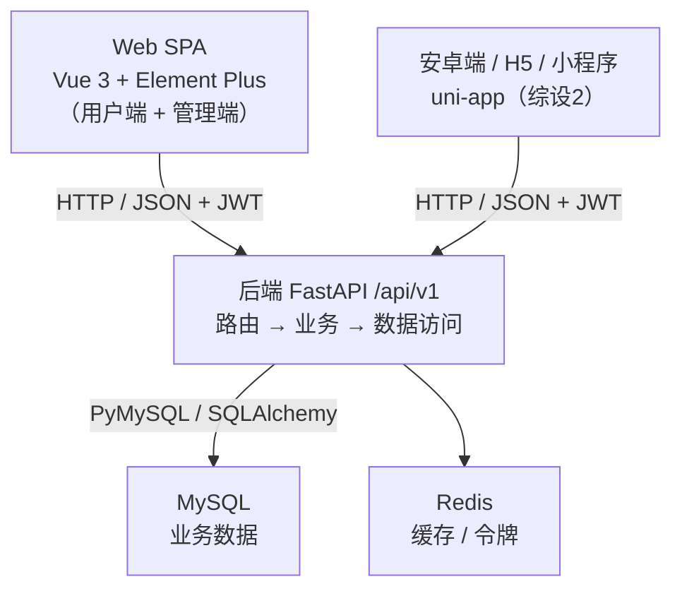
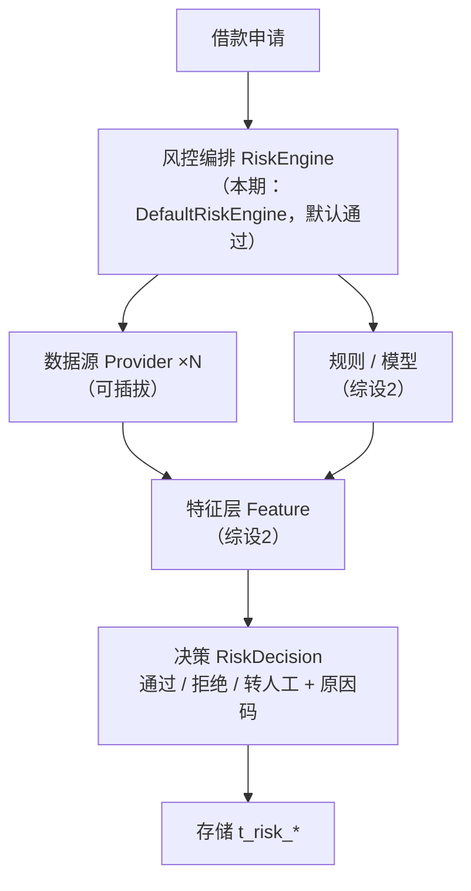

# 06 · 扩展与演进规划

> 本文档汇总本项目（综设1 借贷软件平台）面向**综设2** 及最终项目《多数据融合的贷款系统》的两条扩展路线：**多端适配（安卓端）** 与 **多数据融合风控**。
> 两条路线**本期都只预留骨架、不实现**，不影响本期交付与验收。

---

## 1. 总览

| 扩展方向       | 目标                         | 本期状态                            | 计划                              |
| -------------- | ---------------------------- | ----------------------------------- | --------------------------------- |
| 多端适配       | 支持安卓端（含 H5 / 小程序） | 后端 API 已天然支持多端，本期仅预留 | 综设2 用 uni-app 实现             |
| 多数据融合风控 | 多源数据融合成可解释的决策   | 仅预留接口签名与表结构              | 综设2 单源评分 → 最终项目多源融合 |

**共同前提**：后端采用「前后端分离 + RESTful API + JWT + 统一返回结构 `{code, message, data}`」，**客户端无关、业务规则内聚**，因此两条扩展路线都无需重构后端。

---

## 2. 多端适配与安卓端

### 2.1 背景与结论

借贷类产品在真实场景中以手机为主入口，用户高频操作（申请借款、查看还款计划、还款）多发生在移动端；网页端更多承担运营与管理职责。

| 问题           | 结论                                                              |
| -------------- | ----------------------------------------------------------------- |
| 后端需要重构吗 | **不需要**，安卓端可直接复用同一套 API                            |
| 本期做安卓端吗 | **不做**，本期交付 Web 端（用户端 + 管理端）                      |
| 什么时候做     | 综设2，与信用评分、动态额度同期                                   |
| 用什么技术     | **uni-app**（复用 Vue 3 技能，一套代码编译到 H5 / 安卓 / 小程序） |
| 本期要做什么   | **接口预留**（见 2.5），避免综设2 返工                            |

### 2.2 为什么后端不需要重构

- 后端只暴露 HTTP + JSON 接口，不关心调用方是浏览器、安卓 App 还是小程序；
- 统一返回结构与 `/api/v1` 版本前缀为多客户端提供了稳定的契约；
- JWT 基于请求头鉴权，天然与客户端类型解耦；
- FastAPI 自带的 OpenAPI 文档（`/docs`）可直接作为各端的接口契约来源。



### 2.3 客户端方案选型

| 方案                  | 做法                                        | 成本           | 复用现有技能    | 评价                   |
| --------------------- | ------------------------------------------- | -------------- | --------------- | ---------------------- |
| A. 响应式 Web         | 现有 Vue 加自适应布局，手机浏览器可用       | ⭐ 低          | ✅ Vue          | 性价比高，非原生       |
| B. PWA                | A + manifest + service worker，可加到主屏幕 | ⭐⭐ 低-中     | ✅ Vue          | 演示效果好，仍非真 App |
| C. **uni-app**        | 一套 Vue 语法代码 → 编译 H5 / 安卓 / 小程序 | ⭐⭐⭐ 中      | ✅ **Vue**      | **本项目选定**         |
| D. Flutter / RN       | 跨平台原生渲染                              | ⭐⭐⭐⭐ 中-高 | ❌ 需学 Dart/RN | 性能好，技能栈外       |
| E. 原生安卓（Kotlin） | 真原生体验                                  | ⭐⭐⭐⭐⭐ 高  | ❌ 需学 Kotlin  | 等于多维护一套客户端   |

**选定 uni-app 的理由**：

1. **技能复用度最高**：使用 Vue 语法与组件化思想，团队现有 Vue 3 经验可直接迁移；
2. **一套代码多端运行**：可同时编译 H5、安卓 App、微信小程序，边际成本低；
3. **生态与资料友好**：国内主流方案，中文文档完善、社区活跃；
4. **答辩展示价值高**：能体现工程化思维。

**为什么不选原生安卓 / Flutter**：原生安卓需另一套技术栈（Kotlin + Android SDK），4 人团队学习成本高、等于多维护一套客户端，会挤压利息计算、审批流等答辩重点；Flutter 需学 Dart 且无法复用现有 Vue 生态；React Native 与团队 Vue 技能不匹配。

**用户端与管理端的技术分工**：管理端以桌面为主（大量表格 / 审批 / 报表），保留 **Web + Element Plus**；用户端以移动为主，uni-app 侧重移动体验，Web 端保持响应式兜底。用户端若在 Web 上做移动适配，建议引入 **Vant**（移动端 Vue 组件库）而非硬套桌面向的 Element Plus。

### 2.4 安卓端技术栈

| 层次      | 选型                          | 对应 Web 端  |
| --------- | ----------------------------- | ------------ |
| 框架      | uni-app（Vue 3 语法）         | Vue 3        |
| UI 组件库 | uni-ui / uView Plus           | Element Plus |
| 状态管理  | Pinia                         | Pinia        |
| 网络请求  | `uni.request` 封装            | Axios        |
| 本地存储  | `uni.setStorageSync`          | localStorage |
| 路由      | `pages.json` 配置式           | Vue Router   |
| 打包      | HBuilderX / uni-app CLI → APK | Vite         |

### 2.5 后端需要补充的能力

以下是移动端特有的机制，**建议本期接口设计时就预留**，否则综设2 会返工。

| #   | 能力                 | 本期现状                 | 需要新增                                           | 优先级 |
| --- | -------------------- | ------------------------ | -------------------------------------------------- | ------ |
| 1   | 令牌刷新             | 单 JWT，2 小时过期       | access token + refresh token，`POST /auth/refresh` | 🔴 高  |
| 2   | 文件 / 图片上传      | 实名认证「可简化为表单」 | 证件照 / 人脸上传接口 + 存储方案                   | 🔴 高  |
| 3   | 消息推送             | 仅站内信                 | WebSocket 或轮询（厂商推送可暂不做）               | 🟡 中  |
| 4   | 多端登录策略         | 未定义                   | 明确 Web 与 App 并存的规则，令牌按设备隔离         | 🟡 中  |
| 5   | 接口幂等性           | 仅「防重复提交申请」     | 移动网络易断，重试不重复放款 / 还款                | 🟡 中  |
| 6   | HTTPS / 令牌本地存储 | 未提及                   | 生产强制 HTTPS；App 侧令牌存 Keystore              | 🟢 低  |

**数据库预留**（本期不建表）：`t_refresh_token`（刷新令牌，含设备标识、过期时间、是否吊销）、`t_file`（上传附件元数据）、`t_device`（设备与推送标识，可选）。

### 2.6 安卓端功能范围

安卓端**只做借款人侧**，管理端保留在 Web：

注册 / 登录（含 refresh 自动续期）、实名认证（拍照上传证件）、贷款产品浏览与详情、额度试算、提交借款申请、我的借款 / 还款计划、还款 / 提前还款、消息通知、账户 / 银行卡 / 个人信息。

---

## 3. 多数据融合风控预留

### 3.1 目标与现状差距

最终项目《多数据融合的贷款系统》的核心能力是「多数据融合风控」——汇聚多路数据源（平台自有数据、征信、运营商、电商等），融合成一个**可解释**的风控决策。若本期不预留接口与结构，最终项目将面临推翻重做，而预留的代价很小。

| 多数据融合风控需要什么                        | 当前预留                                      | 差距        |
| --------------------------------------------- | --------------------------------------------- | ----------- |
| 多数据源接入抽象                              | 仅笼统的 `/credit/score`                      | ❌ 缺失     |
| 数据源注册与管理（权重、超时、启停）          | 无                                            | ❌ 缺失     |
| 多源原始数据落地                              | 无                                            | ❌ 缺失     |
| 特征层                                        | 无                                            | ❌ 缺失     |
| 融合评分（规则 + 模型）                       | 4 维**单源**加权（全来自平台自有数据）        | ⚠️ 仅单源   |
| 决策结果模型（通过 / 拒绝 / 转人工 + 原因码） | 仅一个 `credit_score`                         | ⚠️ 不完整   |
| 决策可解释性（命中规则、各源贡献）            | 无                                            | ❌ 缺失     |
| 风控节点嵌入审批流                            | 接口预留了，但未嵌入流程                      | ⚠️ 部分     |
| 外部数据源超时 / 降级                         | 无                                            | ❌ 缺失     |
| 规则可配置                                    | 《01-技术栈分析与选型》明确「不引入规则引擎」 | ❌ 方向相反 |

> 一句话：当前是「给一个用户算一个分」（单源信用评估），而多数据融合风控是「汇聚 N 个来源的数据、融合成一个可解释的决策」。

### 3.2 设计原则

1. **只预留、不实现**：所有风控接口均为骨架 + 默认返回值，不写真实逻辑；
2. **数据源可插拔**：新增数据源只需实现一个 `Provider`，不改动编排层；
3. **决策可解释**：必须能回答「为什么通过 / 为什么拒绝」；
4. **只增不改**：走 `/api/v1`，后续演进只新增字段与接口，不破坏既有契约；
5. **降级可用**：任一数据源超时或失败时，风控仍能给出决策。

### 3.3 目标架构



### 3.4 接口预留

| 方法   | 路径                                    | 本期行为                 | 最终项目行为                 |
| ------ | --------------------------------------- | ------------------------ | ---------------------------- |
| `POST` | `/api/v1/risk/evaluate`                 | 返回固定「通过」决策     | 汇聚多源数据并融合决策       |
| `GET`  | `/api/v1/risk/decision/{applicationId}` | 返回固定的默认决策       | 返回完整决策详情             |
| `GET`  | `/api/v1/risk/datasources`              | 仅返回内置数据源         | 返回多源清单与状态（管理端） |
| `GET`  | `/api/v1/credit/score`                  | 固定返回 60（保留兼容）  | 融合后的信用分               |
| `GET`  | `/api/v1/credit/line`                   | 固定默认额度（保留兼容） | 融合后的授信额度             |

> `/credit/*` 为《02-功能需求分析》§4.4 已预留的接口，继续保留作为风控结果的子集视图。

### 3.5 服务层抽象

本期只定义接口（Protocol）并给出默认实现，不写真实逻辑：

```python
from typing import Protocol
from decimal import Decimal

class RiskDataRecord:
    """单次数据源取数结果"""
    source_code: str
    raw: dict            # 原始返回
    normalized: dict     # 归一化后
    status: str          # success / failed / timeout

class RiskDecision:
    """风控决策结果"""
    decision: str                    # PASS / REJECT / MANUAL
    score: int                       # 融合后的信用分
    level: str                       # A / B / C / D
    credit_line: Decimal             # 建议授信额度
    hit_rules: list[str]             # 命中的规则 / 原因码
    sources: list[RiskDataRecord]    # 参与决策的数据源及其贡献

class RiskDataSourceProvider(Protocol):
    """一类数据源的接入实现（内部 / 征信 / 运营商 / 电商 …）"""
    code: str
    def fetch(self, user_id: int) -> RiskDataRecord: ...

class RiskEngine(Protocol):
    """风控编排：汇聚多源数据 → 融合 → 决策"""
    def evaluate(self, user_id: int, application_id: int) -> RiskDecision: ...
```

本期实现：`RiskEngine` → `DefaultRiskEngine`（直接返回「通过 + 默认分 60 + 默认额度」）；`RiskDataSourceProvider` → `InternalDataProvider`（仅读平台自有数据，预留、不参与评分）。

### 3.6 数据表预留

以下表**本期不建**，仅作为最终项目的结构设计预留。

**数据源注册 `t_risk_datasource`**

| 字段       | 类型         | 说明                                                |
| ---------- | ------------ | --------------------------------------------------- |
| id         | BIGINT PK    | —                                                   |
| code       | VARCHAR(50)  | 数据源编码（唯一），如 `internal` / `credit_bureau` |
| name       | VARCHAR(100) | 数据源名称                                          |
| type       | TINYINT      | 1 内部 / 2 征信 / 3 第三方 / 4 运营商 / 5 电商      |
| weight     | DECIMAL(6,4) | 融合权重                                            |
| timeout_ms | INT          | 调用超时（毫秒）                                    |
| status     | TINYINT      | 0 停用 / 1 启用                                     |
| remark     | VARCHAR(200) | 备注                                                |

**数据快照 `t_risk_data_record`**

| 字段            | 类型        | 说明                     |
| --------------- | ----------- | ------------------------ |
| id              | BIGINT PK   | —                        |
| user_id         | BIGINT      | 用户                     |
| application_id  | BIGINT      | 关联借款申请（可空）     |
| source_code     | VARCHAR(50) | 数据源编码               |
| raw_json        | JSON        | 原始返回数据             |
| normalized_json | JSON        | 归一化后的数据           |
| status          | TINYINT     | 0 失败 / 1 成功 / 2 超时 |
| fetch_time      | DATETIME    | 取数时间                 |

**特征 `t_risk_feature`**

| 字段         | 类型          | 说明                              |
| ------------ | ------------- | --------------------------------- |
| id           | BIGINT PK     | —                                 |
| user_id      | BIGINT        | 用户                              |
| feature_code | VARCHAR(50)   | 特征编码，如 `monthly_income_avg` |
| value        | DECIMAL(18,4) | 特征值                            |
| source_code  | VARCHAR(50)   | 来源数据源                        |
| create_time  | DATETIME      | 生成时间                          |

**决策结果 `t_risk_decision`**

| 字段                | 类型          | 说明                         |
| ------------------- | ------------- | ---------------------------- |
| id                  | BIGINT PK     | —                            |
| application_id      | BIGINT        | 关联借款申请                 |
| user_id             | BIGINT        | 用户                         |
| decision            | TINYINT       | 1 通过 / 2 拒绝 / 3 转人工   |
| score               | INT           | 融合后的信用分               |
| level               | CHAR(1)       | 信用等级                     |
| credit_line         | DECIMAL(18,2) | 建议授信额度                 |
| hit_rules           | JSON          | 命中的规则 / 原因码列表      |
| datasource_snapshot | JSON          | 各数据源贡献快照（可解释性） |
| engine_version      | VARCHAR(20)   | 引擎版本（便于回溯）         |
| decided_at          | DATETIME      | 决策时间                     |

**规则配置 `t_risk_rule`（可选）**

| 字段       | 类型         | 说明                       |
| ---------- | ------------ | -------------------------- |
| id         | BIGINT PK    | —                          |
| rule_code  | VARCHAR(50)  | 规则编码（唯一）           |
| rule_name  | VARCHAR(100) | 规则名称                   |
| expression | VARCHAR(500) | 规则表达式                 |
| priority   | INT          | 优先级                     |
| action     | TINYINT      | 1 通过 / 2 拒绝 / 3 转人工 |
| status     | TINYINT      | 0 停用 / 1 启用            |

### 3.7 与审批流的集成

- **当前流程**：`提交借款申请 → 管理员审批 → 签约 → 放款 → 还款计划`
- **预留后**：`提交借款申请 → 【风控评估节点】→ 管理员审批（风控结论作为参考）→ 签约 → 放款`

风控评估节点本期由 `DefaultRiskEngine` 默认返回「通过」。集成方式：在申请状态机中保留扩展位，风控结论写入 `t_risk_decision`（本期可不落库），管理端审批页预留「风控结论」展示区。

---

## 4. 本期边界

| 类别         | 内容                                                                                                            |
| ------------ | --------------------------------------------------------------------------------------------------------------- |
| 本期**做**   | 后端 API 的移动端友好设计（refresh token、上传、推送接口预留）；`/risk/*` 接口签名与默认实现；`t_risk_*` 表设计 |
| 本期**不做** | 安卓端本体、推送与文件上传的完整实现、真实风控逻辑与规则引擎                                                    |
| 验收说明     | 本期评分与验收**不依赖**这两条扩展路线                                                                          |

---

## 5. 演进路线

| 阶段              | 多端适配                                      | 多数据融合风控                                                               |
| ----------------- | --------------------------------------------- | ---------------------------------------------------------------------------- |
| **综设1（本期）** | Web 端（用户端 + 管理端）；API 预留移动端能力 | 预留 `RiskEngine` / `Provider` 抽象与 `/risk/*` 接口，风控默认通过           |
| **综设2**         | uni-app 安卓端（可选同步产出小程序）          | 实现基于平台自有数据的单源评分；引入规则引擎；信用评分与动态额度落地         |
| **最终项目**      | 多端登录策略、推送完善                        | 接入多路外部数据源（征信 / 运营商 / 电商等）；多数据融合决策；可解释性与降级 |

---

## 6. 风险与对策

| 风险                               | 对策                                                                |
| ---------------------------------- | ------------------------------------------------------------------- |
| uni-app 无法复用 Element Plus 组件 | 用户端本就应做移动优先 UI，改用 uni-ui / uView Plus；管理端留在 Web |
| 一套代码多端表现不一致             | 优先保证 H5 与安卓两端质量，小程序按需再适配                        |
| 后端接口变更影响双端               | 接口契约先行 + `/api/v1` 版本管理；接口只增不改，破坏性变更走 v2    |
| 团队无人做过 uni-app               | 官方中文文档完善；先用 H5 模式验证，再打 APK                        |
| 预留过度导致本期复杂化             | 只定义接口签名与默认实现，不写逻辑、不建表                          |
| 外部数据源不可得（课程环境）       | 用 Mock Provider 模拟多源；结构真实、数据虚构                       |
| 决策不可解释导致答辩被质疑         | 决策结果保留 `hit_rules` 与 `datasource_snapshot` 字段              |
| 两条扩展挤压本期进度               | 明确二者均属综设2，本期不启动，避免范围蔓延                         |

---

## 7. 相关文档

- 总体架构与前端选型：[01-技术栈分析与选型.md](01-技术栈分析与选型.md)
- 功能模块、非功能需求与预留接口：[02-功能需求分析.md](02-功能需求分析.md)
- 数据表结构与 `t_risk_*` 预留：[03-数据库设计.md](03-数据库设计.md)
- 团队分工与开发规范：[04-团队分工与开发规范.md](04-团队分工与开发规范.md)
