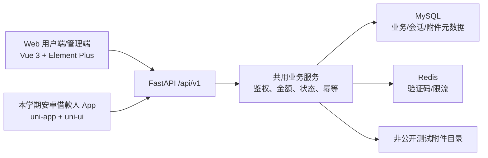
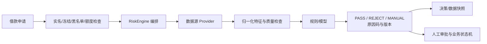

# 06 · 扩展与演进规划

> 修订日期：2026年9月22日 · 版本：v1.1（规划，尚未实现）
> 安卓借款人 App 属于**本学期必须交付项**。信用评分、动态额度与多数据融合仍为后续阶段内容。

## 1. 范围总览

| 路线 | 本学期交付 | 后续阶段 |
| --- | --- | --- |
| 客户端 | Web 用户端、Web 管理端、uni-app 安卓 APK；复用相同 API/数据 | 按需要验证小程序、H5 独立发行、厂商推送 |
| 风控 | 黑名单业务检查；带 is_mock 标记的默认评分/决策接口；数据结构设计 | 单源评分、动态额度，再评估多数据融合和可解释决策 |

本仓库只有文档。下面“本期实现”表示计划任务，不代表已有 API 或表。后端客户端无关的设计可减少重复业务逻辑，但会话、上传、幂等等能力仍须实际开发；不能由“采用 RESTful”推导后端无需任何改动。

## 2. 本学期安卓端交付

### 2.1 目标与边界

App 只提供借款人功能，管理员继续在 Web 完成审批和放款。Web 用户端仍交付；小程序、厂商推送、人脸识别和真实支付不在本期验收。H5 仅可用作 uni-app 调试辅助，H5 页面跑通不能替代 APK 真机验收。

### 2.2 架构与接口复用



Web 使用 Axios，App 使用 uni.request；二者复用契约、状态枚举和数据验证约定，不直接共享 Element Plus 页面。管理权限由服务端执行，隐藏菜单不能替代权限校验。

### 2.3 方案选型依据

| 方案 | 适用性 | 本项目选择 |
| --- | --- | --- |
| 响应式 Web/PWA | 实现快，适合浏览器入口 | 可改善 Web 体验，不能替代本期 APK 交付 |
| uni-app（Vue 3） | 复用 Vue 技能，有平台差异及打包成本 | 选定；仅保证本期安卓目标 |
| Kotlin 原生 | 原生能力直接，需独立安卓技能 | 本期不采用 |
| Flutter/React Native | 可跨端，需额外 Dart/React 技能 | 本期不采用 |

选型基于课程时间和技能复用，不是性能实测排名。“一套代码可编译多端”不意味着所有组件、插件和权限行为一致，每新增一个目标平台都要安排验证。

### 2.4 技术栈与打包

| 层次 | 本期选择 | 实施约束 |
| --- | --- | --- |
| 框架/UI | uni-app Vue 3 + uni-ui | uView Plus 仅作备选，不同时混用两套组件库 |
| 状态/路由 | Pinia / pages.json | 清理失效会话，按用户身份限制页面 |
| 网络 | uni.request 统一封装 | 统一错误、单次刷新、幂等键、环境 API 地址 |
| 存储 | 非敏感偏好用 uni storage；刷新令牌用经验证的 Android 安全存储适配 | 不把 uni.setStorageSync 当作加密存储，不保存明文密码；适配方案在 M1 验证 |
| 构建 | HBuilderX 配套 App 打包流程 | CLI 资源构建不等于已生成 APK；签名、账号、网络与构建条件须验证 |
| 交付 | 签名 APK、安装/版本说明 | 签名私钥不入库，记录包名、版本、构建环境与测试设备 |

App 的 access token 保存在内存；重启后从安全存储读取 refresh token 换取新令牌。Web 基线为当前页面会话保存在内存，刷新页面后重新登录，避免为课程演示另引入持久化凭证策略。

### 2.5 本学期后端配套能力

| 能力 | 明确行为 | 主责/数据依据 |
| --- | --- | --- |
| 刷新与吊销 | access token 2 小时；会话固定 7 天；刷新令牌轮换；退出吊销当前会话，冻结吊销全部会话 | A；t_refresh_token |
| 多端登录 | Web 与 App 可以并存，每次登录独立 sid；device_id 为安装标识，不作身份凭据 | A；[04 §6.2](04-团队分工与开发规范.md#62-会话契约) |
| 基础上传 | POST /api/v1/files，multipart/form-data；JPEG/PNG 测试图片 ≤5 MiB；返回 file_id | A；t_file，私有存储 |
| 附件读取 | GET /api/v1/files/{id}；只允许所属用户或管理员，返回图片字节 | A；不是公开静态路径；JSON 响应封装仅用于元数据/错误 |
| 消息 | 前台每 30 秒查询未读数，进入消息页刷新；后台暂停轮询 | A/全栈；t_message 事件唯一键 |
| 写操作幂等 | 超时或续期后的重试沿用原键；数据库幂等结果与记账原子提交 | B；t_business_request 与状态/流水唯一键 |
| 网络 | 正式部署 HTTPS；手机使用可访问 IP/域名 | 全栈；局域网 HTTP 仅隔离演示配置允许，不混入交付配置 |

会话、文件、幂等表都纳入本学期建设，字段见 [03 §3.13–3.15](03-数据库设计.md#313-会话表-t_refresh_token本期建设)。无需单独建 t_device：本期设备标识放在会话表，厂商推送标识以后再设计。上传仅使用虚构测试图片，不调用真实身份或人脸核验服务。

### 2.6 功能与验收覆盖

App 必需功能：注册/登录/退出/续期、模拟实名与图片、个人资料/模拟卡、产品列表/详情、试算、申请/撤销/签约、借款记录、还款计划、按期/逾期还款、提前结清、账户/流水、站内消息。

接口结果是权威金额；端上不得重新决定年利率或本息。验收除成功路径，还要覆盖：401 续期、登录失效、断网后结果查询、重复点击、文件越权/格式错误、余额不足、审批拒绝、签约超时和跨端状态刷新。

### 2.7 本学期实施计划与验收

| 阶段 | 主责 | 安卓交付及退出条件 |
| --- | --- | --- |
| M1，第 1–2 周 | 全栈；A 提供认证接口，前端协助 UI | mobile/ 骨架、真机测试 APK、登录/刷新、网络及安全存储验证；记录最低支持版本与演示设备 |
| M2，第 3–5 周 | 全栈；A/B 提供接口 | 模拟认证及上传、产品/试算、提交/撤销/签约，与 Web 审批联调通过 |
| M3，第 6–9 周 | 全栈；B 主责资金，A 主责消息 | 计划、还款/提前结清、余额流水和消息；弱网重试不重复扣款 |
| M4，第 10–12 周 | 全栈；全员回归 | 签名 APK 安装、完整闭环、用户手册、设备/构建记录，核心阻塞问题为零 |

M1 就打包验证，不把首次 APK 构建留到 M4。验收端到端路线为“App 申请 → Web 审批 → App 签约 → Web 放款 → App 还款/结清”。

## 3. 多数据融合风控预留

### 3.1 本期与目标差距

| 能力 | 本学期设计 | 后续需要的证据 |
| --- | --- | --- |
| 数据源 | Provider 抽象、internal 元信息；不拉外部数据 | 数据合法来源、授权、格式/时效与缺失处理 |
| 评分 | 固定 60/C，is_mock=true | 可复现特征、规则或模型验证，不能将固定值称作有效评分 |
| 决策 | 模拟 PASS，仅供接口联调 | 原因码、规则/模型版本、人工审批处理 |
| 存储 | t_risk_* 仅设计，不建表 | 决策与数据快照可追踪、保留期限和访问权限 |
| 动态额度 | 不实现，读取用户配置授信 | 额度规则验证及现有债务约束 |
| 降级 | 本期无外部依赖 | 超时/缺失返回 MANUAL 或拒绝自动决策，不能静默 PASS |

本期没有独立规则引擎并不与后续演进矛盾；只有在规则规模和验证需求明确后再引入，避免为了未来可能性增加本期负担。

### 3.2 设计原则

1. 区分模拟与真实结果；模拟默认值必须有 is_mock 标记。
2. 黑名单、冻结、实名、额度与人工审批独立于模型，默认 PASS 不能覆盖这些检查。
3. Provider 可替换，但数据质量与接口兼容性仍需验证。
4. 破坏性 API 变更须版本化；新规则先验证再启用。
5. 未来评分失败转人工，不以“降级可用”为由自动放贷。

### 3.3 目标架构（后续阶段）



该图描述后续目标；本期引擎只返回模拟结果，不需要特征表或模型服务。

### 3.4 接口预留与权限

| 方法/路径（前缀 /api/v1） | 本期行为 | 调用权限 |
| --- | --- | --- |
| POST /risk/evaluate | 模拟 PASS、默认 60/C、is_mock=true | 管理员；申请服务可内部调用 |
| GET /risk/decision/{applicationId} | 已存在申请的模拟结果，不伪造持久化历史 | 本人/管理员，必须校验资源归属 |
| GET /risk/datasources | internal 元信息 | 管理员 |
| GET /credit/score | 默认 60/C，is_mock=true | 本人 |
| GET /credit/line | 用户当前配置授信 | 本人，不接受客户端指定额度 |

风险评估结果不会直接改变申请状态。额度读取实际用户配置，不能被引擎常量 50000 覆盖管理员调整值。

### 3.5 服务层抽象

以下代码只定义数据对象与接口形状，不是评分实现：

```python
from dataclasses import dataclass, field
from decimal import Decimal
from typing import Any, Literal, Protocol

@dataclass
class RiskDataRecord:
    source_code: str
    status: Literal["success", "failed", "timeout"]
    normalized: dict[str, Any] = field(default_factory=dict)

@dataclass
class RiskDecision:
    decision: Literal["PASS", "REJECT", "MANUAL"]
    score: int
    level: str
    credit_line: Decimal
    is_mock: bool
    engine_version: str
    hit_rules: list[str] = field(default_factory=list)

class RiskDataSourceProvider(Protocol):
    code: str
    def fetch(self, user_id: int) -> RiskDataRecord: ...

class RiskEngine(Protocol):
    def evaluate(self, user_id: int, application_id: int) -> RiskDecision: ...
```

本期计划由 DefaultRiskEngine 读取用户配置授信并返回模拟 PASS、60/C、版本 mock-v1。Provider 本期仅定义抽象，数据源列表返回静态 internal 元信息；不实现真实取数或默认查询不存在的 t_risk_* 表。

### 3.6 数据表预留

以下表**本期不建**，仅作为最终项目的结构设计预留。

**数据源注册 `t_risk_datasource`**

| 字段       | 类型         | 说明                                                |
| ---------- | ------------ | --------------------------------------------------- |
| id         | BIGINT PK    | —                                                   |
| code       | VARCHAR(50)  | 数据源编码（唯一），如 `internal` / `credit_bureau` |
| name       | VARCHAR(100) | 数据源名称                                          |
| type       | TINYINT      | 1 内部 / 2 征信 / 3 第三方 / 4 运营商 / 5 电商      |
| weight     | DECIMAL(6,4) | 融合权重                                            |
| timeout_ms | INT          | 调用超时（毫秒）                                    |
| status     | TINYINT      | 0 停用 / 1 启用                                     |
| remark     | VARCHAR(200) | 备注                                                |

**数据快照 `t_risk_data_record`**

| 字段            | 类型        | 说明                     |
| --------------- | ----------- | ------------------------ |
| id              | BIGINT PK   | —                        |
| user_id         | BIGINT      | 用户                     |
| application_id  | BIGINT      | 关联借款申请（可空）     |
| source_code     | VARCHAR(50) | 数据源编码               |
| raw_json        | JSON        | 原始返回数据             |
| normalized_json | JSON        | 归一化后的数据           |
| status          | TINYINT     | 0 失败 / 1 成功 / 2 超时 |
| fetch_time      | DATETIME    | 取数时间                 |

**特征 `t_risk_feature`**

| 字段         | 类型          | 说明                              |
| ------------ | ------------- | --------------------------------- |
| id           | BIGINT PK     | —                                 |
| user_id      | BIGINT        | 用户                              |
| feature_code | VARCHAR(50)   | 特征编码，如 `monthly_income_avg` |
| value        | DECIMAL(18,4) | 特征值                            |
| source_code  | VARCHAR(50)   | 来源数据源                        |
| create_time  | DATETIME      | 生成时间                          |

**决策结果 `t_risk_decision`**

| 字段                | 类型          | 说明                         |
| ------------------- | ------------- | ---------------------------- |
| id                  | BIGINT PK     | —                            |
| application_id      | BIGINT        | 关联借款申请                 |
| user_id             | BIGINT        | 用户                         |
| decision            | TINYINT       | 1 通过 / 2 拒绝 / 3 转人工   |
| score               | INT           | 融合后的信用分               |
| level               | CHAR(1)       | 信用等级                     |
| credit_line         | DECIMAL(18,2) | 建议授信额度                 |
| hit_rules           | JSON          | 命中的规则 / 原因码列表      |
| datasource_snapshot | JSON          | 各数据源贡献快照（可解释性） |
| engine_version      | VARCHAR(20)   | 引擎版本（便于回溯）         |
| decided_at          | DATETIME      | 决策时间                     |

**规则配置 `t_risk_rule`（可选）**

| 字段       | 类型         | 说明                       |
| ---------- | ------------ | -------------------------- |
| id         | BIGINT PK    | —                          |
| rule_code  | VARCHAR(50)  | 规则编码（唯一）           |
| rule_name  | VARCHAR(100) | 规则名称                   |
| expression | VARCHAR(500) | 规则表达式                 |
| priority   | INT          | 优先级                     |
| action     | TINYINT      | 1 通过 / 2 拒绝 / 3 转人工 |
| status     | TINYINT      | 0 停用 / 1 启用            |

上述为候选逻辑字段，不是可直接执行的 DDL。后续补充外键、唯一键和快照版本：特征须能定位评估批次，决策须关联申请及引擎版本；JSON 字段不得无限保留原始敏感资料。规则配置只支持白名单表达式，不直接执行任意 Python/SQL。

### 3.7 与审批流的集成

本期流程：校验实名/冻结/黑名单/额度 → 创建申请 → 内部模拟评估 → 管理员审批 → 签约 → 再次校验并放款。模拟评估不写 t_risk_decision；管理端显示“模拟结果，仅用于联调”，不显示为真实已通过风控。

后续启用真实评估时，记录决策快照与原因码；失败或缺失进入人工判断，所有放款仍经过独立业务校验。

## 4. 本期边界与验收

| 项目 | 验收要求 |
| --- | --- |
| 安卓 | 必须交付可安装 APK 与完整借款人流程 |
| 后端配套 | 刷新/吊销、上传/归属、幂等、站内消息实际可用 |
| 风控预留 | 接口能返回可识别的模拟值，权限正确且不绕过业务检查 |
| 后续能力 | 不把小程序、厂商推送、真实风控效果作为本期通过条件 |

## 5. 演进路线

| 阶段 | 客户端 | 风控 |
| --- | --- | --- |
| 本学期综设1 | Web + 安卓 APK、基本会话与消息 | 黑名单 + 默认接口、候选表设计 |
| 后续阶段 | 设备管理、厂商推送、小程序按需排期 | 验证单源评分、动态额度与规则管理 |
| 最终项目 | 持续完善体验 | 在数据可得且授权明确时评估多源融合、可解释性及降级 |

## 6. 风险与对策

| 风险 | 处理方式 |
| --- | --- |
| uni-app 平台差异 | 使用明确支持 App 的组件/插件，H5 和真机分别验证 |
| APK 打包/签名受阻 | M1 完成最小安装包，记录账号/网络/工具条件及可用备选路径 |
| 全栈同时承担安卓和集成 | A/B 自负迁移与测试，前端协助移动页面，每周核对负荷 |
| 双端接口变化 | 版本化契约、联调记录；金额/状态变更须同时回归 |
| 可选扩展挤占进度 | 冻结 P0 范围，风控不扩展到真实取数或评分 |
| 外部数据不可得 | 后续可用明确标记的 Mock 验证流程，不据此宣称评分有效 |

## 7. 相关文档

- [01-技术栈分析与选型](01-技术栈分析与选型.md)：依赖与构建约束。
- [02-功能需求分析](02-功能需求分析.md)：唯一业务规则基线。
- [03-数据库设计](03-数据库设计.md)：会话、文件、幂等与账务数据。
- [04-团队分工与开发规范](04-团队分工与开发规范.md)：责任、契约及验收。
