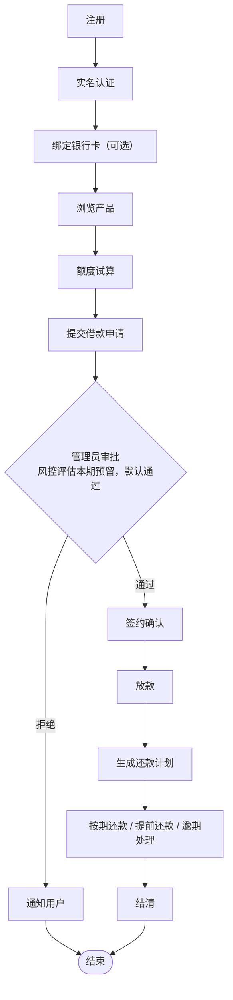

# 需求分析报告 · 第一部分（总述与外部接口）

> **覆盖章节**：1. 引言 · 2. 综合描述 · 3. 外部接口需求
> **负责人**：＿＿＿＿＿　**状态**：初稿（整合自现有文档）　**计划完成**：第 ＿＿ 周
> **配套文件**：[00-框架与分工.md](00-框架与分工.md)
> **标记说明**：`〔待确认〕`＝需团队拍板；`〔待补充〕`＝需补充素材。定稿后删除所有标记。

---

## 1. 引言

### 1.1 编写目的

本报告为**借贷软件平台（FinLend）**编写，该产品面向高校「综合设计 1」课程设计项目（版本 v1.0）。

开发该平台的意义在于：以一个**完整的借贷业务闭环**（注册认证 → 借款申请 → 审批放款 → 按期还款）为载体，训练团队在需求分析、系统设计与工程协作方面的能力。产品的核心目标为「**业务流程跑通 + 关键业务规则正确**」，其中利息计算、审批流转、还款与逾期处理是关键业务规则。

本报告详尽说明该软件产品的需求规格，作为后续概要设计、详细设计、编码、测试与验收的依据。**覆盖范围**：本期（综设1）交付的 Web 端用户端与管理端。信用评分、动态授信额度、多端适配（安卓端）与多数据融合风控属综设2 及最终项目的扩展内容，本期**仅预留接口**，详见《06-扩展与演进规划》。

### 1.2 项目风险

本阶段涉及三类风险承担者：

| 风险承担者 | 本项目对应方        | 本阶段主要风险                                                                         |
| ---------- | ------------------- | -------------------------------------------------------------------------------------- |
| 任务提出者 | 课程组 / 指导教师   | 需求理解偏差导致交付物与课程要求不符；验收标准不够明确                                 |
| 软件开发者 | 4 人开发团队        | 需求分析不充分导致后期返工；业务规则（利息 / 审批 / 逾期）理解错误；进度延误；技能不足 |
| 产品使用者 | 模拟借款人 / 管理员 | 功能与真实借贷习惯不符；关键操作路径不顺畅；错误提示不清晰                             |

〔待确认〕是否需要补充风险的发生概率、影响程度与应对措施（可引用《00-可行性分析报告》§4.3 与《04-团队分工与开发规范》§6）。

### 1.3 文档约定

**排版约定**：正文为中文；专业术语首次出现时给出英文原词；需求以表格形式列出；图表统一用 Mermaid 绘制。

**符号约定**：⚠️ 表示本项目**不采用**的技术或方案。

**需求编号规则**：

| 类型       | 格式                   | 示例                        |
| ---------- | ---------------------- | --------------------------- |
| 功能需求   | `FR-<模块代号>-<序号>` | `FR-AUTH-01`、`FR-LOAN-03`  |
| 非功能需求 | `NFR-<类别>-<序号>`    | `NFR-PERF-01`、`NFR-SEC-01` |
| 用例       | `UC-<序号>`            | `UC-01`                     |
| 待定问题   | `Q-<序号>`             | `Q-01`                      |

**模块代号**：`AUTH` 用户与认证 · `PROD` 贷款产品 · `LOAN` 借款申请 · `RISK` 风控与信用评估 · `LEND` 放款与账户 · `REPAY` 还款 · `ADMIN` 后台管理 · `MSG` 消息通知。

**优先级定义**：高 / 中 / 低三档，与《02-功能需求分析》§9 的 P0 / P1 / P2 对应（P0＝高，P1＝中，P2＝低）。

**需求继承性**：高层次需求（如"支持完整借贷流程"）可被其细化的需求继承；每条细化需求**各自具有独立的优先级**。

### 1.4 预期读者和阅读建议

| 读者类型            | 关注重点                             | 阅读建议                                 |
| ------------------- | ------------------------------------ | ---------------------------------------- |
| 指导教师 / 答辩评委 | 需求完整性、业务规则正确性、可追溯性 | 通读；重点看 §5 功能需求与 §6.5 业务规则 |
| 后端开发人员        | 功能实现细节、输入输出数据、异常处理 | 精读 §5、§8；重点看 §5.3 的计算公式      |
| 前端开发人员        | 外部接口需求、用户界面逻辑特征       | 精读 §3；配合 §4 用例的场景描述          |
| 全栈 / 统稿人       | 全局一致性                           | 通读；负责术语、编号、图表的一致性检查   |
| 测试人员            | 可验证性                             | 依据 §5.1 逐条功能需求设计测试用例       |

**文档其余部分的内容与组织结构**：§1 引言为总览；§2 综合描述给出产品全貌；§3 界定外部接口；§4、§5 为需求主体（用例设计与功能需求）；§6 为非功能需求与业务规则；§7~§9 为词汇表、数据定义与分析模型；§10 记录待定问题。

### 1.5 产品范围

本产品是一个**基础的借贷软件平台**：用户注册并实名认证后在线申请借款，系统进行审批，审批通过后放款，用户按还款计划偿还本金与利息；管理员在后台管理用户、贷款产品、审批流程与逾期催收。

**产品目标**：以「业务流程跑通 + 关键业务规则正确」为核心，产出一个可运行、可演示、可答辩的完整闭环系统。

**范围边界**：

| 类别              | 内容                                                                                                                |
| ----------------- | ------------------------------------------------------------------------------------------------------------------- |
| 本期（综设1）交付 | Web 端（借款人用户端 + 管理员管理端）：注册认证、产品浏览、借款申请、审批、放款、还款计划、还款、逾期罚息、后台管理 |
| 本期不做          | 真实资金通道、真实征信接入、信用评分与动态额度（仅预留接口）、安卓端（综设2）                                       |
| 本期预留          | 风控评估接口 `/risk/*`、`t_risk_*` 表设计、移动端接口（refresh token / 上传 / 推送）                                |

### 1.6 参考文献

| 序号 | 名称                             | 编号 / 版本 | 来源           |
| ---- | -------------------------------- | ----------- | -------------- |
| [1]  | 借贷软件平台项目说明（README）   | v1.0        | 本项目仓库     |
| [2]  | 00-可行性分析报告                | v1.0        | 本项目 `docs/` |
| [3]  | 01-技术栈分析与选型              | v1.0        | 本项目 `docs/` |
| [4]  | 02-功能需求分析                  | v1.0        | 本项目 `docs/` |
| [5]  | 03-数据库设计                    | v1.0        | 本项目 `docs/` |
| [6]  | 04-团队分工与开发规范            | v1.0        | 本项目 `docs/` |
| [7]  | 05-术语表                        | v1.0        | 本项目 `docs/` |
| [8]  | 06-扩展与演进规划                | v1.0        | 本项目 `docs/` |
| [9]  | 软件项目报告模板（含附录 A~E）   | —           | 课程提供       |
| [10] | FastAPI / Vue 3 / MySQL 官方文档 | 最新        | 各项目官方网站 |

---

## 2. 综合描述

### 2.1 产品的状况

本产品为**新建产品**，属于「**新型的、自主型的产品**」——不是既有产品系列的延伸，也不是成熟产品的升级替代。

**与其它系统的关系**：本产品是最终项目《**多数据融合的贷款系统**》的**前置阶段**。演进关系如下：

| 阶段            | 产品形态                                                    |
| --------------- | ----------------------------------------------------------- |
| 综设1（本产品） | 基础借贷平台：完整业务闭环 + Web 端                         |
| 综设2           | 增加安卓端（uni-app）、信用评分与授信额度动态计算、规则引擎 |
| 最终项目        | 扩展为多数据源融合风控的贷款系统                            |

**外部接口**：本期不与真实银行、征信机构、支付通道对接，外部依赖仅为基础软件（操作系统、数据库、缓存），接口定义见 §3。

### 2.2 产品的功能

本产品在业务层面划分为 **8 个功能模块**：

```
借贷软件平台
├── 1. 用户模块
├── 2. 贷款产品模块
├── 3. 借款申请模块
├── 4. 风控与信用评估模块（本期预留接口）
├── 5. 放款与账户模块
├── 6. 还款模块
├── 7. 后台管理模块
└── 8. 消息通知模块
```

借款主流程（顶层数据流程）：



> 各模块的详细功能需求见 §5，本节仅作业务层概览，**不重复展开**。

**非作用领域**（明确不做，以免误解）：不从事真实放贷经营、不提供真实资金通道、不接入征信数据、不处理真实个人敏感信息。

### 2.3 用户类和特性

| 用户类 | 重要程度 | 特征                                             | 主要诉求                                           |
| ------ | -------- | ------------------------------------------------ | -------------------------------------------------- |
| 借款人 | **重要** | 已实名认证的个人用户，熟悉网页 / 手机基本操作    | 快速了解产品、便捷提交申请、清晰查看还款计划与还款 |
| 管理员 | **重要** | 平台运营人员，承担审批与风控职责，需处理批量数据 | 高效处理审批、管理产品与用户、掌握逾期情况         |

**附加用户类**：本期**无**。本产品不通过报表、应用程序接口或系统硬件接口向外部人员或机构提供数据服务，因此不存在附加用户类及其需求。

### 2.4 运行环境

| 类别           | 内容                                                                            |
| -------------- | ------------------------------------------------------------------------------- |
| 硬件平台       | 服务端：x86_64 通用服务器或开发机；客户端：PC（桌面浏览器）、手机（移动浏览器） |
| 操作系统       | 开发与演示：Windows 10 / 11；服务端亦可运行于 Linux                             |
| 支撑环境       | MySQL 8.0（关系型数据库）、Redis（缓存 / 验证码 / 令牌黑名单）                  |
| 其它软件组件   | Python 3.11+（后端运行时）、Node.js 18+（前端构建）                             |
| 共存的应用程序 | 无特殊要求，可与常规办公软件共存                                                |

### 2.5 设计和实现上的限制

| 限制类型          | 具体内容                                                                                                     |
| ----------------- | ------------------------------------------------------------------------------------------------------------ |
| 必须使用的技术    | Python 3.11+ / FastAPI（后端）、Vue 3 + Element Plus（前端）、MySQL 8.0、Redis                               |
| 避免使用的技术 ⚠️ | 微服务架构、消息队列（RabbitMQ / Kafka）、分布式事务、规则引擎（本期）、原生安卓 App（本期）                 |
| 必须遵循的规范    | RESTful 接口设计；统一返回结构 `{code, message, data}`；金额必须使用 `DECIMAL` / `Decimal`，**严禁 `float`** |
| 硬性技术约束      | 需要 JWT 鉴权与角色校验；放款须在事务内完成并防止并发超额                                                    |
| 课程与资源约束    | 课程周期有限；4 人团队；无经费预算；使用团队自有设备                                                         |
| 法规与标准        | 本项目为教学演示系统，不从事真实放贷业务，不触发金融牌照要求；全部使用虚构数据，不采集真实个人信息           |

### 2.6 假设和约束（依赖）

**假设因素**（若不成立将影响项目）：

1. 不接入真实支付通道，放款采用**账户记账**方式模拟；
2. 不接入外部征信，信用分使用**固定默认值**（60，等级 C）；
3. 全部使用**虚构测试数据**，不涉及真实用户信息；
4. 使用者具备基本借贷概念（本金、利息、期数、逾期等）。

**约束因素（依赖）**：

| 约束类型 | 内容                                          |
| -------- | --------------------------------------------- |
| 工期约束 | 需在课程周期内完成，里程碑 M1~M4              |
| 人员约束 | 固定 4 人，按《04》§2 分工                    |
| 设备约束 | 使用团队自有电脑，无专用服务器                |
| 经费约束 | 无经费，全部采用开源免费技术                  |
| 环境约束 | 课程环境无法获取外部数据源，外部数据一律 Mock |

---

## 3. 外部接口需求

> 本章描述**接口本身**的需求，不描述通过接口取得服务的人的需求（后者见 §2.3 附加用户类）。

### 3.1 用户界面

**GUI 标准**：采用基于 Element Plus 组件库的桌面端 Web 界面，统一布局为「顶部导航 + 侧边菜单 + 内容区」。

**屏幕布局限制**：管理端以表格与表单为主，内容区宽度自适应；用户端页面适配浏览器窗口宽度。本期不做移动端专属布局（综设2 由 uni-app 承担）。

**界面软件组件**：选单、标准按钮、导航链接、数据表格、表单控件、弹窗、全局消息栏、分页控件、图表。

**显示格式规定**：

| 数据类别 | 格式规定                                                         |
| -------- | ---------------------------------------------------------------- |
| 金额     | 固定两位小数，**右对齐**，带千分位（如 `12,345.67`），单位「元」 |
| 利率     | 百分比数值，保留两位小数（如 `7.20%`）                           |
| 日期     | `YYYY-MM-DD`                                                     |
| 时间     | `YYYY-MM-DD HH:mm:ss`                                            |
| 比例     | 百分比，保留两位小数                                             |

**错误信息显示标准**：采用「全局消息提示 + 表单字段级错误」两层呈现；错误信息使用**中文业务表述**，不暴露技术堆栈细节。后端统一返回 `{ code, message, data }`，`code = 0` 表示成功，非 0 为错误码，前端按 code 统一处理。

〔待确认〕Q-07：是否需要在本报告内列出**完整错误码表**？（建议：本报告给出错误码分段规则，完整码表留到概要设计阶段。）

### 3.2 硬件接口

**不适用。**

本系统为纯软件平台，不与特定硬件设备交互，无硬件接口需求，不涉及硬件类型、控制信息与通讯协议。

### 3.3 软件接口

| 外部组件   | 名称与版本               | 接口方式                      | 交换的数据 / 目的                          |
| ---------- | ------------------------ | ----------------------------- | ------------------------------------------ |
| 操作系统   | Windows 10 / 11 或 Linux | 运行时宿主                    | 提供进程与文件系统能力                     |
| 数据库     | MySQL 8.0                | PyMySQL 驱动 / SQLAlchemy 2.x | 全部业务数据的持久化读写                   |
| 缓存       | Redis                    | redis-py 客户端               | 验证码（5 分钟过期）、令牌黑名单、热点缓存 |
| 接口文档   | FastAPI 内置 OpenAPI     | HTTP（`/docs`）               | 对外提供接口契约，供前端与测试查阅         |
| 前端运行时 | Node.js 18+              | 构建期                        | 构建前端静态资源                           |
| 身份凭证   | PyJWT / passlib[bcrypt]  | 库调用                        | 令牌签发与校验、密码哈希                   |
| 定时任务   | APScheduler              | 库调用                        | 逾期检测、还款提醒                         |

**说明**：本期**不集成**任何商业中间件、消息服务或第三方开放平台。

### 3.4 通讯接口

| 项目            | 需求                                                                                       |
| --------------- | ------------------------------------------------------------------------------------------ |
| 网络通讯协议    | HTTP/1.1 + JSON；生产环境要求 HTTPS / TLS                                                  |
| 消息格式        | 请求与响应统一为 `{ code, message, data }`；分页参数 `limit` / `offset`                    |
| 通讯安全与加密  | 密码经 BCrypt 哈希存储；身份证号、手机号、银行卡号脱敏；JWT 签名校验；令牌注销后加入黑名单 |
| 鉴权方式        | 令牌置于请求头 `Authorization: Bearer <token>`                                             |
| 数据传输速率    | 无特殊要求（常规 Web 应用，无需实时流式传输）                                              |
| 同步 / 异步机制 | 以**同步请求—响应**为主；逾期检测与还款提醒由服务端定时任务**异步**触发                    |
| 综设2 预留      | 消息推送接口（WebSocket 或轮询），本期不实现                                               |

---

## 自检清单（提交前逐项勾选）

- [ ] 全文术语与 `docs/05-术语表` 一致，无自造译名
- [ ] 需求编号规则已在 §1.3 明确写出
- [ ] §2.2 的概略功能与 §5 详细功能**不重复**（2.2 只做概览）
- [ ] §3.1 只写逻辑特征，未越界写具体界面设计
- [ ] §3.2 硬件接口已明确写"不适用"及理由
- [ ] §1.6 参考文献格式统一（名称 / 编号 / 来源）
- [ ] 所有 `〔待确认〕`、`〔待补充〕` 标记已处理并删除
- [ ] 图表使用 Mermaid，风格与其它部分一致
