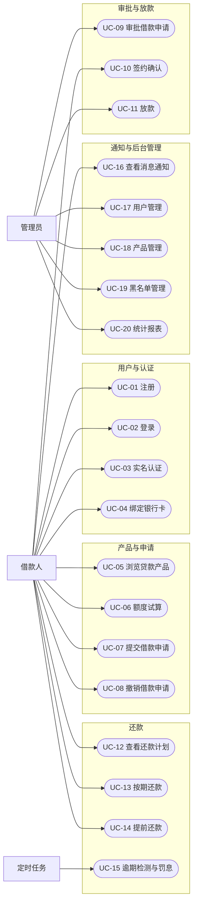

# 需求分析报告 · 第二部分（用例与功能需求）

> **覆盖章节**：4. 系统用例设计 · 5. 系统功能需求
> **负责人**：后端 A（UC-01~05、UC-16~20）＋ 后端 B（UC-06~15）
> **状态**：框架＋清单初稿（用例描述待补）　**计划完成**：第 ＿＿ 周
> **配套文件**：[00-框架与分工.md](00-框架与分工.md)
> **标记说明**：`〔待确认〕`＝需团队拍板；`〔待补充〕`＝需补充素材。定稿后删除所有标记。

---

## 4. 系统用例设计

### 4.1 参与者

| 参与者   | 类型       | 说明                                                    |
| -------- | ---------- | ------------------------------------------------------- |
| 借款人   | 主要参与者 | 已实名认证的借款用户，使用用户端                        |
| 管理员   | 主要参与者 | 平台运营人员，使用管理端，承担审批、放款与风控职责      |
| 定时任务 | 次要参与者 | 系统内部的逾期检测与还款提醒任务（由 APScheduler 驱动） |

### 4.2 用例图



### 4.3 用例清单

| 用例编号 | 用例名称       | 主要参与者 | 次要参与者 | 归属模块 | 功能需求                                 | 负责人 |
| -------- | -------------- | ---------- | ---------- | -------- | ---------------------------------------- | ------ |
| UC-01    | 用户注册       | 借款人     | —          | 用户模块 | `FR-AUTH-01`                             | 后端 A |
| UC-02    | 用户登录       | 借款人     | —          | 用户模块 | `FR-AUTH-02`、`FR-AUTH-03`               | 后端 A |
| UC-03    | 实名认证       | 借款人     | —          | 用户模块 | `FR-AUTH-04`                             | 后端 A |
| UC-04    | 绑定银行卡     | 借款人     | —          | 用户模块 | `FR-AUTH-06`                             | 后端 A |
| UC-05    | 浏览贷款产品   | 借款人     | —          | 产品模块 | `FR-PROD-01`、`FR-PROD-02`               | 后端 A |
| UC-06    | 额度试算       | 借款人     | —          | 申请模块 | `FR-LOAN-01`                             | 后端 B |
| UC-07    | 提交借款申请   | 借款人     | 定时任务   | 申请模块 | `FR-LOAN-02`、`FR-RISK-01`、`FR-RISK-05` | 后端 B |
| UC-08    | 撤销借款申请   | 借款人     | —          | 申请模块 | `FR-LOAN-04`                             | 后端 B |
| UC-09    | 审批借款申请   | 管理员     | —          | 审批模块 | `FR-LOAN-05`                             | 后端 B |
| UC-10    | 签约确认       | 借款人     | —          | 审批模块 | `FR-LOAN-06`                             | 后端 B |
| UC-11    | 放款           | 管理员     | —          | 放款模块 | `FR-LEND-01`、`FR-REPAY-01`              | 后端 B |
| UC-12    | 查看还款计划   | 借款人     | —          | 还款模块 | `FR-REPAY-05`                            | 后端 B |
| UC-13    | 按期还款       | 借款人     | —          | 还款模块 | `FR-REPAY-02`、`FR-REPAY-06`             | 后端 B |
| UC-14    | 提前还款       | 借款人     | —          | 还款模块 | `FR-REPAY-03`                            | 后端 B |
| UC-15    | 逾期检测与罚息 | 定时任务   | 借款人     | 还款模块 | `FR-REPAY-04`、`FR-MSG-02`               | 后端 B |
| UC-16    | 查看消息通知   | 借款人     | —          | 通知模块 | `FR-MSG-01`                              | 后端 A |
| UC-17    | 用户管理       | 管理员     | —          | 后台管理 | `FR-ADMIN-01`                            | 后端 A |
| UC-18    | 产品管理       | 管理员     | —          | 后台管理 | `FR-PROD-03`                             | 后端 A |
| UC-19    | 黑名单管理     | 管理员     | —          | 后台管理 | `FR-RISK-05`                             | 后端 A |
| UC-20    | 统计报表       | 管理员     | —          | 后台管理 | `FR-ADMIN-03`                            | 后端 A |

**信用评估相关用例（UC-21~UC-23）本期为预留用例**，不实现逻辑，仅返回默认值：信用评分查询、授信额度查询、风控决策查询。

---

## 5. 系统功能需求

### 5.1 说明和优先级

> **模板硬性判据**：每条功能需求都应能且只需用**一条测试用例**验证；若找不到合适用例或需多条用例，说明该需求描述有问题。

| 需求编号    | 需求名称             | 优先级 | 说明                                                                     | 对应用例     |
| ----------- | -------------------- | ------ | ------------------------------------------------------------------------ | ------------ |
| FR-AUTH-01  | 用户注册             | 高     | 支持手机号 + 验证码或账号密码注册；手机号唯一；验证码经 Redis 5 分钟过期 | UC-01        |
| FR-AUTH-02  | 用户登录             | 高     | 手机号/账号 + 密码登录，校验 BCrypt 密码，成功后签发 JWT（默认 2 小时）  | UC-02        |
| FR-AUTH-03  | 退出登录             | 中     | 使当前令牌立即失效（写入 Redis 黑名单）                                  | UC-02        |
| FR-AUTH-04  | 实名认证             | 高     | 提交姓名、身份证号；校验身份证 18 位；**认证通过后才可借款**             | UC-03        |
| FR-AUTH-05  | 个人信息管理         | 中     | 查看/修改昵称、邮箱、职业、收入、居住地址（职业/收入供综设2 使用）       | —            |
| FR-AUTH-06  | 银行卡绑定           | 中     | 绑定放款/还款银行卡，校验卡号；支持设置默认卡                            | UC-04        |
| FR-AUTH-07  | 账户信息查询         | 高     | 查看账户余额与可用额度（信用分字段本期不展示）                           | UC-07        |
| FR-PROD-01  | 产品列表             | 高     | 展示可借产品的名称、额度区间、利率、期限、还款方式                       | UC-05        |
| FR-PROD-02  | 产品详情             | 高     | 展示产品完整规则、费用说明与还款示例                                     | UC-05        |
| FR-PROD-03  | 产品管理             | 高     | 管理员新增/编辑/上架/下架产品；下架产品不再接受新申请                    | UC-18        |
| FR-LOAN-01  | 额度试算             | 高     | 输入金额与期限，实时展示应还总额、利息与每期还款；**后端必须重算**       | UC-06        |
| FR-LOAN-02  | 提交借款申请         | 高     | 选择产品，填写金额、期限、用途、还款方式；须在产品区间内且 ≤ 可用额度    | UC-07        |
| FR-LOAN-03  | 申请记录查询         | 高     | 查看本人申请列表与当前状态                                               | UC-07        |
| FR-LOAN-04  | 撤销借款申请         | 中     | 仅「待审核」状态可撤销                                                   | UC-08        |
| FR-LOAN-05  | 审批借款申请         | 高     | 管理员通过/拒绝并填写意见；**拒绝必须填写原因**                          | UC-09        |
| FR-LOAN-06  | 签约确认             | 高     | 审批通过后用户确认签约；超时未签约自动失效                               | UC-10        |
| FR-RISK-01  | 风控评估（预留）     | 低     | 预留 `POST /risk/evaluate`，本期固定返回「通过」决策                     | UC-07        |
| FR-RISK-02  | 风控决策查询（预留） | 低     | 预留 `GET /risk/decision/{applicationId}`                                | UC-21~23     |
| FR-RISK-03  | 信用评分（预留）     | 低     | 预留 `GET /credit/score`，本期固定返回 60                                | UC-21        |
| FR-RISK-04  | 授信额度（预留）     | 低     | 预留 `GET /credit/line`，本期返回固定默认额度                            | UC-22        |
| FR-RISK-05  | 黑名单拦截           | 高     | 黑名单用户提交申请时自动拒绝（**本期唯一真实风控**）                     | UC-07、UC-19 |
| FR-LEND-01  | 放款                 | 高     | 审批通过并签约后放款；**事务内**完成扣减额度、记账与生成还款计划         | UC-11        |
| FR-LEND-02  | 账户余额查询         | 高     | 查询虚拟账户余额与冻结金额                                               | UC-07        |
| FR-LEND-03  | 账户流水查询         | 中     | 按时间倒序查看账户每笔金额变动                                           | —            |
| FR-REPAY-01 | 生成还款计划         | 高     | 放款时按还款方式一次性生成 `n` 期计划（应还本金/利息/日期）              | UC-11        |
| FR-REPAY-02 | 按期还款             | 高     | 用户主动还款（余额/银行卡）；校验金额并更新计划状态                      | UC-13        |
| FR-REPAY-03 | 提前还款             | 中     | 结清剩余本金 + 当期利息 +（可选）违约金                                  | UC-14        |
| FR-REPAY-04 | 逾期检测与罚息       | 高     | 定时任务每日标记逾期并按日计罚息                                         | UC-15        |
| FR-REPAY-05 | 还款记录查询         | 中     | 查看还款流水与计划明细                                                   | UC-12        |
| FR-REPAY-06 | 结清                 | 高     | 全部还清后标记结清并生成结清状态                                         | UC-13        |
| FR-ADMIN-01 | 用户管理             | 高     | 管理员查询/冻结/解冻用户；冻结后不可登录与借款                           | UC-17        |
| FR-ADMIN-02 | 逾期管理与催收       | 中     | 逾期借款列表与催收备注登记                                               | UC-15        |
| FR-ADMIN-03 | 统计报表             | 中     | 放款总额、待还金额、逾期率、用户数（图表 + 导出可选）                    | UC-20        |
| FR-MSG-01   | 站内通知             | 中     | 审批结果、放款成功、还款提醒、逾期提醒；含已读标记                       | UC-16        |
| FR-MSG-02   | 还款提醒             | 中     | 还款日前 N 天由定时任务生成提醒                                          | UC-15        |

> **优先级分布**：高 19 条 · 中 13 条 · 低 4 条（预留项）。合计 **36 条**功能需求，对应 20 个本期用例 + 3 个预留用例。

### 5.2 激励／响应序列

> 描述关键功能的「触发事件 → 系统响应」序列。

| 编号  | 触发事件                 | 系统响应                                                              | 关联需求                 |
| ----- | ------------------------ | --------------------------------------------------------------------- | ------------------------ |
| ES-01 | 用户提交注册表单         | 校验手机号唯一性与验证码 → 创建用户 → 返回成功并跳转登录              | FR-AUTH-01               |
| ES-02 | 用户提交登录表单         | 校验 BCrypt 密码 → 签发 JWT → 返回令牌与用户信息                      | FR-AUTH-02               |
| ES-03 | 用户提交实名认证         | 校验身份证 18 位 → 更新实名状态 → 解锁借款权限                        | FR-AUTH-04               |
| ES-04 | 用户提交借款申请         | 校验额度与产品区间 → 触发风控评估（本期默认通过）→ 创建「待审核」申请 | FR-LOAN-02、FR-RISK-01   |
| ES-05 | 管理员点击「通过」       | 申请转为「待签约」→ 通知用户                                          | FR-LOAN-05               |
| ES-06 | 管理员点击「拒绝」       | 校验已填写原因 → 申请转为「已拒绝」→ 通知用户                         | FR-LOAN-05               |
| ES-07 | 用户确认签约             | 申请转为「待放款」                                                    | FR-LOAN-06               |
| ES-08 | 管理员点击「放款」       | 事务内：扣减额度 → 记账 → 生成还款计划 → 申请转为「已放款」→ 通知用户 | FR-LEND-01、FR-REPAY-01  |
| ES-09 | 用户发起按期还款         | 校验还款金额 → 更新计划已还本金/利息 → 若全部还清则标记结清           | FR-REPAY-02、FR-REPAY-06 |
| ES-10 | 用户发起提前还款         | 计算剩余本金 + 当期截止日利息 +（可选）违约金 → 扣款 → 标记结清       | FR-REPAY-03              |
| ES-11 | 定时任务每日执行（凌晨） | 标记到期未还计划为逾期 → 计算并累加罚息 → 生成逾期提醒                | FR-REPAY-04、FR-MSG-02   |
| ES-12 | 定时任务执行还款提醒     | 扫描还款日前 N 天的计划 → 生成站内提醒                                | FR-MSG-02                |
| ES-13 | 黑名单用户提交申请       | 立即拒绝申请并说明原因                                                | FR-RISK-05               |
| ES-14 | 冻结用户尝试登录或借款   | 拦截并返回「账号已冻结」提示                                          | FR-ADMIN-01              |

### 5.3 输入／输出数据

#### 5.3.1 关键功能的输入输出

| 功能                 | 输入数据                         | 处理方法             | 输出数据                       |
| -------------------- | -------------------------------- | -------------------- | ------------------------------ |
| FR-LOAN-01 额度试算  | 借款金额、期限、产品、还款方式   | §5.3.2 利息计算公式  | 应还总额、总利息、每期还款明细 |
| FR-LOAN-02 提交申请  | 产品、金额、期限、用途、还款方式 | 区间与额度校验       | 申请编号、申请状态             |
| FR-LEND-01 放款      | 申请编号                         | 事务 + 行级锁/乐观锁 | 放款结果、账户流水、还款计划   |
| FR-REPAY-02 按期还款 | 计划期号、还款金额、支付方式     | 金额校验 + 状态更新  | 还款记录、剩余应还             |
| FR-REPAY-03 提前还款 | 申请编号、提前还款金额           | §5.3.2 提前还款计算  | 结清金额明细、结清状态         |
| FR-REPAY-04 逾期处理 | 系统日期                         | §5.3.2 罚息计算      | 逾期计划列表、罚息金额         |

#### 5.3.2 计算方法（须逐步给出算式）

设：本金 `P`、月利率 `r`（= 年利率 ÷ 12）、期数 `n`。

**① 等额本息**（每期还款额固定）

```
第 1 步  计算每期还款额：A = P × r × (1+r)^n / [(1+r)^n − 1]
第 2 步  第 k 期利息 = 剩余本金 × r
第 3 步  第 k 期本金 = A − 第 k 期利息
第 4 步  剩余本金 ← 剩余本金 − 第 k 期本金，回到第 2 步计算下一期
平账规则 每期金额保留两位小数；最后一期做差额平账，保证各期本金合计 = P
```

**② 等额本金**（每期本金固定，利息递减）

```
第 1 步  每期本金 = P / n
第 2 步  第 k 期利息 = 剩余本金 × r
第 3 步  第 k 期还款额 = 每期本金 + 第 k 期利息
平账规则 同上，最后一期做差额平账
```

**③ 先息后本**（每月只还利息，最后一期还本金 + 当期利息）

```
第 1 步  第 1 ~ n−1 期利息 = P × r
第 2 步  第 n 期还款额 = P + P × r
```

**④ 逾期罚息**

```
罚息 = 逾期应还本金 × 罚息日利率 × 逾期天数
罚息日利率 = 产品配置值（默认可取「年利率 × 1.5 ÷ 360」）
逾期天数 = 当前日期 − 应还日期（按自然日，不做顺延）
```

**⑤ 提前还款**

```
结清金额 = 剩余本金 + 当期截止日利息 + 违约金
违约金  = 剩余本金 × 提前还款违约金率（产品可配；亦可规定前 N 期不允许提前还款）
```

**⑥ 授信额度与可用额度**

```
可用额度 = 授信额度 − 未结清借款本金
授信额度（本期）     = 固定默认额度（如 50000，管理员可在后台为用户设置）
授信额度（综设2 预留）= min(产品上限, 月收入 × 收入系数 × 信用分系数)
```

**⑦ 精度规则（全项目强制）**

所有金额计算使用 `DECIMAL(18,2)` / Python `Decimal`，**严禁 `float`**；每期金额保留两位小数，最后一期差额平账。

### 5.4 用例描述

> 按模板要求的 **12 项要素**逐条描述。下列给出 3 个**范例**（覆盖申请、审批、还款三条关键链路），其余用例请按同一模板补齐。

#### UC-07 提交借款申请

| 要素         | 内容                                                                                                                                                                                                                              |
| ------------ | --------------------------------------------------------------------------------------------------------------------------------------------------------------------------------------------------------------------------------- |
| 用例名       | 提交借款申请                                                                                                                                                                                                                      |
| 简述         | 借款人选择贷款产品并填写借款金额、期限、用途与还款方式，系统校验后生成待审核申请                                                                                                                                                  |
| 主要参与者   | 借款人                                                                                                                                                                                                                            |
| 情景目标     | 成功创建一笔状态为「待审核」的借款申请                                                                                                                                                                                            |
| 前提条件     | 用户已登录、已实名认证；产品处于上架状态；用户不在黑名单中；当前无其它待审核申请                                                                                                                                                  |
| 触发事件     | 用户在「借款申请」页面点击「提交申请」                                                                                                                                                                                            |
| 场景描述     | 1) 用户选择产品 → 2) 填写金额/期限/用途/还款方式 → 3) 前端试算并展示应还明细 → 4) 提交 → 5) 后端校验金额在产品区间内且 ≤ 可用额度 → 6) 调用风控评估（本期默认通过）→ 7) 生成申请编号并落库为「待审核」→ 8) 返回成功并跳转申请记录 |
| 异常处理     | ① 金额超出产品区间 → 提示区间范围；② 金额超可用额度 → 提示可用额度；③ 已存在待审核申请 → 提示不可重复提交；④ 用户被冻结 → 拦截并提示；⑤ 命中黑名单 → 自动拒绝并说明原因                                                           |
| 优先级       | 高                                                                                                                                                                                                                                |
| 使用频率     | 高（核心链路）                                                                                                                                                                                                                    |
| 次要参与者   | 定时任务（负责后续超时处理）                                                                                                                                                                                                      |
| 未明确的问题 | 同一用户是否允许同时存在多笔「待签约」申请？（见 §10 Q-08）                                                                                                                                                                       |

#### UC-09 审批借款申请

| 要素         | 内容                                                                                                                                                                                                 |
| ------------ | ---------------------------------------------------------------------------------------------------------------------------------------------------------------------------------------------------- |
| 用例名       | 审批借款申请                                                                                                                                                                                         |
| 简述         | 管理员查看待审批列表，对单笔申请作出通过或拒绝的决定并填写审批意见                                                                                                                                   |
| 主要参与者   | 管理员                                                                                                                                                                                               |
| 情景目标     | 使申请从「待审核」转为「待签约」或「已拒绝」                                                                                                                                                         |
| 前提条件     | 管理员已登录且具备审批权限；申请处于「待审核」状态                                                                                                                                                   |
| 触发事件     | 管理员在待审批列表中点击「通过」或「拒绝」                                                                                                                                                           |
| 场景描述     | 1) 管理员打开待审批列表 → 2) 查看申请详情（含风控结论，本期为默认通过）→ 3) 选择通过/拒绝 → 4) 填写审批意见 → 5) 系统校验（拒绝时必须填写原因）→ 6) 更新申请状态与审批时间 → 7) 生成站内通知给借款人 |
| 异常处理     | ① 拒绝但未填写原因 → 阻止提交并提示；② 申请已被撤销/已过期 → 提示状态已变更；③ 并发审批同一笔 → 乐观锁保证只有一次生效                                                                               |
| 优先级       | 高                                                                                                                                                                                                   |
| 使用频率     | 高                                                                                                                                                                                                   |
| 次要参与者   | —                                                                                                                                                                                                    |
| 未明确的问题 | 是否需要支持批量审批？（见 §10 Q-09）                                                                                                                                                                |

#### UC-13 按期还款

| 要素         | 内容                                                                                                                                                                                                 |
| ------------ | ---------------------------------------------------------------------------------------------------------------------------------------------------------------------------------------------------- |
| 用例名       | 按期还款                                                                                                                                                                                             |
| 简述         | 借款人对到期还款计划发起还款，系统校验金额、更新计划状态，全部还清后标记结清                                                                                                                         |
| 主要参与者   | 借款人                                                                                                                                                                                               |
| 情景目标     | 完成一期还款；若为最后一期则使借款结清                                                                                                                                                               |
| 前提条件     | 用户已登录；存在未结清的借款与还款计划；账户余额充足或银行卡可用                                                                                                                                     |
| 触发事件     | 用户在还款页面点击「还款」                                                                                                                                                                           |
| 场景描述     | 1) 用户查看还款计划 → 2) 选择待还期次 → 3) 确认还款金额（应还本金 + 利息 + 罚息）→ 4) 选择支付方式 → 5) 系统校验金额 → 6) 扣款并生成还款记录 → 7) 更新计划状态 → 8) 若全部还清则标记申请为「已结清」 |
| 异常处理     | ① 余额不足 → 提示并引导充值/换卡；② 还款金额超过应还 → 多还部分转为账户余额或原路退回；③ 并发还款同一期 → 事务 + 乐观锁防重复扣款；④ 还款日遇节假日 → 按自然日计算，不顺延                           |
| 优先级       | 高                                                                                                                                                                                                   |
| 使用频率     | 高（核心链路）                                                                                                                                                                                       |
| 次要参与者   | —                                                                                                                                                                                                    |
| 未明确的问题 | 是否支持部分还款？（见 §10 Q-10）                                                                                                                                                                    |

**其余用例描述模板**（复制使用，UC-01~06、08、10~12、14~23 均按此补齐）：

```markdown
#### UC-XX 用例名称

| 要素         | 内容 |
| ------------ | ---- |
| 用例名       |      |
| 简述         |      |
| 主要参与者   |      |
| 情景目标     |      |
| 前提条件     |      |
| 触发事件     |      |
| 场景描述     |      |
| 异常处理     |      |
| 优先级       |      |
| 使用频率     |      |
| 次要参与者   |      |
| 未明确的问题 |      |
```

---

## 二人分工与待办

| 负责人 | 待办                                                                                                          |
| ------ | ------------------------------------------------------------------------------------------------------------- |
| 后端 A | 补齐 UC-01~05、UC-16~20 的用例描述（共 10 个）；核对 `FR-AUTH` / `FR-PROD` / `FR-ADMIN` / `FR-MSG` 各条       |
| 后端 B | 补齐 UC-06、08、10~12、14、15 的用例描述（共 8 个）；核对 `FR-LOAN` / `FR-LEND` / `FR-REPAY` / `FR-RISK` 各条 |

---

## 自检清单（提交前逐项勾选）

- [ ] 用例编号与功能需求编号全局唯一且连续，符合 `00-框架与分工.md` §5 的编号规则
- [ ] 用例图中每条用例都在 §5.1 有对应功能需求（**可追溯**，见 4.3 表格）
- [ ] **每条功能需求都能且只需用一条测试用例验证**（模板硬性判据）
- [ ] §2.2 列出的功能本章全部覆盖且未重复描述
- [ ] 利息计算等复杂处理已写出**每一步具体算式**（§5.3.2）
- [ ] 每个用例的 **12 项要素**均已填写，无空缺项
- [ ] 异常处理覆盖了《02》§8 的 6 类异常场景
- [ ] 优先级取值统一为高/中/低
- [ ] 所有 `〔待确认〕`、`〔待补充〕` 标记已处理并删除
