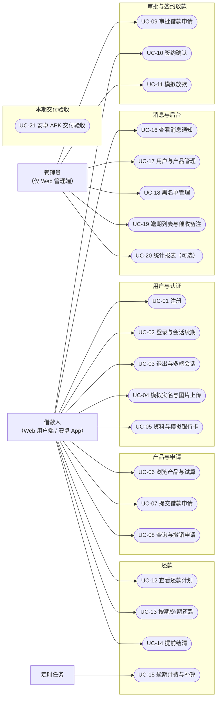

# 需求分析报告 · 第二部分（用例与功能需求）

> **覆盖章节**：4. 系统用例设计 · 5. 系统功能需求
> **负责人**：后端 A（UC-01~05、UC-16~20）＋ 后端 B（UC-06~15）＋ 全栈（UC-21 安卓端）
> **状态**：框架＋清单初稿（用例描述待补）　**计划完成**：第 ＿＿ 周
> **配套文件**：[00-框架与分工.md](00-框架与分工.md)
> **业务基线**：本部分业务口径一律以 [《02-功能需求分析》](../docs/02-功能需求分析.md) v1.1 为准。
> **标记说明**：`〔待确认〕`＝需团队拍板；`〔待补充〕`＝需补充素材。定稿后删除所有标记。

---

## 4. 系统用例设计

### 4.1 参与者

| 参与者   | 类型       | 说明                                                                        |
| -------- | ---------- | --------------------------------------------------------------------------- |
| 借款人   | 主要参与者 | 可使用 **Web 用户端或本学期交付的安卓 App**；未实名不能申请，冻结后不能登录 |
| 管理员   | 主要参与者 | 平台运营人员，**仅在 Web 管理端**操作，承担审批、放款与风控职责             |
| 定时任务 | 次要参与者 | 逾期补算、还款提醒、签约超时（APScheduler，单调度实例）                     |

### 4.2 用例图



### 4.3 用例清单

> **编号映射**：本报告 `FR-<模块>-<序号>` 与《02-功能需求分析》§4 的 `<模块>-<序号>` **一一对应**（如 `FR-AUTH-01` ↔ `AUTH-01`），便于合稿追溯。

| 用例编号 | 用例名称           | 主要参与者 | 次要参与者 | 归属模块   | 功能需求                                 | 负责人 |
| -------- | ------------------ | ---------- | ---------- | ---------- | ---------------------------------------- | ------ |
| UC-01    | 注册               | 借款人     | —          | 用户与认证 | `FR-AUTH-01`                             | 后端 A |
| UC-02    | 登录与会话续期     | 借款人     | —          | 用户与认证 | `FR-AUTH-02`、`FR-AUTH-07`               | 后端 A |
| UC-03    | 退出与多端会话     | 借款人     | —          | 用户与认证 | `FR-AUTH-03`                             | 后端 A |
| UC-04    | 模拟实名与图片上传 | 借款人     | —          | 用户与认证 | `FR-AUTH-04`、`FR-FILE-01`               | 后端 A |
| UC-05    | 资料与模拟银行卡   | 借款人     | —          | 用户与认证 | `FR-AUTH-05`                             | 后端 A |
| UC-06    | 浏览产品与试算     | 借款人     | —          | 产品与申请 | `FR-PROD-01`、`FR-LOAN-01`               | 后端 B |
| UC-07    | 提交借款申请       | 借款人     | 定时任务   | 产品与申请 | `FR-LOAN-02`、`FR-RISK-01`、`FR-RISK-05` | 后端 B |
| UC-08    | 查询与撤销申请     | 借款人     | —          | 产品与申请 | `FR-LOAN-03`                             | 后端 B |
| UC-09    | 审批借款申请       | 管理员     | 定时任务   | 审批与签约 | `FR-LOAN-04`                             | 后端 B |
| UC-10    | 签约确认           | 借款人     | 定时任务   | 审批与签约 | `FR-LOAN-05`                             | 后端 B |
| UC-11    | 模拟放款           | 管理员     | —          | 审批与签约 | `FR-LEND-01`、`FR-REPAY-01`              | 后端 B |
| UC-12    | 查看还款计划       | 借款人     | —          | 还款       | `FR-REPAY-05`                            | 后端 B |
| UC-13    | 按期/逾期还款      | 借款人     | —          | 还款       | `FR-REPAY-02`、`FR-REPAY-04`             | 后端 B |
| UC-14    | 提前结清           | 借款人     | —          | 还款       | `FR-REPAY-03`                            | 后端 B |
| UC-15    | 逾期计费与补算     | 定时任务   | 借款人     | 还款       | `FR-REPAY-06`、`FR-MSG-02`               | 后端 B |
| UC-16    | 查看消息通知       | 借款人     | —          | 消息       | `FR-MSG-01`                              | 后端 A |
| UC-17    | 用户与产品管理     | 管理员     | —          | 后台管理   | `FR-ADMIN-01`、`FR-PROD-02`              | 后端 A |
| UC-18    | 黑名单管理         | 管理员     | —          | 后台管理   | `FR-RISK-05`                             | 后端 A |
| UC-19    | 逾期列表与催收备注 | 管理员     | —          | 后台管理   | `FR-ADMIN-02`                            | 后端 A |
| UC-20    | 统计报表（可选）   | 管理员     | —          | 后台管理   | `FR-ADMIN-03`                            | 后端 A |
| UC-21    | 安卓 APK 交付验收  | 借款人     | —          | 安卓端交付 | `FR-APP-01`                              | 全栈   |

---

## 5. 系统功能需求

### 5.1 说明和优先级

> **模板硬性判据**：每条功能需求都应能且只需用**一条测试用例**验证。
> **优先级**：高 / 中 / 低，对应《02》§9 的 P0 / P1 / 后续预留。

| 需求编号    | 需求名称             | 优先级 | 说明（口径以《02》v1.1 为准）                                                                                                           | 对应用例 | 《02》编号 |
| ----------- | -------------------- | ------ | --------------------------------------------------------------------------------------------------------------------------------------- | -------- | ---------- |
| FR-AUTH-01  | 注册                 | 高     | 账号与手机号唯一；注册事务同时创建唯一账户；默认授信 50000.00 元；演示验证码 5 分钟过期且单次有效                                       | UC-01    | AUTH-01    |
| FR-AUTH-02  | 登录与会话续期       | 高     | 密码校验后返回 access/refresh token；错误密码、冻结账号、过期或已吊销的刷新令牌被拒绝                                                   | UC-02    | AUTH-02    |
| FR-AUTH-03  | 退出与多端会话       | 中     | Web 与 App 会话独立；退出吊销当前会话的两种令牌，其他设备会话不受影响                                                                   | UC-03    | AUTH-03    |
| FR-AUTH-04  | 模拟实名与图片上传   | 高     | 姓名 + 18 位虚构证件号 + 本人上传的测试证件图片通过格式检查后标记**模拟**认证；界面明示非真实核验                                       | UC-04    | AUTH-04    |
| FR-AUTH-05  | 资料与模拟银行卡     | 中     | 修改本人资料；绑定/删除模拟卡、最多一张默认卡；**银行卡不参与资金划转**                                                                 | UC-05    | AUTH-05    |
| FR-AUTH-06  | 账户查询             | 高     | 返回本人余额、授信与可用额度；默认分数不是实际信用评估结果                                                                              | UC-07    | AUTH-06    |
| FR-AUTH-07  | 会话轮换与吊销       | 高     | 刷新时令牌轮换、旧令牌立即失效；账号冻结或退出吊销相应会话；业务请求每次检查会话与账号状态                                              | UC-02    | AUTH-02/03 |
| FR-PROD-01  | 产品列表与详情       | 高     | 显示金额/期限范围、年利率、还款方式、罚息与提前结清费用                                                                                 | UC-06    | PROD-01    |
| FR-PROD-02  | 产品管理             | 高     | 管理员创建/修改/上下架；金额与期限上下限有效；**下架后不能新增申请**                                                                    | UC-17    | PROD-02    |
| FR-PROD-03  | 规则快照             | 高     | 每产品指定一种还款方式；本期年利率上下限相等；申请时复制利率与费用规则，**产品后续修改不改变已提交申请**                                | UC-07    | PROD-03    |
| FR-LOAN-01  | 额度试算             | 高     | 使用后端返回的计划与总额展示；客户端不能自行决定成交利率或应还金额                                                                      | UC-06    | LOAN-01    |
| FR-LOAN-02  | 提交借款申请         | 高     | 校验实名、冻结/黑名单、上架状态、金额/期限与可用额度；同一用户最多一笔待审核申请；**提交校验不承诺放款成功**                            | UC-07    | LOAN-02    |
| FR-LOAN-03  | 查询与撤销申请       | 高     | 仅本人可查；只有待审核状态可撤销                                                                                                        | UC-08    | LOAN-03    |
| FR-LOAN-04  | 审批借款申请         | 高     | 管理员通过/拒绝，**拒绝原因必填**；并发审批只有一次状态转换成功                                                                         | UC-09    | LOAN-04    |
| FR-LOAN-05  | 签约确认             | 高     | 本人确认规则快照；审批后 **72 小时内**可签约，超过 `sign_deadline` 记为**已失效**，不得放款                                             | UC-10    | LOAN-05    |
| FR-RISK-01  | 风控评估（模拟）     | 高     | 返回模拟 PASS、默认分 60/C 与用户授信，标注 `is_mock=true`；**不能覆盖实名、冻结、黑名单或额度检查**                                    | UC-07    | 4.4        |
| FR-RISK-02  | 风控决策查询（模拟） | 中     | 校验申请存在与资源归属后返回模拟决策，不冒充历史真实评分                                                                                | UC-07    | 4.4        |
| FR-RISK-03  | 信用分查询（模拟）   | 低     | `GET /credit/score` 固定 60/C 且 `is_mock=true`                                                                                         | UC-07    | 4.4        |
| FR-RISK-04  | 授信额度查询         | 中     | 返回**用户当前实际配置的授信**，不做动态计算，不接受客户端指定额度                                                                      | UC-07    | 4.4        |
| FR-RISK-05  | 黑名单检查           | 高     | 黑名单用户提交申请或放款时被拒绝（**本期唯一真实执行的风控规则**）；允许其查询并偿还既有债务                                            | UC-07/18 | 4.4        |
| FR-LEND-01  | 模拟放款             | 高     | 仅待放款申请可操作；同一事务内再次检查额度、**增加借款人余额**、生成放款流水与完整还款计划、改变申请状态                                | UC-11    | LEND-01    |
| FR-LEND-02  | 余额与流水           | 高     | 余额是借款人模拟现金，**不是授信额度**；流水正数入账、负数出账，每笔业务有可追踪编号                                                    | UC-12    | LEND-02    |
| FR-LEND-03  | 演示资金             | 中     | seed 初始化模拟余额并记录初始化流水，足够支付演示利息；**无真实充值或银行卡扣款**                                                       | —        | LEND-03    |
| FR-REPAY-01 | 生成还款计划         | 高     | 放款时生成 n 期，期数不重复；**各期本金之和精确等于借款额**（末期平账）                                                                 | UC-11    | REPAY-01   |
| FR-REPAY-02 | 按期/逾期还款        | 高     | 结清**最早一笔未还计划**的全部到期应还额；未到期须走提前结清；**不接受任意部分还款或超额扣款**                                          | UC-13    | REPAY-02   |
| FR-REPAY-03 | 提前结清             | 中     | 服务端试算全部未还本金、到期未还利息/罚息、当期日息与违约金；确认时重算，金额变化返回 409                                               | UC-14    | REPAY-03   |
| FR-REPAY-04 | 还款与结清记录       | 高     | 一次还款可分摊到多期并保留分项；余额、计划、流水、还款记录与申请状态**原子更新**                                                        | UC-13    | REPAY-05   |
| FR-REPAY-05 | 还款记录查询         | 中     | 查看还款订单、分摊明细与计划状态                                                                                                        | UC-12    | REPAY-05   |
| FR-REPAY-06 | 逾期计费与补算       | 高     | 按 `last_penalty_date` 补计未处理日期；**重跑不多计**；扣款前补算当日罚息                                                               | UC-15    | REPAY-04   |
| FR-FILE-01  | 图片上传与附件读取   | 高     | 仅 JPEG/PNG、≤ 5 MiB，校验实际文件格式；按鉴权接口读取，**不是公开静态路径**；只接受本人已上传附件                                      | UC-04    | 4.1/3.14   |
| FR-ADMIN-01 | 用户管理             | 高     | 管理员查询/冻结/解冻用户；**冻结是账号停用，已签发会话同时失效**，不清除欠款、不停止罚息                                                | UC-17    | 4.7        |
| FR-ADMIN-02 | 逾期列表与催收备注   | 中     | 逾期借款列表；催收备注为可选增强项                                                                                                      | UC-19    | 4.7        |
| FR-ADMIN-03 | 统计报表             | 中     | 放款总额、待还总额、逾期率、用户数；**口径按《02》§4.7**（放款总额含已放款与已结清；逾期率分母为当前未结清已放款借款数，为零时显示 0%） | UC-20    | 4.7        |
| FR-MSG-01   | 站内消息             | 中     | 审批结果、放款成功、到期前 3 天与逾期提醒写入站内消息，**同一事件只生成一次**（事件唯一键去重）；含已读状态                             | UC-16    | 4.8        |
| FR-MSG-02   | 消息获取（轮询）     | 中     | App 前台每 30 秒查询未读数，进入消息页刷新，退到后台停止轮询；**不要求后台实时推送**                                                    | UC-16    | 4.8        |
| FR-APP-01   | 安卓端交付           | 高     | 复用全部借款人必需功能（含签约与撤销入口）；**签名 APK 在指定真机完成一次安装与完整借还流程**；管理操作在 Web 配合演示                  | UC-21    | 4.9        |

> **优先级分布**：高 21 条 · 中 12 条 · 低 1 条。合计 **34 条**功能需求，对应 21 个用例。
> **本期必需项**（P0）：注册登录与会话续期、模拟实名与图片上传、产品、申请、签约、审批放款、还款与提前结清、逾期、站内消息、基础后台**及 APK**。

### 5.2 激励／响应序列

| 编号  | 触发事件                   | 系统响应                                                                                                 | 关联需求                 |
| ----- | -------------------------- | -------------------------------------------------------------------------------------------------------- | ------------------------ |
| ES-01 | 用户提交注册表单           | 校验账号/手机号唯一与演示验证码 → 创建用户与唯一账户（默认授信 50000.00）→ 返回成功                      | FR-AUTH-01               |
| ES-02 | 用户提交登录表单           | 校验 BCrypt 密码 → 签发 access/refresh token → 返回过期时间                                              | FR-AUTH-02               |
| ES-03 | access token 过期（401）   | 客户端**单次**用 refresh token 换取新令牌（令牌轮换）；失败则清除会话并跳转登录                          | FR-AUTH-07               |
| ES-04 | 用户上传测试证件图片       | 校验 JPEG/PNG 与实际格式、≤5 MiB → 落库元数据并返回 `file_id`；文件存于非公开目录                        | FR-FILE-01               |
| ES-05 | 用户提交实名认证           | 校验证件号为 18 位且附件属于本人 → 标记模拟认证（界面注明非真实核验）                                    | FR-AUTH-04               |
| ES-06 | 用户提交借款申请           | 校验未实名/冻结/黑名单/上下架/金额期限/可用额度 → 内部调用模拟评估（不改状态）→ 创建「待审核」申请       | FR-LOAN-02、FR-RISK-01   |
| ES-07 | 管理员点击「拒绝」         | 校验已填写原因 → 申请转为「已拒绝」→ 写业务结果消息（事件键去重）                                        | FR-LOAN-04               |
| ES-08 | 管理员点击「通过」         | 申请转为「待签约」并写入 `sign_deadline`（+72 小时）→ 通知用户                                           | FR-LOAN-04               |
| ES-09 | 定时任务扫描签约超时       | `sign_deadline` 到达仍未签约 → 申请转为「已失效」，不得放款                                              | FR-LOAN-05               |
| ES-10 | 用户确认签约               | 核对规则快照 → 申请转为「待放款」并记录 `signed_at`                                                      | FR-LOAN-05               |
| ES-11 | 管理员点击「放款」         | 加锁后再次校验额度与状态 → **余额入账** → 写正数流水 → 生成完整计划 → 申请转「已放款」→ 写消息与幂等结果 | FR-LEND-01、FR-REPAY-01  |
| ES-12 | 用户发起还款               | 扣款前补算当日罚息 → 校验金额与余额 → 生成还款订单与分摊记录 → 更新计划/余额/流水/状态（原子提交）       | FR-REPAY-02、FR-REPAY-04 |
| ES-13 | 用户发起提前结清           | 返回报价 → 用户确认金额与幂等键 → 后端锁定重算（不一致返回 409）→ 扣款结清并记录 `waived_interest`       | FR-REPAY-03              |
| ES-14 | 定时任务每日执行           | 按 `last_penalty_date` 补算罚息、更新计划状态、写去重提醒；同一日重跑增量为零                            | FR-REPAY-06、FR-MSG-01   |
| ES-15 | 定时任务执行还款提醒       | 扫描到期前 3 天计划 → 按事件键生成提醒（重跑不重复）                                                     | FR-MSG-01                |
| ES-16 | 冻结用户尝试登录或续期     | 拒绝并吊销其全部会话                                                                                     | FR-ADMIN-01、FR-AUTH-07  |
| ES-17 | 任何写接口超时后客户端重试 | 同一 `Idempotency-Key` 与相同内容返回**原结果**；同键不同内容返回 409，不重复记账                        | 全局幂等约定             |

### 5.3 输入／输出数据

#### 5.3.1 关键功能的输入输出

| 功能                 | 输入数据                  | 处理方法               | 输出数据                        |
| -------------------- | ------------------------- | ---------------------- | ------------------------------- |
| FR-LOAN-01 额度试算  | 产品、借款金额、期限      | §5.3.2 计划算法        | 应还总额、总利息、逐期明细      |
| FR-LOAN-02 提交申请  | 产品、金额、期限、用途    | 状态/额度/区间校验     | 申请编号、申请状态              |
| FR-LEND-01 模拟放款  | 申请编号                  | 事务 + 用户锁 + 幂等键 | 入账余额、放款流水、还款计划    |
| FR-REPAY-02 按期还款 | 计划期号、支付方式        | 补算 + 报价校验 + 事务 | 还款订单、分摊明细、剩余应还    |
| FR-REPAY-03 提前结清 | 申请编号                  | §5.3.2 提前结清算法    | 报价、结清金额明细、减免利息    |
| FR-REPAY-06 逾期计费 | 业务日期（Asia/Shanghai） | §5.3.2 罚息补算        | 更新的罚息、`last_penalty_date` |

#### 5.3.2 计算方法（须逐步给出算式）

**① 利率与精度约定**

```
年利率以百分数存储：7.2000 表示 7.2%
月利率 r = annual_rate / 100 / 12
金额与利率经 JSON 以字符串传输，后端用 Decimal 计算，ROUND_HALF_UP 保留两位
月末规则：每期从原放款日推算，目标月不存在该日时取月末
          （例：1 月 31 日放款 → 2 月末、3 月 31 日到期）
业务时区：Asia/Shanghai；首期到期日 = 放款日 + 1 个自然月；到期日当天可还，次日开始逾期
```

**② 等额本息**（每期还款额固定）

```
第 1 步  A = P × r × (1+r)^n / ((1+r)^n − 1)
第 2 步  第 k 期利息 = 期初剩余本金 × r
第 3 步  第 k 期本金 = A − 第 k 期利息
第 4 步  剩余本金 ← 剩余本金 − 第 k 期本金，回到第 2 步
平账规则 最后一期本金 = 原本金 − 前期已分配本金（末期月供可因舍入略有差异）
```

**③ 等额本金**

```
每期本金 = P / n
每期利息 = 期初剩余本金 × r
```

**④ 先息后本**

```
第 1 ~ n−1 期：利息 = P × r，本金为 0
第 n 期：本金 = P，利息 = P × r
```

**⑤ 零利率分支**

```
等额本息单独取 A = P / n（避免除零）；所有方式利息均为 0
零利率先息后本的前期零金额计划生成时直接标记已还，不创建零金额扣款，也不产生逾期
```

**⑥ 参数合法性**：若极小本金 / 过长期数组合造成负本金或提前分完本金，试算与提交均**拒绝该参数组合**。

**⑦ 验算基准**（P = 12000.00，annual_rate = 12.0000，n = 12）

| 方式     | 预期结果（逐期舍入）                                              |
| -------- | ----------------------------------------------------------------- |
| 等额本息 | 前 11 期月供 **1066.19**，末期平账 **1066.14**，总利息 **794.23** |
| 等额本金 | 每期本金 1000.00，首期利息 120.00、末期 10.00，总利息 **780.00**  |
| 先息后本 | 每期利息 120.00，总利息 **1440.00**，末期同时归还本金             |

**⑧ 逾期罚息与补算**

```
日罚息 = 当日计费前的逾期未还本金 × penalty_daily_rate / 100，再舍入到分
只对逾期未还本金计费，不对利息或罚息复利
last_penalty_date 初值为 due_date；业务日 D 处理 (last_penalty_date, D]，成功后更新到 D
同一日重跑增量为零；还款前在同一锁定流程中补算到当天
例：未还本金 1000.00、日利率 0.0500% → 一天 0.50，连续 3 天合计 1.50
```

**⑨ 提前结清**（本期仅支持**整笔结清**，三种方式均适用）

```
结清金额 = 1) 全部未还本金
         + 2) 到期（含当日）计划的未还利息与罚息
         + 3) 下一笔未到期计划的当期日息：
              该期起息日的剩余本金 × 年利率 / 100 / 365 × 已经过的自然日
              （不超过该期未付计划利息）
         + 4) 未还本金 × prepay_fee_rate / 100（违约金，默认费率 0）
减免  未来期利息与当期未计收部分记为 waived_interest，保留原计划，不覆盖原始利息
费用  独立记入还款订单，不能伪装成本金或罚息
例    12000.00 元、年利率 12.0000%、2026-01-01 放款，2026-01-11 全额提前结清且费率为 0：
      日息 = 12000 × 0.12 / 365 × 10 = 39.45 元，总计 12039.45 元
流程  先返回报价 → 用户提交确认金额与幂等键 → 后端锁定重算；金额不一致返回 409（不能按过期报价扣款）
```

**⑩ 授信额度与余额**

```
可用额度 = max(0, 授信额度 − 已放款未结清计划的未还本金合计)
只按未还本金占用额度，归还本金后立即释放；利息、罚息不占授信
授信 ≠ 账户余额：放款增加模拟余额，还款从余额扣减
申请/审批/签约不扣现金、不预占额度；放款持用户锁并重新计算额度
```

### 5.4 用例描述

> 按模板要求的 **12 项要素**逐条描述。下列给出 3 个**范例**（覆盖申请、审批、还款三条关键链路），其余用例按同一模板补齐。

#### UC-07 提交借款申请

| 要素         | 内容                                                                                                                                                                                                                                                                  |
| ------------ | --------------------------------------------------------------------------------------------------------------------------------------------------------------------------------------------------------------------------------------------------------------------- |
| 用例名       | 提交借款申请                                                                                                                                                                                                                                                          |
| 简述         | 借款人选择产品并填写金额、期限、用途，系统校验后创建待审核申请                                                                                                                                                                                                        |
| 主要参与者   | 借款人（Web 用户端或安卓 App）                                                                                                                                                                                                                                        |
| 情景目标     | 成功创建一笔状态为「待审核」的借款申请                                                                                                                                                                                                                                |
| 前提条件     | 已登录；已模拟实名；产品上架；用户不在黑名单且未冻结；**当前无其它待审核申请**；金额期限在区间内且 ≤ 可用额度                                                                                                                                                         |
| 触发事件     | 用户点击「提交申请」                                                                                                                                                                                                                                                  |
| 场景描述     | 1) 选择产品 → 2) 试算（权威金额由后端返回）→ 3) 填写金额/期限/用途 → 4) 携带 `Idempotency-Key` 提交 → 5) 后端校验状态、黑名单、区间与可用额度 → 6) 内部调用模拟风控评估（`is_mock=true`，**不改变申请状态**）→ 7) 复制产品规则快照并落库为「待审核」→ 8) 返回申请编号 |
| 异常处理     | ① 未实名 → 引导认证；② 命中黑名单或账号冻结 → 拒绝并说明；③ 金额超区间/超可用额度 → 提示；④ 已存在待审核申请 → 提示不可重复；⑤ 同幂等键不同内容 → 409                                                                                                                 |
| 优先级       | 高                                                                                                                                                                                                                                                                    |
| 使用频率     | 高（核心链路）                                                                                                                                                                                                                                                        |
| 次要参与者   | 定时任务（负责签约超时与消息）                                                                                                                                                                                                                                        |
| 未明确的问题 | 见 §10 Q-08（是否允许多笔待签约/待放款并存——本报告按《02》口径：**允许并存，但不预占授信**）                                                                                                                                                                          |

#### UC-09 审批借款申请

| 要素         | 内容                                                                                                                                                                                                                                      |
| ------------ | ----------------------------------------------------------------------------------------------------------------------------------------------------------------------------------------------------------------------------------------- |
| 用例名       | 审批借款申请                                                                                                                                                                                                                              |
| 简述         | 管理员查看待审批列表，对单笔申请作出通过或拒绝的决定并填写意见                                                                                                                                                                            |
| 主要参与者   | 管理员（仅 Web 管理端）                                                                                                                                                                                                                   |
| 情景目标     | 使申请从「待审核」转为「待签约」或「已拒绝」                                                                                                                                                                                              |
| 前提条件     | 管理员已登录且具备权限；申请处于「待审核」状态                                                                                                                                                                                            |
| 触发事件     | 管理员点击「通过」或「拒绝」                                                                                                                                                                                                              |
| 场景描述     | 1) 打开待审批列表 → 2) 查看申请详情（风控区显示「模拟结果，仅用于联调」）→ 3) 选择通过/拒绝 → 4) 填写意见 → 5) 系统校验（拒绝必填原因）→ 6) 通过时写入 `sign_deadline`（+72 小时）→ 7) 更新状态与审批人 → 8) 写业务结果消息（事件键去重） |
| 异常处理     | ① 拒绝未填原因 → 阻止提交；② 申请已撤销/已失效 → 提示状态已变更；③ 并发审批 → 乐观锁保证仅一次状态转换成功；④ 同幂等键重复提交 → 返回原结果                                                                                               |
| 优先级       | 高                                                                                                                                                                                                                                        |
| 使用频率     | 高                                                                                                                                                                                                                                        |
| 次要参与者   | 定时任务（72 小时超时置为已失效）                                                                                                                                                                                                         |
| 未明确的问题 | 见 §10 Q-09（是否支持批量审批）                                                                                                                                                                                                           |

#### UC-13 按期/逾期还款

| 要素         | 内容                                                                                                                                                                                                                                                                     |
| ------------ | ------------------------------------------------------------------------------------------------------------------------------------------------------------------------------------------------------------------------------------------------------------------------ |
| 用例名       | 按期/逾期还款                                                                                                                                                                                                                                                            |
| 简述         | 借款人对**最早到期的整期债务**发起还款，系统补算罚息、校验金额后原子更新订单、分摊、余额与状态                                                                                                                                                                           |
| 主要参与者   | 借款人                                                                                                                                                                                                                                                                   |
| 情景目标     | 结清最早一笔未还计划的全部到期应还额；若为最后一期则使借款结清                                                                                                                                                                                                           |
| 前提条件     | 已登录；存在未结清借款与未还计划；账户余额充足                                                                                                                                                                                                                           |
| 触发事件     | 用户点击「还款」                                                                                                                                                                                                                                                         |
| 场景描述     | 1) 查看还款计划 → 2) 选择最早未还期次 → 3) 后端补算当日罚息并返回应还额 → 4) 用户确认并携带幂等键提交 → 5) 加锁校验余额与金额 → 6) 生成还款订单与分摊记录 → 7) 更新计划已付值、账户余额、负数流水、结清状态与幂等结果（**一次事务提交**）→ 8) 全部还清则申请转「已结清」 |
| 异常处理     | ① 余额不足 → 拒绝且**无部分记账**；② 金额超出应还额或报价已变化 → 409，不多扣不退款；③ 并发/重复请求 → 唯一键 + 幂等键保证只产生一次记账；④ Redis/数据库不可用 → 503 **不降级放行**；⑤ 逾期当天还款计一天罚息                                                            |
| 优先级       | 高                                                                                                                                                                                                                                                                       |
| 使用频率     | 高（核心链路）                                                                                                                                                                                                                                                           |
| 次要参与者   | —                                                                                                                                                                                                                                                                        |
| 未明确的问题 | 见 §10 Q-10（本期**不支持任意部分还款**，已按《02》基线确定；如需支持须先改 02）                                                                                                                                                                                         |

**其余用例描述模板**（复制使用）：

```markdown
#### UC-XX 用例名称

| 要素         | 内容 |
| ------------ | ---- |
| 用例名       |      |
| 简述         |      |
| 主要参与者   |      |
| 情景目标     |      |
| 前提条件     |      |
| 触发事件     |      |
| 场景描述     |      |
| 异常处理     |      |
| 优先级       |      |
| 使用频率     |      |
| 次要参与者   |      |
| 未明确的问题 |      |
```

---

## 分工与待办

| 负责人 | 待办                                                                                                                         |
| ------ | ---------------------------------------------------------------------------------------------------------------------------- |
| 后端 A | 补齐 UC-01~05、UC-16~20 用例描述；核对 `FR-AUTH` / `FR-PROD` / `FR-ADMIN` / `FR-MSG` / `FR-FILE` 各条与《02》一致            |
| 后端 B | 补齐 UC-06、08、10~15 用例描述；核对 `FR-LOAN` / `FR-LEND` / `FR-REPAY` / `FR-RISK` 各条；**复核 §5.3.2 全部算式与验算基准** |
| 全栈   | 补齐 UC-21（APK 交付验收）；确认 `FR-APP-01` 的验收口径                                                                      |

---

## 自检清单（提交前逐项勾选）

- [ ] 每条 FR 的「《02》编号」列已核对，映射无遗漏
- [ ] 用例图中每条用例都在 §5.1 有对应功能需求（**可追溯**）
- [ ] **每条功能需求都能且只需用一条测试用例验证**（模板硬性判据）
- [ ] §5.3.2 的**验算基准**已用程序复核（1066.19 / 1066.14 / 794.23 / 780.00 / 1440.00 / 1.50 / 39.45）
- [ ] 每个用例的 **12 项要素**均已填写，无空缺项
- [ ] 异常处理覆盖《02》§8 的 7 类场景（重复提交、余额/额度不足、金额超应还、无效状态、黑名单/冻结、任务漏跑、依赖不可用）
- [ ] 优先级取值统一为高/中/低，并与《02》§9 的 P0/P1/后续预留对应
- [ ] 「不支持任意部分还款」等基线口径已如实写入，未沿用旧版描述
- [ ] 所有 `〔待确认〕`、`〔待补充〕` 标记已处理并删除
