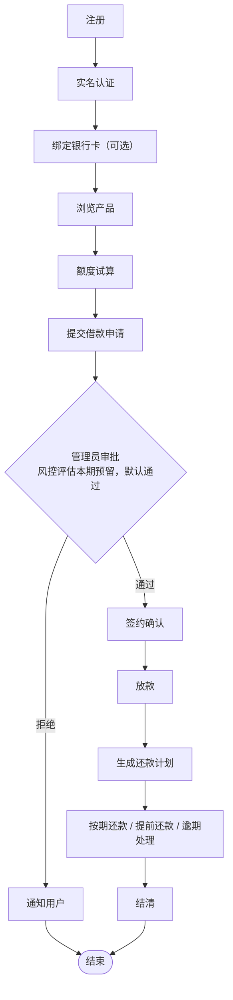
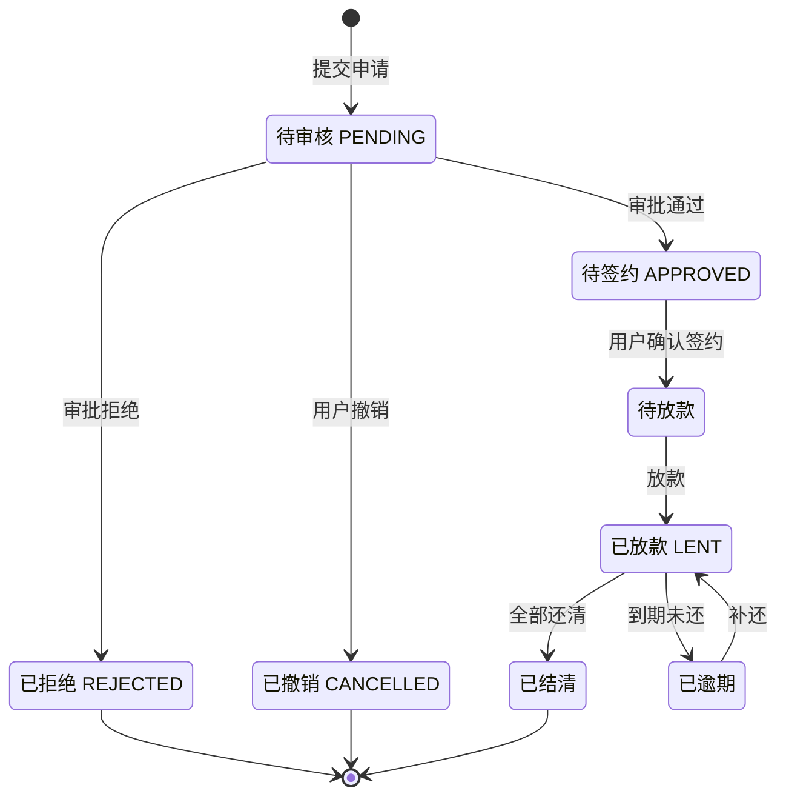
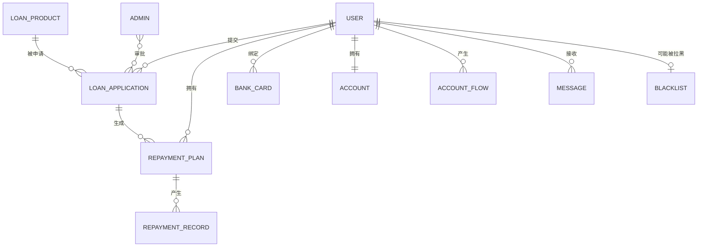

# 需求分析报告 · 第三部分（非功能需求与数据）

> **覆盖章节**：6. 其它非功能需求 · 7. 词汇表 · 8. 数据定义 · 9. 分析模型 · 10. 待定问题列表
> **负责人**：全栈　**状态**：初稿（整合自现有文档）　**计划完成**：第 ＿＿ 周
> **配套文件**：[00-框架与分工.md](00-框架与分工.md)
> **标记说明**：`〔待确认〕`＝需团队拍板；`〔待补充〕`＝需补充素材。定稿后删除所有标记。

---

## 6. 其它非功能需求

### 6.1 性能需求

> 模板要求：说明提出需求的**原理或依据**，以帮助开发人员做出合理的设计选择。

| 类别                   | 需求指标                                                                             | 依据 / 说明                                             |
| ---------------------- | ------------------------------------------------------------------------------------ | ------------------------------------------------------- |
| 相互合作的用户数量     | 注册用户 ≤ 50，同时在线 ≤ 20                                                         | 课程演示规模，无需按互联网产品量级设计 〔待确认〕       |
| 系统支持的并发操作数量 | 20 并发请求                                                                          | 覆盖「多人同时演示」的最坏情况 〔待确认〕               |
| 响应时间               | 常规查询/提交接口 ≤ 500 ms（P95）；统计报表 ≤ 2 s                                    | 答辩演示体感要求；统计类涉及多表聚合，放宽至 2 s        |
| 与实时系统的时间关系   | **非实时系统**，无硬实时约束                                                         | 唯一的时间敏感项是定时任务：逾期检测每日凌晨执行 1 次   |
| 容量需求 — 存储器      | 服务端内存 ≥ 4 GB                                                                    | MySQL + Redis + 应用进程共存的最低要求                  |
| 容量需求 — 磁盘空间    | ≥ 10 GB                                                                              | 数据库文件 + 日志                                       |
| 数据库中表的最大行数   | `t_loan_application` ≤ 10 万；`t_repayment_plan` ≤ 100 万；`t_account_flow` ≤ 100 万 | 按每笔借款平均 12 期估算，预留演示与压测余量 〔待确认〕 |

〔待确认〕Q-11：上述量化指标是否按课程演示规模确认？若教师要求更严格的指标，需同步调整。

### 6.2 安全措施需求

| 可能发生的损失 / 破坏 / 危害  | 必须采取的安全保护或动作                                                                       |
| ----------------------------- | ---------------------------------------------------------------------------------------------- |
| 密码泄露                      | 密码经 BCrypt 哈希后存储，**不得明文或可逆加密保存**                                           |
| 令牌被盗用                    | JWT 签名校验；令牌设置有效期（默认 2 小时）；退出后加入 Redis 黑名单                           |
| 接口被越权调用                | 所有业务接口校验令牌；管理端接口额外校验 `ROLE_ADMIN` 角色                                     |
| 金额计算被篡改或精度丢失      | 金额统一使用 `DECIMAL(18,2)` 与 Python `Decimal`，**严禁 `float`**；后端对前端传值**重新校验** |
| 并发操作导致超额扣款/重复放款 | 关键写操作置于数据库事务内，配合行级锁或乐观锁（版本号）                                       |
| 大量请求导致服务不可用        | 〔待补充〕是否引入接口限流；课程环境建议至少对登录接口做失败次数限制                           |
| 数据丢失                      | 〔待补充〕数据库定期备份策略（课程环境可采用导出 SQL 快照）                                    |

**必须遵从的安全标准/规则**：RESTful 接口统一鉴权；不信任任何前端输入（后端用 Pydantic 全量校验）。

### 6.3 安全性需求

**与系统安全性和完整性相关的需求**：

1. 每个接口必须校验调用者身份，未登录请求一律拒绝；
2. 用户只能访问本人的数据（借款、还款、账户、消息），**不得通过修改请求参数访问他人数据**；
3. 管理员与借款人权限严格分离，管理端接口不得被借款人令牌调用。

**与个人隐私相关的需求**：

| 敏感数据 | 保护要求                                                    |
| -------- | ----------------------------------------------------------- |
| 身份证号 | 列表与详情页脱敏显示（如 `510***********1234`）；日志中脱敏 |
| 手机号   | 脱敏显示（如 `138****8888`）；日志中脱敏                    |
| 银行卡号 | 脱敏存储或加密；展示时仅显示后四位                          |
| 密码     | 不可逆哈希存储，任何接口不得返回密码字段                    |

**身份认证与授权需求**：

- 用户登录后签发 JWT，令牌置于请求头 `Authorization`；
- 借款人须**完成实名认证**方可发起借款申请；
- 被冻结用户在冻结期间不可登录与借款。

**模板给出的安全需求范例（供对照）**：「每个用户在第一次登录后，必须更改他的系统预置登录密码，系统预置的登录密码不能重用。」——本项目不设此规则（演示账号可复用），**特此说明以免误解**。

### 6.4 软件质量属性

| 属性     | 要求                                                                                              | 相对侧重点               |
| -------- | ------------------------------------------------------------------------------------------------- | ------------------------ |
| 可维护性 | 分层清晰（路由层 → 业务层 → 数据访问层）；统一返回结构与统一异常处理；接口文档由 FastAPI 自动生成 | **本项目最看重**         |
| 可测试性 | 业务规则（利息、罚息、额度）与框架解耦，可独立单元测试；每条功能需求对应一条测试用例              | 与可维护性同级           |
| 可扩展性 | 风控、信用评估、多端接口以抽象接口预留，新增实现不改动既有调用方                                  | 次之                     |
| 易用性   | 关键操作给出友好中文提示；表单前端 + 后端双重校验                                                 | 易用性 **优于** 易学性   |
| 可靠性   | 关键事务保证「要么全成功、要么全失败」；异常有统一兜底                                            | 次之                     |
| 可移植性 | 依赖均为开源跨平台组件，可运行于 Windows / Linux                                                  | 有效性 **优于** 可移植性 |

> 模板要求这些属性「必须是确定的、定量的、在需要时可以验证的」。上表中可量化的项已在 §6.1 给出指标；其余属性以「是否满足既定实现约定」作为验证方式。

### 6.5 业务规则

> 业务规则**本身不是功能需求**，但会引出执行这些规则的功能需求。

| 编号  | 业务规则                                                                      |
| ----- | ----------------------------------------------------------------------------- |
| BR-01 | 借款流程为：注册 → 实名认证 → 提交申请 → 审批 → 签约 → 放款 → 按期还款 → 结清 |
| BR-02 | **未完成实名认证的用户不得发起借款申请**                                      |
| BR-03 | 单笔借款金额必须落在产品额度区间内，且不超过用户可用额度                      |
| BR-04 | 同一用户同一时间**只允许存在一笔待审核申请**                                  |
| BR-05 | 审批拒绝时**必须填写拒绝原因**                                                |
| BR-06 | 审批通过后用户须完成签约确认；超时未签约自动失效                              |
| BR-07 | 利息计算支持三种方式：等额本息 / 等额本金 / 先息后本（算式见 §5.3.2）         |
| BR-08 | 逾期产生罚息，按「逾期应还本金 × 罚息日利率 × 逾期天数」按日计算              |
| BR-09 | 提前还款须偿还剩余本金 + 当期截止日利息 +（可选）违约金                       |
| BR-10 | 可用额度 = 授信额度 − 未结清借款本金                                          |
| BR-11 | 黑名单用户提交的借款申请**自动拒绝**                                          |
| BR-12 | 被冻结用户在冻结期间不可登录与借款                                            |
| BR-13 | 还款日遇节假日**按自然日计算，不做顺延**（简化处理）                          |
| BR-14 | 还款金额超过应还金额时，多还部分转为账户余额或原路退回                        |
| BR-15 | 信用评分与动态授信额度**综设2 才实现**，本期用户统一使用默认信用分 60、等级 C |

### 6.6 用户文档

随产品交付的用户文档及其格式：

| 文档名称       | 交付格式                         | 说明                           |
| -------------- | -------------------------------- | ------------------------------ |
| 安装与部署指南 | 电子文档（Markdown），随仓库分发 | 环境搭建、建库、启动步骤       |
| 用户使用手册   | 电子文档（含截图）               | 借款人端操作说明               |
| 管理员手册     | 电子文档（含截图）               | 审批、放款、产品与用户管理说明 |
| 在线帮助       | 电子文档，集成于系统内（可选）   | 关键页面操作提示               |
| 接口文档       | 在线（FastAPI `/docs` 自动生成） | 供开发与测试使用               |

〔待确认〕Q-12：课程是否要求提交**纸质文档**（模板示例为「纸质文档，16 开本」）？若要求，需额外排版。

---

## 7. 词汇表

> 模板要求：本表以**业务层面术语**为主（便于非计算机专业人士阅读）；无法回避的计算机术语一并列出并准确定义。
> 完整版见仓库 `docs/05-术语表`（含更多技术术语），本章为报告精简版。

### 7.1 借贷业务术语

| 术语            | 英文 / 缩写          | 定义                                                           |
| --------------- | -------------------- | -------------------------------------------------------------- |
| 本金            | Principal            | 借出的款项本身                                                 |
| 利息            | Interest             | 使用资金所支付的报酬                                           |
| 利率 / 年化利率 | Interest Rate / APR  | 利息与本金的比率，通常按年表示                                 |
| 月利率          | Monthly Rate         | 年化利率 ÷ 12                                                  |
| 等额本息        | Equal Installment    | 每期还款总额相同，前期利息占比高、本金占比低                   |
| 等额本金        | Equal Principal      | 每期偿还的本金相同，利息逐期递减                               |
| 先息后本        | Interest-first       | 前期只还利息，最后一期一次性偿还本金                           |
| 还款计划        | Repayment Schedule   | 放款时生成的逐期还款清单（期数、应还日期、应还本金、应还利息） |
| 逾期            | Overdue              | 到达应还日期仍未足额还款的状态                                 |
| 罚息            | Penalty Interest     | 逾期产生的额外罚金，按日计算                                   |
| 提前还款        | Early Repayment      | 未到期末即偿还剩余本金                                         |
| 违约金          | Prepayment Penalty   | 提前还款时按约定收取的费用                                     |
| 授信额度        | Credit Line          | 平台允许用户借款的上限                                         |
| 可用额度        | Available Credit     | 授信额度减去未结清借款本金后的可借余额                         |
| 信用评分 / 等级 | Credit Score / Level | 依据收入、还款记录等评估的信用水平（本期统一为 60 分 / C 级）  |
| 风控            | Risk Control         | 控制放贷风险的规则体系（本期仅实现黑名单拦截）                 |
| 实名认证        | KYC                  | 核验用户真实身份（Know Your Customer）                         |
| 审批            | Approval             | 管理员决定借款申请是否通过                                     |
| 放款            | Disbursement         | 审批通过后向借款人支付款项                                     |
| 结清            | Settlement           | 本金与利息全部偿还完毕，借款关系终止                           |
| 催收            | Collection           | 对逾期用户的提醒与追讨                                         |
| 黑名单          | Blacklist            | 被限制借款的用户名单，其申请自动拒绝                           |
| 账户流水        | Account Flow         | 账户每一笔金额变动的记录                                       |
| 冻结金额        | Frozen Amount        | 已锁定、暂时不可动用的金额                                     |

### 7.2 系统与技术术语

| 术语                  | 英文 / 缩写                             | 定义                                                  |
| --------------------- | --------------------------------------- | ----------------------------------------------------- |
| 前后端分离            | Front-end / Back-end Separation         | 界面与业务逻辑拆分为两个独立程序，通过网络接口通信    |
| 接口 / API            | Application Programming Interface       | 程序之间约定的调用方式                                |
| RESTful               | Representational State Transfer         | 一种以资源为中心、用标准 HTTP 方法操作的接口设计风格  |
| JSON                  | JavaScript Object Notation              | 一种轻量的文本数据交换格式                            |
| JWT                   | JSON Web Token                          | 一种自包含的登录凭证（令牌）                          |
| 令牌黑名单            | Token Blacklist                         | 记录已注销令牌、使其立即失效的机制                    |
| 哈希                  | Hash                                    | 将数据转换为不可逆定长摘要的算法（密码存储用 BCrypt） |
| 脱敏                  | Masking                                 | 敏感信息以掩码方式展示                                |
| 事务                  | Transaction                             | 一组操作要么全部成功、要么全部失败                    |
| 乐观锁                | Optimistic Lock                         | 通过版本号比对避免并发覆盖的并发控制方式              |
| 精度 / DECIMAL        | Precision                               | 定点数表示，用于保证金额计算无浮点误差                |
| 状态机                | State Machine                           | 用「状态 + 允许的转移」描述业务流程                   |
| 定时任务              | Scheduled Task                          | 按固定时间自动执行的任务                              |
| 用例                  | Use Case                                | 参与者与系统之间为实现某一目标而进行的交互序列        |
| 功能需求 / 非功能需求 | Functional / Non-functional Requirement | 前者描述系统「做什么」，后者描述系统「做得怎么样」    |

---

## 8. 数据定义

> 本章定义系统使用的**逻辑数据项**（业务视角），物理表结构见仓库 `docs/03-数据库设计`。
> 每个数据项除中文名外给出**英文名**，软件开发时沿用该英文名。

### 8.1 记号约定

| 记号       | 名称       | 含义                                                                 |
| ---------- | ---------- | -------------------------------------------------------------------- |
| `*...*`    | 原数据元素 | 不可再分解的数据项；以星号为界的一行注释描述其定义                   |
| `[a \| b]` | 选择项     | 只可取有限离散值，用方括号枚举，值之间以管道符分隔                   |
| `a + b`    | 组合项     | 数据结构或记录，由多个数据项以加号连接；可选项用圆括号括起           |
| `{a}`      | 重复项     | 组合项的特例，某一项在结构中重复出现；范围按「最小值：最大值」写在前 |

### 8.2 用户域数据项

| 中文名   | 英文名         | 含义与类型           | 大小 / 格式          | 单位 | 精度 | 取值范围 / 约束                  |
| -------- | -------------- | -------------------- | -------------------- | ---- | ---- | -------------------------------- |
| 用户编号 | user_id        | 用户唯一标识（整数） | 19 位                | —    | 整数 | 正整数，系统生成                 |
| 登录账号 | username       | 用户登录名（文本）   | ≤ 50 字符            | —    | —    | 唯一；不含空格                   |
| 密码     | password       | 登录口令（文本）     | 60 字符（BCrypt）    | —    | —    | 哈希存储，不可逆                 |
| 手机号   | phone          | 联系手机号（文本）   | 11 位                | —    | —    | 唯一；`1[3-9]\d{9}`              |
| 真实姓名 | real_name      | 实名姓名（文本）     | ≤ 50 字符            | —    | —    | 实名认证时填写                   |
| 身份证号 | id_card        | 身份证号码（文本）   | 18 位                | —    | —    | 18 位校验；脱敏展示              |
| 月收入   | monthly_income | 月收入（金额）       | 12 位整数 + 2 位小数 | 元   | 0.01 | ≥ 0；综设2 用于信用评分          |
| 信用分   | credit_score   | 信用评分（整数）     | 3 位                 | 分   | 1    | 0 ~ 100；本期固定 60             |
| 信用等级 | credit_level   | 信用等级（字符）     | 1 字符               | —    | —    | `[A \| B \| C \| D]`；本期固定 C |
| 授信额度 | credit_line    | 授信上限（金额）     | 18 位整数 + 2 位小数 | 元   | 0.01 | ≥ 0；本期为固定默认值            |
| 实名状态 | is_real_name   | 是否已实名（标志）   | 1 位                 | —    | —    | `[0 未实名 \| 1 已实名]`         |
| 用户状态 | status         | 账号状态（标志）     | 1 位                 | —    | —    | `[0 正常 \| 1 冻结]`             |

**组合项示例**：

```
用户 = 用户编号 + 登录账号 + 密码 + 手机号 + (真实姓名) + (身份证号) + (昵称) + (邮箱)
     + (职业) + (月收入) + (居住地址) + 信用分 + 信用等级 + 授信额度 + 实名状态 + 用户状态
用户列表 = { 用户 }
```

### 8.3 贷款产品域数据项

| 中文名            | 英文名                            | 含义与类型             | 大小 / 格式          | 单位 | 精度   | 取值范围 / 约束                            |
| ----------------- | --------------------------------- | ---------------------- | -------------------- | ---- | ------ | ------------------------------------------ |
| 产品编号          | product_id                        | 产品唯一标识（整数）   | 19 位                | —    | 整数   | 正整数，系统生成                           |
| 产品名称          | name                              | 产品名称（文本）       | ≤ 100 字符           | —    | —      | 非空                                       |
| 最小 / 最大借款额 | min_amount / max_amount           | 额度区间（金额）       | 18 位整数 + 2 位小数 | 元   | 0.01   | ≥ 0；min ≤ max                             |
| 年利率下限 / 上限 | annual_rate_min / annual_rate_max | 利率区间（比率）       | 4 位整数 + 4 位小数  | %    | 0.0001 | ≥ 0；min ≤ max                             |
| 期限范围          | min_term / max_term               | 借款期限（整数）       | 3 位                 | 月   | 1      | ≥ 1；min ≤ max                             |
| 还款方式          | repay_type                        | 还款方式（标志）       | 1 位                 | —    | —      | `[1 等额本息 \| 2 等额本金 \| 3 先息后本]` |
| 罚息日利率        | penalty_daily_rate                | 逾期罚息日利率（比率） | 4 位整数 + 4 位小数  | %    | 0.0001 | ≥ 0                                        |
| 提前还款违约金率  | prepay_fee_rate                   | 违约金比率（比率）     | 4 位整数 + 4 位小数  | %    | 0.0001 | ≥ 0                                        |
| 产品状态          | status                            | 上下架状态（标志）     | 1 位                 | —    | —      | `[0 下架 \| 1 上架]`                       |

### 8.4 借款申请域数据项

| 中文名     | 英文名        | 含义与类型               | 大小 / 格式           | 单位 | 精度   | 取值范围 / 约束                                                                      |
| ---------- | ------------- | ------------------------ | --------------------- | ---- | ------ | ------------------------------------------------------------------------------------ |
| 申请编号   | apply_no      | 申请业务编号（文本）     | ≤ 32 字符             | —    | —      | 唯一，格式 `LA` + 日期 + 序号                                                        |
| 借款金额   | amount        | 申请金额（金额）         | 18 位整数 + 2 位小数  | 元   | 0.01   | > 0；在产品区间内且 ≤ 可用额度                                                       |
| 借款期限   | term          | 借款期数（整数）         | 3 位                  | 月   | 1      | ≥ 1；在产品期限范围内                                                                |
| 最终年利率 | annual_rate   | 审批确定的年利率（比率） | 4 位整数 + 4 位小数   | %    | 0.0001 | 在产品利率区间内                                                                     |
| 借款用途   | purpose       | 借款用途说明（文本）     | ≤ 200 字符            | —    | —      | 非空                                                                                 |
| 申请状态   | status        | 申请流转状态（标志）     | 1 位                  | —    | —      | `[0 待审核 \| 1 待签约 \| 2 待放款 \| 3 已放款 \| 4 已结清 \| 5 已拒绝 \| 6 已撤销]` |
| 审批意见   | audit_opinion | 管理员审批意见（文本）   | ≤ 200 字符            | —    | —      | 拒绝时必填                                                                           |
| 审批时间   | audit_time    | 审批发生时间（时间）     | `YYYY-MM-DD HH:mm:ss` | —    | 秒     | ≥ 申请提交时间                                                                       |
| 放款时间   | lend_time     | 放款发生时间（时间）     | 同上                  | —    | 秒     | ≥ 审批时间                                                                           |
| 结清时间   | finish_time   | 结清发生时间（时间）     | 同上                  | —    | 秒     | ≥ 放款时间                                                                           |

**组合项示例**：

```
借款申请 = 申请编号 + 用户编号 + 产品编号 + 借款金额 + 借款期限 + 最终年利率
         + 还款方式 + 借款用途 + 申请状态 + (审批意见) + (审批时间) + (放款时间) + (结清时间)
```

### 8.5 还款域数据项

| 中文名   | 英文名         | 含义与类型           | 大小 / 格式           | 单位 | 精度 | 取值范围 / 约束                            |
| -------- | -------------- | -------------------- | --------------------- | ---- | ---- | ------------------------------------------ |
| 期数     | period_no      | 第几期（整数）       | 3 位                  | 期   | 1    | 1 ~ n                                      |
| 应还日期 | due_date       | 该期到期日（日期）   | `YYYY-MM-DD`          | —    | 日   | ≥ 放款日                                   |
| 应还本金 | principal      | 该期应还本金（金额） | 18 位整数 + 2 位小数  | 元   | 0.01 | ≥ 0；各期合计 = 借款金额                   |
| 应还利息 | interest       | 该期应还利息（金额） | 同上                  | 元   | 0.01 | ≥ 0                                        |
| 已还本金 | paid_principal | 已偿还本金（金额）   | 同上                  | 元   | 0.01 | 0 ~ 应还本金                               |
| 已还利息 | paid_interest  | 已偿还利息（金额）   | 同上                  | 元   | 0.01 | 0 ~ 应还利息                               |
| 罚息     | penalty        | 已产生罚息（金额）   | 同上                  | 元   | 0.01 | ≥ 0                                        |
| 计划状态 | status         | 该期还款状态（标志） | 1 位                  | —    | —    | `[0 未还 \| 1 部分还 \| 2 已还 \| 3 逾期]` |
| 还款金额 | amount         | 本次还款额（金额）   | 同上                  | 元   | 0.01 | > 0                                        |
| 还款类型 | repay_type     | 还款方式（标志）     | 1 位                  | —    | —    | `[1 按期 \| 2 提前结清 \| 3 逾期补缴]`     |
| 还款时间 | repay_time     | 还款发生时间（时间） | `YYYY-MM-DD HH:mm:ss` | —    | 秒   | 非空                                       |

**组合项示例**：

```
还款计划 = 借款申请 + { 期数 + 应还日期 + 应还本金 + 应还利息 + 已还本金 + 已还利息 + 罚息 + 计划状态 }
```

### 8.6 账户与通知域数据项

| 中文名   | 英文名        | 含义与类型             | 大小 / 格式          | 单位 | 精度 | 取值范围 / 约束                                    |
| -------- | ------------- | ---------------------- | -------------------- | ---- | ---- | -------------------------------------------------- |
| 账户余额 | balance       | 账户可用余额（金额）   | 18 位整数 + 2 位小数 | 元   | 0.01 | ≥ 0                                                |
| 冻结金额 | frozen_amount | 已冻结金额（金额）     | 同上                 | 元   | 0.01 | ≥ 0                                                |
| 变动金额 | amount        | 流水变动额（金额）     | 同上                 | 元   | 0.01 | 正数入账、负数出账                                 |
| 流水类型 | type          | 变动原因（标志）       | 1 位                 | —    | —    | `[1 充值 \| 2 放款 \| 3 还款 \| 4 提现 \| 5 罚息]` |
| 消息类型 | type          | 通知类别（标志）       | 1 位                 | —    | —    | `[1 系统 \| 2 还款提醒 \| 3 逾期提醒]`             |
| 已读标记 | is_read       | 是否已读（标志）       | 1 位                 | —    | —    | `[0 未读 \| 1 已读]`                               |
| 拉黑原因 | reason        | 加入黑名单原因（文本） | ≤ 200 字符           | —    | —    | 非空                                               |

---

## 9. 分析模型

> 本章给出与需求相关的分析模型。图均采用 Mermaid 绘制。

### 9.1 数据流程图（借款主流程）



### 9.2 状态转换图（借款申请状态机）



> 说明：「已放款 LENT」即覆盖「还款中」期间；「已逾期」是放款后依据还款计划动态判定的**衍生状态**，不在借款申请中单独持久化。

### 9.3 实体-关系图



> **实体名对应表名**：`USER`→`t_user`、`LOAN_APPLICATION`→`t_loan_application`、`LOAN_PRODUCT`→`t_loan_product`、`REPAYMENT_PLAN`→`t_repayment_plan`、`REPAYMENT_RECORD`→`t_repayment_record`、`BANK_CARD`→`t_bank_card`、`ACCOUNT`→`t_account`、`ACCOUNT_FLOW`→`t_account_flow`、`MESSAGE`→`t_message`、`ADMIN`→`t_admin`、`BLACKLIST`→`t_blacklist`。

### 9.4 类图

〔待补充〕Q-13：本报告尚未绘制类图。建议在概要设计阶段补充（属于设计模型而非需求模型），或本期以 §9.3 的实体-关系图代替，并在报告中说明。

---

## 10. 待定问题列表

| 编号 | 待定问题                                                       | 影响章节           | 责任人 | 目标解决时间 | 状态   |
| ---- | -------------------------------------------------------------- | ------------------ | ------ | ------------ | ------ |
| Q-01 | 「系统用例设计」是否独立成章（模板目录未列、正文有）           | 全文结构           | 全员   | 第 1 周      | 待确认 |
| Q-02 | 第 4 名成员是否承担统稿与评审                                  | 分工               | 全员   | 第 1 周      | 待确认 |
| Q-03 | 是否需额外产出 Word 版报告                                     | 交付形式           | 全员   | 第 3 周      | 待确认 |
| Q-04 | 功能需求清单粒度：按模块（8 条）还是按功能点（本文档取 36 条） | §5.1               | 全员   | 第 2 周      | 已定稿 |
| Q-05 | 信用评分与动态授信额度本期只预留接口，需求描述写到什么程度     | §5.1 / §6.5        | 后端 A | 第 2 周      | 待确认 |
| Q-06 | 实名认证是否含人脸/证件照上传，还是简化为表单                  | UC-03 / §3.3       | 后端 A | 第 2 周      | 待确认 |
| Q-07 | 是否在本报告内列出完整错误码表                                 | §3.1               | 前端   | 第 2 周      | 待确认 |
| Q-08 | 同一用户是否允许同时存在多笔「待签约」申请                     | UC-07 异常处理     | 后端 B | 第 2 周      | 待确认 |
| Q-09 | 审批是否需支持批量操作                                         | UC-09              | 后端 B | 第 2 周      | 待确认 |
| Q-10 | 按期还款是否支持部分还款                                       | UC-13 异常处理     | 后端 B | 第 2 周      | 待确认 |
| Q-11 | §6.1 性能指标是否按课程演示规模确认                            | §6.1               | 全栈   | 第 2 周      | 待确认 |
| Q-12 | 课程是否要求提交纸质文档                                       | §6.6               | 全栈   | 第 3 周      | 待确认 |
| Q-13 | 是否需要补充类图                                               | §9.4               | 全栈   | 第 2 周      | 待确认 |
| Q-14 | 多端适配（安卓端）与风控接口预留是否写入本期需求范围           | §2.2 / §2.5 / §2.6 | 全员   | 第 1 周      | 待确认 |
| Q-15 | 还款日遇节假日不顺延，是否会被判定为需求遗漏                   | §6.5 BR-13         | 后端 B | 第 2 周      | 待确认 |

---

## 自检清单（提交前逐项勾选）

- [ ] §6.1 性能需求已**量化为具体数字**并给出依据
- [ ] §6.4 质量属性满足「确定、定量、可验证」，并指明了相对侧重点
- [ ] §6.5 业务规则与 §5 功能需求**不重复**（规则不是需求，但能引出需求）
- [ ] §7 术语以**业务术语**为主，计算机术语已尽量转化为业务表述
- [ ] §8 每个数据项都有中文名 + 英文名，且含义/类型/大小/格式/单位/精度/取值范围齐全
- [ ] §8 数据项按**实际意义**汇总去重，未按名称机械合并
- [ ] §9 图表与 §4 用例图不重复，图注说明了分析视角
- [ ] §10 待定问题均已编号并指定责任人与目标解决时间
- [ ] 所有 `〔待确认〕`、`〔待补充〕` 标记已处理并删除
