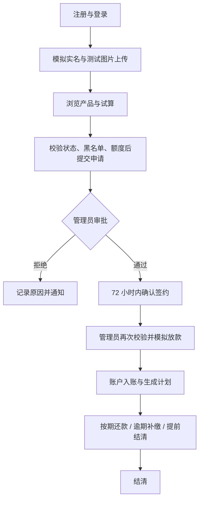
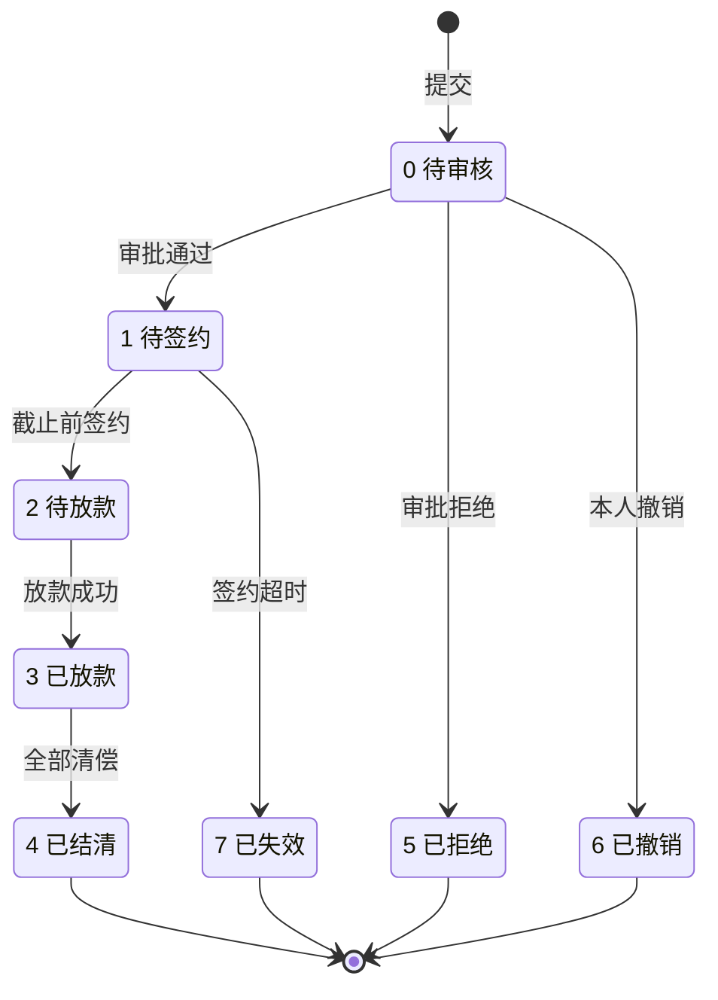
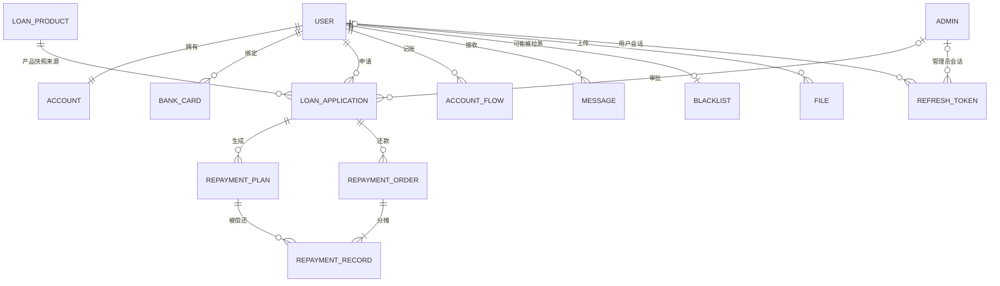

# 需求分析报告 · 第三部分（非功能需求与数据）

> **覆盖章节**：6. 其它非功能需求 · 7. 词汇表 · 8. 数据定义 · 9. 分析模型 · 10. 待定问题列表
> **负责人**：全栈　**状态**：初稿（整合自现有文档）　**计划完成**：第 ＿＿ 周
> **配套文件**：[00-框架与分工.md](00-框架与分工.md)
> **业务基线**：口径一律以 [《02-功能需求分析》](../docs/02-功能需求分析.md) v1.1 为准，数据结构见 [《03-数据库设计》](../docs/03-数据库设计.md) v1.1。
> **标记说明**：`〔待确认〕`＝需团队拍板；`〔待补充〕`＝需补充素材。定稿后删除所有标记。

---

## 6. 其它非功能需求

### 6.1 性能需求

> 模板要求：说明提出需求的**原理或依据**。以下为**计划验收指标，不能视为已测结果**。

| 编号   | 指标                                                                                                     | 验证方式                                                       |
| ------ | -------------------------------------------------------------------------------------------------------- | -------------------------------------------------------------- |
| NFR-01 | 在记录配置的本地服务端、**50 个演示用户 / 20 并发**下，常规查询 P95 ≤ 500 ms、报表 ≤ 2 s（图片传输除外） | 预热后连续测试 5 分钟，记录数据量、错误率及环境                |
| NFR-02 | 访问他人借款 / 附件、借款人调用管理 API 均被拒绝                                                         | 至少两个用户和一个管理员交叉验证                               |
| NFR-03 | 重复请求、并发放款 / 还款、任务重跑**不导致重复入账或计费**                                              | 记录同一幂等键的响应、订单数、余额差与流水                     |
| NFR-04 | 必填项、加载 / 断网 / 过期提示明确；写操作不因多次点击创建多笔业务                                       | Web 与 APK 各执行成功和失败路径                                |
| NFR-05 | Chrome/Edge 及**至少一台 Android 真机**完成核心流程                                                      | M1 冻结实际 OS、浏览器、HBuilderX、机型与最低支持版本；M4 留档 |
| NFR-06 | 空库可通过迁移和 seed 初始化，备份可还原出同一业务余额                                                   | M4 在独立测试库恢复验证                                        |
| NFR-07 | 同一业务规则在服务层实现，接口带 OpenAPI 示例，错误与请求可追踪                                          | 代码评审与接口契约检查                                         |

**容量需求**〔待确认〕Q-11：服务端内存 ≥ 4 GB、磁盘 ≥ 10 GB；`t_repayment_plan` / `t_account_flow` 行数上限按每笔借款平均 12 期估算（演示规模 ≤ 100 万行）。课程演示规模下无需按互联网产品量级设计。

### 6.2 安全措施需求

| 可能发生的损失 / 破坏 / 危害  | 必须采取的安全保护或动作                                                                              |
| ----------------------------- | ----------------------------------------------------------------------------------------------------- |
| 密码泄露                      | 密码经 BCrypt 哈希后存储，**不得明文或可逆加密保存**                                                  |
| 令牌被盗用                    | access token 签名校验（JWT，默认 2 小时）与 refresh token 分离；刷新令牌服务端只存摘要、每次轮换      |
| 会话被长期复用                | 会话固定 7 天；退出吊销当前会话，冻结账号吊销**全部**会话；业务请求每次检查会话与账号状态             |
| 接口被越权调用                | 所有业务接口校验令牌与资源归属；管理端接口额外校验管理员身份，**不能以客户端传入角色获得权限**        |
| 附件被越权读取                | 附件只允许所属用户或管理员读取，**不能把存储路径当作公开静态 URL**                                    |
| 金额计算被篡改或精度丢失      | 金额统一使用 `DECIMAL(18,2)` 与 `Decimal`，**严禁 `float`**；接口以字符串传输；后端对前端传值重新校验 |
| 重复请求造成重复记账          | 写接口携带 `Idempotency-Key`；幂等结果与业务变更**同一事务提交**；数据库唯一键兜底                    |
| 并发操作导致超额扣款/重复放款 | 关键写操作置于事务内（READ COMMITTED），遵循统一用户锁序，配合唯一键或乐观锁                          |
| 大量请求导致服务不可用        | Redis 用于验证码与限流；依赖不可用时返回 503，**不降级放行**                                          |
| 数据丢失                      | 迁移与 seed 版本化；M4 在独立测试库验证备份恢复                                                       |

**必须遵从的安全标准/规则**：RESTful 接口统一鉴权；不信任任何前端输入（后端用 Pydantic 全量校验）；`.env`、私钥与 APK 签名密钥不入库。

### 6.3 安全性需求

**与系统安全性和完整性相关的需求**：

1. 每个接口必须校验调用者身份，未登录请求一律拒绝；
2. 用户只能访问本人的数据（借款、还款、账户、消息、附件），**不得通过修改请求参数访问他人数据**；
3. 管理员与借款人权限严格分离，管理端接口不得被借款人令牌调用；管理员登录使用独立入口，公开用户登录不能签发管理员权限。

**与个人隐私相关的需求**：

| 敏感数据 | 保护要求                                                 |
| -------- | -------------------------------------------------------- |
| 身份证号 | 列表与详情页脱敏显示；日志中脱敏                         |
| 手机号   | 脱敏显示（如 `138****8888`）；日志中脱敏                 |
| 银行卡号 | 仅保存**虚构测试卡号**，展示仅后四位；不参与真实资金划转 |
| 密码     | 不可逆哈希存储，任何接口不得返回密码字段                 |
| 证件图片 | 仅存虚构测试图片，放于非公开目录，按鉴权接口读取         |

**身份认证与授权需求**：

- 用户登录后签发 JWT access token，令牌置于请求头 `Authorization`；安卓端通过 refresh token 自动续期；
- 借款人须**完成模拟实名**方可发起借款申请；
- 被冻结用户在冻结期间不可登录、续期、申请或放款。

**与模板范例的差异说明**：模板范例为「首次登录后必须更改预置密码且不得重用」——本项目为演示系统，账号可复用，**不设此规则**，特此说明以免误解。

### 6.4 软件质量属性

| 属性     | 要求                                                                                              | 相对侧重点               |
| -------- | ------------------------------------------------------------------------------------------------- | ------------------------ |
| 可维护性 | 分层清晰（路由层 → 业务层 → 数据访问层）；统一返回结构与统一异常处理；接口文档由 FastAPI 自动生成 | **本项目最看重**         |
| 可测试性 | 业务规则（利息、罚息、额度、提前结清）与框架解耦，可独立单元测试；每条功能需求对应一条测试用例    | 与可维护性同级           |
| 可扩展性 | 风控、信用评估、多端接口以抽象接口预留；Web 与安卓端共用 API，新增客户端不改动业务规则            | 次之                     |
| 易用性   | 关键操作给出友好中文提示；表单前端 + 后端双重校验；写操作不因多次点击创建多笔业务                 | 易用性 **优于** 易学性   |
| 可靠性   | 关键事务保证「要么全成功、要么全失败」；依赖不可用时返回 503 而非降级放行                         | 次之                     |
| 可移植性 | 依赖均为开源跨平台组件；Web 与安卓端分别构建，服务端可运行于 Windows / Linux                      | 有效性 **优于** 可移植性 |

### 6.5 业务规则

> 业务规则**本身不是功能需求**，但会引出执行这些规则的功能需求。

| 编号  | 业务规则                                                                                                              |
| ----- | --------------------------------------------------------------------------------------------------------------------- |
| BR-01 | 借款流程为：注册 → 模拟实名（含测试图片）→ 提交申请 → 审批 → 签约（72 小时内）→ 放款 → 按期/逾期还款或提前结清 → 结清 |
| BR-02 | **未完成模拟实名的用户不得发起借款申请**                                                                              |
| BR-03 | 单笔借款金额必须落在产品额度区间内，且不超过用户可用额度；**提交校验不承诺放款成功**                                  |
| BR-04 | 同一用户同一时间**只允许一笔待审核申请**；待签约、待放款申请可以并存，且**不预占授信**                                |
| BR-05 | 审批拒绝时**必须填写拒绝原因**                                                                                        |
| BR-06 | 审批通过后 **72 小时内**须完成签约；超过 `sign_deadline` 记为**已失效**，不得放款                                     |
| BR-07 | 利息计算支持三种方式：等额本息 / 等额本金 / 先息后本；月利率 = 年利率 / 100 / 12（算式见第二部分 §5.3.2）             |
| BR-08 | 逾期按日计提罚息：日罚息 = 当日计费前的逾期未还本金 × 罚息日利率 / 100，分日舍入；**重跑不重计**                      |
| BR-09 | 提前还款**仅支持整笔提前结清**；未来期利息与当期未计收部分记为减免，保留原计划                                        |
| BR-10 | 可用额度 = max(0, 授信额度 − 已放款未结清计划的未还本金)；**只按未还本金占用，利息罚息不占授信**                      |
| BR-11 | 黑名单用户的新申请与放款被拒绝；**允许其查询并偿还既有债务**                                                          |
| BR-12 | 冻结是账号停用，已签发会话同时失效；**不清除欠款、不停止罚息**，需管理员解冻后才能继续还款                            |
| BR-13 | 业务时区统一 Asia/Shanghai；到期日当天可还，**次日开始逾期**；还款日遇节假日按自然日计算，不顺延                      |
| BR-14 | 一次普通还款结清**最早到期的整期债务**；**不接受任意部分还款，也不接受超额扣款**（金额超应还返回 409）                |
| BR-15 | 信用评分与动态授信额度**后续阶段才实现**，本期用户统一使用默认信用分 60、等级 C，接口标注 `is_mock=true`              |
| BR-16 | 提交、审批、签约、放款、还款等写操作必须幂等：同键同内容返回原结果，不同内容返回 409                                  |
| BR-17 | **虚拟身份、模拟资金**：身份资料仅做格式检查，放款为账户记账，银行卡不参与资金划转                                    |

### 6.6 用户文档

| 文档名称           | 交付格式                         | 说明                                  |
| ------------------ | -------------------------------- | ------------------------------------- |
| 安装与部署指南     | 电子文档（Markdown），随仓库分发 | 环境搭建、迁移与 seed、启动步骤       |
| 用户使用手册       | 电子文档（含截图）               | Web 用户端与安卓 App 借款人端操作说明 |
| 管理员手册         | 电子文档（含截图）               | 审批、放款、产品与用户管理说明        |
| 安卓安装与版本说明 | 电子文档                         | APK 安装步骤、包名、版本与设备记录    |
| 在线帮助           | 电子文档，集成于系统内（可选）   | 关键页面操作提示                      |
| 接口文档           | 在线（FastAPI `/docs` 自动生成） | 供开发与测试使用                      |

〔待确认〕Q-12：课程是否要求提交**纸质文档**（模板示例为「纸质文档，16 开本」）？若要求，需额外排版。

---

## 7. 词汇表

> 模板要求：本表以**业务层面术语**为主；无法回避的计算机术语一并列出并准确定义。
> 完整版见仓库 [《05-术语表》](../docs/05-术语表.md)，本章为报告精简版。

### 7.1 借贷业务术语

| 术语            | 英文 / 缩写                  | 定义                                                                          |
| --------------- | ---------------------------- | ----------------------------------------------------------------------------- |
| 本金            | Principal                    | 借出的款项本身                                                                |
| 利息            | Interest                     | 使用资金所支付的报酬                                                          |
| 年利率          | Annual Interest Rate         | 按年表示的合同利息率；**不等同于含全部费用的综合年化成本**                    |
| 月利率          | Monthly Rate                 | 计算月息用的小数比例，等于 年利率 / 100 / 12                                  |
| 等额本息        | Equal Installment            | 每期还款总额相同，前期利息占比高、本金占比低                                  |
| 等额本金        | Equal Principal              | 每期偿还的本金相同，利息逐期递减                                              |
| 先息后本        | Interest-first               | 前期只还利息，最后一期一次性偿还本金                                          |
| 还款计划        | Repayment Schedule           | 放款时生成的逐期清单（期数、到期日、应还本金、应还利息）                      |
| 逾期            | Overdue                      | **到期日次日**仍有未清偿款项；是**还款计划状态或聚合标志，不是申请状态**      |
| 罚息            | Penalty Interest             | 逾期未还本金产生的额外费用；按日计提、分日舍入、**重跑不重计**，不对利息复利  |
| 提前还款        | Early Repayment              | 到期前归还贷款；**本期仅支持整笔提前结清**，未来利息减免有记录                |
| 违约金          | Prepayment Penalty           | 提前结清时按约定收取的费用（本期默认费率为 0）                                |
| 授信额度        | Credit Line                  | 允许占用的**借款本金上限**，默认 50000.00，管理员可调；**区别于账户现金余额** |
| 可用额度        | Available Credit             | 授信中尚未被本金占用的部分 = 授信 − 未还本金                                  |
| 账户余额        | Account Balance              | 借款人可用**模拟现金**；放款增加、还款减少                                    |
| 信用评分 / 等级 | Credit Score / Level         | 依据收入、还款记录等评估的信用水平；本期为固定 60 / C 并标注 `is_mock`        |
| 风控            | Risk Control                 | 控制放贷风险的规则体系；本期**仅黑名单为真实执行**                            |
| 模拟实名        | Mock Identity Check          | 仅做身份资料格式检查与测试图片上传，**不是真实身份核验**                      |
| 审批            | Approval                     | 管理员决定借款申请是否通过                                                    |
| 放款            | Disbursement                 | 贷款资金进入借款人账户；本期为**模拟余额增加**，并生成计划与正数流水          |
| 结清            | Settlement                   | 本金利息全部偿还完毕，借款关系终止                                            |
| 利息减免        | Interest Waiver              | 提前结清不再收取的计划利息，记为 `waived_interest`，不覆盖原计划              |
| 还款订单 / 分摊 | Repayment Order / Allocation | 一次扣款及其对多期计划的分配；订单金额 = 分项现金合计 + 违约金                |
| 对账            | Reconciliation               | 验证余额、流水、订单与计划分摊互相一致                                        |
| 黑名单          | Blacklist                    | 被限制借款的用户名单，新申请自动拒绝，但允许偿还既有债务                      |
| 账户流水        | Account Flow                 | 账户每一笔金额变动的记录，含记账后余额                                        |

### 7.2 系统与技术术语

| 术语           | 英文 / 缩写                       | 定义                                                            |
| -------------- | --------------------------------- | --------------------------------------------------------------- |
| 前后端分离     | Front-end / Back-end Separation   | 界面与业务逻辑拆分为独立程序，通过网络接口通信                  |
| 接口 / API     | Application Programming Interface | 程序之间约定的调用方式                                          |
| RESTful        | Representational State Transfer   | 以资源为中心、用标准 HTTP 方法操作的接口设计风格                |
| JSON           | JavaScript Object Notation        | 轻量文本数据交换格式；本项目金额 / 利率以字符串传输             |
| access token   | —                                 | 调用业务 API 的短期凭证（JWT，默认 2 小时）                     |
| refresh token  | —                                 | 换取新 access token 的凭证；高熵随机串、服务端存摘要、每次轮换  |
| 会话 / sid     | Session / Session ID              | 一次设备登录对应的凭证集合；用户与管理员各设备会话独立          |
| 安全存储       | Secure Storage                    | 借助系统保护机制保存凭证；普通本地存储**不等价于**加密存储      |
| 哈希           | Hash                              | 将输入映射为摘要；通用哈希不适合直接存口令；刷新令牌存 SHA-256  |
| 脱敏           | Masking                           | 敏感信息以掩码方式展示                                          |
| 事务           | Transaction                       | 一组操作要么全部成功、要么全部失败                              |
| 乐观锁         | Optimistic Lock                   | 通过版本号比对避免并发覆盖                                      |
| 幂等           | Idempotency                       | 重复执行相同请求不产生额外业务效果；同键同内容返回原结果        |
| 规则快照       | Rule Snapshot                     | 业务发生时复制并保留当时规则；产品修改不影响已有申请            |
| 精度 / DECIMAL | Precision                         | 定点数表示，保证金额计算无浮点误差                              |
| 状态机         | State Machine                     | 用「状态 + 允许的转移」描述业务流程                             |
| 定时任务       | Scheduled Task                    | 按固定时间自动执行的任务；本期为**单调度实例**                  |
| 用例           | Use Case                          | 参与者与系统之间为实现某一目标而进行的交互序列                  |
| APK            | Android Package                   | 安卓应用安装包；M1 首次真机安装，M4 交付签名包                  |
| HBuilderX      | —                                 | uni-app 开发及配套打包工具                                      |
| is_mock        | —                                 | 模拟数据标记；默认评分 / 风控结果明确标注，不能作为真实评估依据 |

---

## 8. 数据定义

> 本章定义**逻辑数据项**（业务视角），物理表结构见 [《03-数据库设计》](../docs/03-数据库设计.md) v1.1。
> 每个数据项除中文名外给出**英文名**，软件开发时沿用该英文名。

### 8.1 记号约定

| 记号       | 名称       | 含义                                                                 |
| ---------- | ---------- | -------------------------------------------------------------------- |
| `*...*`    | 原数据元素 | 不可再分解的数据项；以星号为界的一行注释描述其定义                   |
| `[a \| b]` | 选择项     | 只可取有限离散值，用方括号枚举，值之间以管道符分隔                   |
| `a + b`    | 组合项     | 数据结构或记录，由多个数据项以加号连接；可选项用圆括号括起           |
| `{a}`      | 重复项     | 组合项的特例，某一项在结构中重复出现；范围按「最小值：最大值」写在前 |

### 8.2 用户与会话域数据项

| 中文名     | 英文名         | 含义与类型               | 大小 / 格式          | 单位 | 精度 | 取值范围 / 约束                    |
| ---------- | -------------- | ------------------------ | -------------------- | ---- | ---- | ---------------------------------- |
| 用户编号   | user_id        | 用户唯一标识（整数）     | 19 位                | —    | 整数 | 正整数，系统生成                   |
| 登录账号   | username       | 用户登录名（文本）       | ≤ 50 字符            | —    | —    | **唯一**；非空                     |
| 手机号     | phone          | 模拟手机号（文本）       | ≤ 20 字符            | —    | —    | **唯一**；非空                     |
| 密码       | password       | 密码哈希（文本）         | ≤ 255 字符           | —    | —    | BCrypt 哈希，**不返回客户端**      |
| 真实姓名   | real_name      | 虚构实名姓名（文本）     | ≤ 50 字符            | —    | —    | 可空                               |
| 身份证号   | id_card        | 虚构证件号（文本）       | 18 位                | —    | —    | 格式校验；脱敏展示                 |
| 证件附件   | cert_file_id   | 证件图片附件标识（整数） | 19 位                | —    | 整数 | 可空；须校验归属与 `user_id` 一致  |
| 月收入     | monthly_income | 月收入（金额）           | 12 位整数 + 2 位小数 | 元   | 0.01 | ≥ 0；后续阶段用于信用评分          |
| 信用分     | credit_score   | 信用评分（整数）         | 3 位                 | 分   | 1    | 0 ~ 100；本期固定 60，`is_mock`    |
| 信用等级   | credit_level   | 信用等级（字符）         | 1 字符               | —    | —    | `[A \| B \| C \| D]`；本期固定 C   |
| 授信额度   | credit_line    | 授信总额（金额）         | 18 位整数 + 2 位小数 | 元   | 0.01 | 默认 50000.00，非负；**非现金**    |
| 实名状态   | is_real_name   | 是否已模拟实名（标志）   | 1 位                 | —    | —    | `[0 未实名 \| 1 已实名]`           |
| 用户状态   | status         | 账号状态（标志）         | 1 位                 | —    | —    | `[0 正常 \| 1 冻结]`               |
| 客户端类型 | client_type    | 登录端类型（文本）       | ≤ 10 字符            | —    | —    | `[WEB \| ANDROID]`                 |
| 设备标识   | device_id      | 安装标识（文本）         | ≤ 64 字符            | —    | —    | 随机安装标识，**不是硬件身份凭证** |
| 令牌摘要   | token_hash     | 刷新令牌摘要（文本）     | 64 字符（SHA-256）   | —    | —    | **唯一**；服务端不保存令牌原文     |
| 会话到期   | expires_at     | 会话到期时间（时间）     | ISO 8601 +08:00      | —    | 秒   | 固定 7 天，轮换不延长              |
| 吊销时间   | revoked_at     | 会话吊销时间（时间）     | 同上                 | —    | 秒   | 可空；非空表示已吊销               |

**组合项示例**：

```
用户 = 用户编号 + 登录账号 + 密码 + 手机号 + (真实姓名) + (身份证号) + (证件附件)
     + (昵称) + (邮箱) + (职业) + (月收入) + (居住地址)
     + 信用分 + 信用等级 + 授信额度 + 实名状态 + 用户状态
用户会话 = 会话标识 + (用户编号 + 管理员编号) + 客户端类型 + 设备标识
         + 令牌摘要 + 会话到期 + (吊销时间)
```

### 8.3 贷款产品域数据项

| 中文名            | 英文名                            | 含义与类型               | 大小 / 格式          | 单位 | 精度   | 取值范围 / 约束                                        |
| ----------------- | --------------------------------- | ------------------------ | -------------------- | ---- | ------ | ------------------------------------------------------ |
| 产品编号          | product_id                        | 产品唯一标识（整数）     | 19 位                | —    | 整数   | 正整数，系统生成                                       |
| 产品名称          | name                              | 产品名称（文本）         | ≤ 100 字符           | —    | —      | 非空                                                   |
| 最小 / 最大借款额 | min_amount / max_amount           | 额度区间（金额）         | 18 位整数 + 2 位小数 | 元   | 0.01   | 0 < min ≤ max                                          |
| 年利率下限 / 上限 | annual_rate_min / annual_rate_max | 利率区间（百分数）       | 4 位整数 + 4 位小数  | %    | 0.0001 | ≥ 0；**本期两者相等**（固定成交利率）                  |
| 期限范围          | min_term / max_term               | 借款期限（整数）         | 3 位                 | 月   | 1      | 1 ≤ min ≤ max                                          |
| 还款方式          | repay_type                        | 还款方式（标志）         | 1 位                 | —    | —      | `[1 等额本息 \| 2 等额本金 \| 3 先息后本]`；每产品一种 |
| 罚息日利率        | penalty_daily_rate                | 逾期罚息日利率（百分数） | 4 位整数 + 4 位小数  | %    | 0.0001 | ≥ 0                                                    |
| 提前结清费率      | prepay_fee_rate                   | 违约金率（百分数）       | 4 位整数 + 4 位小数  | %    | 0.0001 | ≥ 0；默认 0                                            |
| 产品状态          | status                            | 上下架状态（标志）       | 1 位                 | —    | —      | `[0 下架 \| 1 上架]`                                   |

### 8.4 借款申请域数据项

| 中文名       | 英文名             | 含义与类型                   | 大小 / 格式          | 单位 | 精度   | 取值范围 / 约束                                                                                  |
| ------------ | ------------------ | ---------------------------- | -------------------- | ---- | ------ | ------------------------------------------------------------------------------------------------ |
| 申请编号     | apply_no           | 申请业务编号（文本）         | ≤ 32 字符            | —    | —      | **唯一**；格式 `LA` + 日期 + 序号                                                                |
| 借款金额     | amount             | 申请金额（金额）             | 18 位整数 + 2 位小数 | 元   | 0.01   | > 0；在产品区间内且 ≤ 可用额度                                                                   |
| 借款期限     | term               | 借款期数（整数）             | 3 位                 | 月   | 1      | ≥ 1；在产品期限范围内                                                                            |
| 合同利率快照 | annual_rate        | 提交时的年利率（百分数）     | 4 位整数 + 4 位小数  | %    | 0.0001 | ≥ 0；**提交后不随产品改变**                                                                      |
| 罚息率快照   | penalty_daily_rate | 提交时的罚息日利率（百分数） | 4 位整数 + 4 位小数  | %    | 0.0001 | ≥ 0                                                                                              |
| 结清费率快照 | prepay_fee_rate    | 提交时的违约金率（百分数）   | 4 位整数 + 4 位小数  | %    | 0.0001 | ≥ 0                                                                                              |
| 还款方式快照 | repay_type         | 提交时的还款方式（标志）     | 1 位                 | —    | —      | `[1 \| 2 \| 3]`                                                                                  |
| 借款用途     | purpose            | 借款用途说明（文本）         | ≤ 200 字符           | —    | —      | 可空                                                                                             |
| 申请状态     | status             | 申请流转状态（标志）         | 1 位                 | —    | —      | `[0 待审核 \| 1 待签约 \| 2 待放款 \| 3 已放款 \| 4 已结清 \| 5 已拒绝 \| 6 已撤销 \| 7 已失效]` |
| 审批人       | auditor_id         | 审批管理员标识（整数）       | 19 位                | —    | 整数   | 可空                                                                                             |
| 审批意见     | audit_opinion      | 审批意见（文本）             | ≤ 200 字符           | —    | —      | 拒绝时必填                                                                                       |
| 签约截止     | sign_deadline      | 签约截止时间（时间）         | ISO 8601 +08:00      | —    | 秒     | 审批通过时间 + 72 小时                                                                           |
| 实际签约     | signed_at          | 实际签约时间（时间）         | 同上                 | —    | 秒     | 可空                                                                                             |
| 放款时间     | lend_time          | 放款发生时间（时间）         | 同上                 | —    | 秒     | 可空；≥ 签约时间                                                                                 |
| 结清时间     | finish_time        | 结清发生时间（时间）         | 同上                 | —    | 秒     | 可空                                                                                             |

> **说明**：「逾期」不作为申请状态值，由还款计划状态聚合得到。

### 8.5 还款域数据项

| 中文名     | 英文名                                           | 含义与类型                   | 大小 / 格式          | 单位 | 精度 | 取值范围 / 约束                                               |
| ---------- | ------------------------------------------------ | ---------------------------- | -------------------- | ---- | ---- | ------------------------------------------------------------- |
| 期数       | period_no                                        | 第几期（整数）               | 3 位                 | 期   | 1    | 1 ~ n；**同一借款内唯一**                                     |
| 到期日     | due_date                                         | 该期到期日（日期）           | `YYYY-MM-DD`         | —    | 日   | 从原放款日逐期推算；目标月无该日取月末                        |
| 应还本金   | principal                                        | 该期计划本金（金额）         | 18 位整数 + 2 位小数 | 元   | 0.01 | ≥ 0；**各期合计精确等于借款金额**                             |
| 应还利息   | interest                                         | 该期计划利息（金额）         | 同上                 | 元   | 0.01 | ≥ 0；原始计划金额，不覆盖                                     |
| 已还本金   | paid_principal                                   | 累计已付本金（金额）         | 同上                 | 元   | 0.01 | 0 ≤ 已付本金 ≤ 应还本金                                       |
| 已还利息   | paid_interest                                    | 累计已付利息（金额）         | 同上                 | 元   | 0.01 | 已付利息 + 减免 ≤ 应还利息                                    |
| 已付罚息   | paid_penalty                                     | 累计已付罚息（金额）         | 同上                 | 元   | 0.01 | 0 ≤ 已付罚息 ≤ 累计罚息                                       |
| 累计罚息   | penalty                                          | 累计应计罚息（金额）         | 同上                 | 元   | 0.01 | ≥ 0                                                           |
| 利息减免   | waived_interest                                  | 提前结清减免（金额）         | 同上                 | 元   | 0.01 | ≥ 0；**不覆盖原始利息**                                       |
| 计费进度   | last_penalty_date                                | 罚息计费处理到的日期（日期） | `YYYY-MM-DD`         | —    | 日   | 初值 = 到期日；用于**增量补算、重跑不重计**                   |
| 计划状态   | status                                           | 该期还款状态（标志）         | 1 位                 | —    | —    | `[0 未还 \| 1 部分还（保留，本期不产生）\| 2 已还 \| 3 逾期]` |
| 还款编号   | repay_no                                         | 还款订单编号（文本）         | ≤ 32 字符            | —    | —    | **唯一**                                                      |
| 订单金额   | amount                                           | 本次扣款金额（金额）         | 18 位整数 + 2 位小数 | 元   | 0.01 | > 0                                                           |
| 提前结清费 | prepay_fee                                       | 违约金（金额）               | 同上                 | 元   | 0.01 | ≥ 0；默认 0；**独立记账，不伪装成本金或罚息**                 |
| 还款类型   | repay_type                                       | 还款方式（标志）             | 1 位                 | —    | —    | `[1 按期 \| 2 提前结清 \| 3 逾期补缴]`                        |
| 还款时间   | repay_time                                       | 还款发生时间（时间）         | ISO 8601 +08:00      | —    | 秒   | 非空                                                          |
| 分摊金额   | principal / interest / penalty / waived_interest | 对某一期的分项分摊（金额）   | 18 位整数 + 2 位小数 | 元   | 0.01 | ≥ 0；**订单金额 = 分项现金合计 + 违约金**                     |

**组合项示例**：

```
还款计划 = 借款申请 + { 期数 + 到期日 + 应还本金 + 应还利息 + 已付本金 + 已付利息
                    + 累计罚息 + 已付罚息 + 利息减免 + 计费进度 + 计划状态 }
还款订单 = 还款编号 + 借款申请 + 用户编号 + 订单金额 + 提前结清费 + 还款类型 + 还款时间
         + { 分摊记录 }
分摊记录 = 还款订单 + 还款计划 + (本金 + 利息 + 罚息 + 利息减免)
应还余额 = 应还本金 − 已付本金 + 应还利息 − 已付利息 − 利息减免 + 累计罚息 − 已付罚息
```

### 8.6 账户、通知与幂等域数据项

| 中文名     | 英文名          | 含义与类型             | 大小 / 格式          | 单位 | 精度 | 取值范围 / 约束                                |
| ---------- | --------------- | ---------------------- | -------------------- | ---- | ---- | ---------------------------------------------- |
| 账户余额   | balance         | 模拟现金余额（金额）   | 18 位整数 + 2 位小数 | 元   | 0.01 | **≥ 0**；放款增加、还款减少                    |
| 变动金额   | amount          | 流水变动额（金额）     | 同上                 | 元   | 0.01 | 正数入账、负数出账                             |
| 记账后余额 | balance_after   | 记账后余额（金额）     | 同上                 | 元   | 0.01 | ≥ 0                                            |
| 流水类型   | type            | 变动原因（标志）       | 1 位                 | —    | —    | `[1 演示初始化/充值 \| 2 放款 \| 3 还款]`      |
| 业务编号   | business_no     | 业务追溯编号（文本）   | ≤ 64 字符            | —    | —    | **唯一**；如 `LEND:申请编号`、`REPAY:还款编号` |
| 消息类型   | type            | 通知类别（标志）       | 1 位                 | —    | —    | `[1 业务结果 \| 2 还款提醒 \| 3 逾期提醒]`     |
| 事件键     | event_key       | 消息去重键（文本）     | ≤ 100 字符           | —    | —    | `(用户编号, 事件键)` **唯一**；重跑不重复生成  |
| 已读标记   | is_read         | 是否已读（标志）       | 1 位                 | —    | —    | `[0 未读 \| 1 已读]`                           |
| 拉黑原因   | reason          | 加入黑名单原因（文本） | ≤ 200 字符           | —    | —    | 非空                                           |
| 拉黑操作人 | operator_id     | 操作管理员标识（整数） | 19 位                | —    | 整数 | 非空                                           |
| 生效标志   | active          | 黑名单是否生效（标志） | 1 位                 | —    | —    | `[0 已移出 \| 1 生效]`                         |
| 幂等键     | idempotency_key | 客户端幂等键（文本）   | ≤ 64 字符            | —    | —    | 与主体 / 操作联合**唯一**                      |
| 请求摘要   | request_hash    | 请求内容摘要（文本）   | 64 字符（SHA-256）   | —    | —    | 同键不同摘要 → 409                             |
| 幂等响应   | response_json   | 原响应内容（JSON）     | —                    | —    | —    | 同键同摘要时返回原结果                         |
| 附件存储键 | storage_key     | 附件存储标识（文本）   | ≤ 255 字符           | —    | —    | **唯一**；文件存非公开目录                     |
| 附件类型   | mime_type       | 媒体类型（文本）       | ≤ 50 字符            | —    | —    | 本期仅 `image/jpeg`、`image/png`               |
| 附件大小   | size_bytes      | 字节数（整数）         | 19 位                | 字节 | 整数 | ≤ 5 MiB（5242880）                             |
| 附件用途   | purpose         | 附件用途（文本）       | ≤ 30 字符            | —    | —    | 本期 `IDENTITY_TEST`                           |

---

## 9. 分析模型

> 图均采用 Mermaid 绘制，与 [《02》](../docs/02-功能需求分析.md) §5 保持一致。

### 9.1 数据流程图（借款主流程）



### 9.2 状态转换图（借款申请状态机）



> **说明**：逾期是**还款计划状态及其聚合标志**，不增加申请状态枚举；已放款申请可同时存在已还、未还与逾期计划。签约接口与超时任务检查同一 `sign_deadline`，更新须带原状态条件以避免竞争。

### 9.3 实体-关系图



> **实体名对应表名**：`USER`→`t_user`、`ACCOUNT`→`t_account`、`BANK_CARD`→`t_bank_card`、`LOAN_PRODUCT`→`t_loan_product`、`LOAN_APPLICATION`→`t_loan_application`、`REPAYMENT_PLAN`→`t_repayment_plan`、`REPAYMENT_ORDER`→`t_repayment_order`、`REPAYMENT_RECORD`→`t_repayment_record`、`ACCOUNT_FLOW`→`t_account_flow`、`MESSAGE`→`t_message`、`ADMIN`→`t_admin`、`BLACKLIST`→`t_blacklist`、`FILE`→`t_file`、`REFRESH_TOKEN`→`t_refresh_token`。
> **说明**：一期还款对应**一个订单 + 至多一条分摊**；提前结清为**一个订单 + 多条分摊**，因此不能将一笔提前结清强行关联到单个计划。

### 9.4 类图

〔待补充〕Q-13：本报告尚未绘制类图。建议在概要设计阶段补充（属设计模型而非需求模型），或本期以 §9.3 的实体-关系图代替，并在报告中说明。

---

## 10. 待定问题列表

| 编号 | 待定问题                                                        | 影响章节           | 责任人 | 目标解决时间 | 状态                               |
| ---- | --------------------------------------------------------------- | ------------------ | ------ | ------------ | ---------------------------------- |
| Q-01 | 「系统用例设计」是否独立成章（模板目录未列、正文有）            | 全文结构           | 全员   | 第 1 周      | 已定稿                             |
| Q-02 | 第 4 名成员是否承担统稿与评审                                   | 分工               | 全员   | 第 1 周      | 已定稿                             |
| Q-03 | 是否需额外产出 Word 版报告                                      | 交付形式           | 全员   | 第 3 周      | 已定稿                             |
| Q-04 | 功能需求清单粒度                                                | §5.1               | 全员   | 第 2 周      | 已定稿                             |
| Q-05 | 信用评分与动态授信额度本期只预留接口，需求描述写到什么程度      | §5.1 / §6.5        | 后端 A | 第 2 周      | 已定稿（《02》§6.5）               |
| Q-06 | 模拟实名是否含人脸 / 证件照上传                                 | UC-04 / §3.3       | 后端 A | 第 2 周      | 已定稿（仅格式检查 + 测试图片）    |
| Q-07 | 是否在本报告内列出完整错误码表                                  | §3.1               | 前端   | 第 2 周      | 待确认                             |
| Q-08 | 是否允许多笔待签约 / 待放款并存                                 | UC-07              | 后端 B | 第 2 周      | 已定稿（允许并存，不预占授信）     |
| Q-09 | 审批是否需支持批量操作                                          | UC-09              | 后端 B | 第 2 周      | 待确认（本期不实现）               |
| Q-10 | 按期还款是否支持部分还款                                        | UC-13              | 后端 B | 第 2 周      | 已定稿（本期**不支持**）           |
| Q-11 | §6.1 容量指标是否按课程演示规模确认                             | §6.1               | 全栈   | 第 2 周      | 待确认                             |
| Q-12 | 课程是否要求提交纸质文档                                        | §6.6               | 全栈   | 第 3 周      | 待确认                             |
| Q-13 | 是否需要补充类图                                                | §9.4               | 全栈   | 第 2 周      | 待确认                             |
| Q-14 | 安卓端纳入本期交付，风控接口继续预留                            | §2.2 / §2.5 / §2.6 | 全员   | 第 1 周      | 已确定                             |
| Q-15 | 还款日遇节假日不顺延，是否会被判定为需求遗漏                    | §6.5 BR-13         | 后端 B | 第 2 周      | 已定稿（按自然日，明确写入 BR-13） |
| Q-16 | 本报告是否需与《02》v1.1 完全同口径（含会话 / 幂等 / 图片上传） | 全文               | 统稿人 | 第 2 周      | 已定稿（本版已按 02 v1.1 更新）    |
| Q-17 | APK 验收口径：真机型号、最低支持版本、签名与构建记录            | §6.1 / UC-21       | 全栈   | M1 冻结      | 待确认                             |

---

## 自检清单（提交前逐项勾选）

- [ ] §6.1 的 NFR 编号与《02》§7 一致，且标注为「计划指标」而非已测结果
- [ ] §6.5 业务规则与 §5 功能需求**不重复**（规则不是需求，但能引出需求）
- [ ] §7 术语以**业务术语**为主，计算机术语已尽量转化为业务表述
- [ ] §8 每个数据项都有中文名 + 英文名，且含义/类型/大小/格式/单位/精度/取值范围齐全
- [ ] §8 已覆盖**会话、附件、幂等、还款订单与分摊**等本期新建数据
- [ ] §9 图表与《02》§5 一致；图注说明了分析视角
- [ ] §10 待定问题均已编号并指定责任人与目标解决时间
- [ ] 全文无「综设2」「下学期」等过期表述
- [ ] 所有 `〔待确认〕`、`〔待补充〕` 标记已处理并删除
